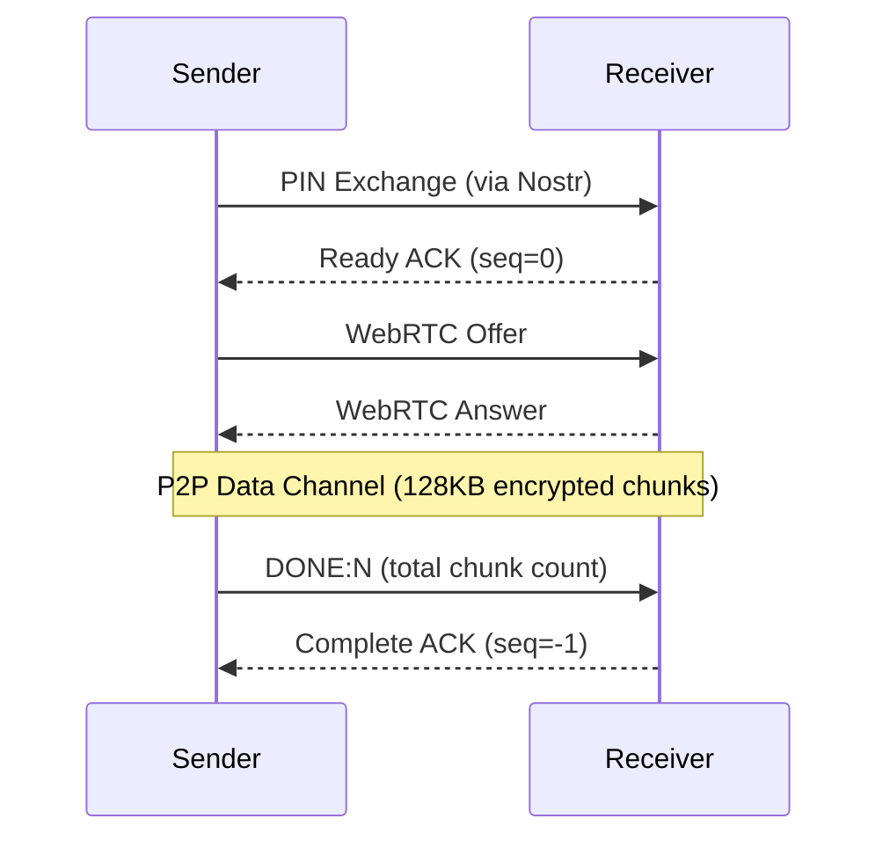
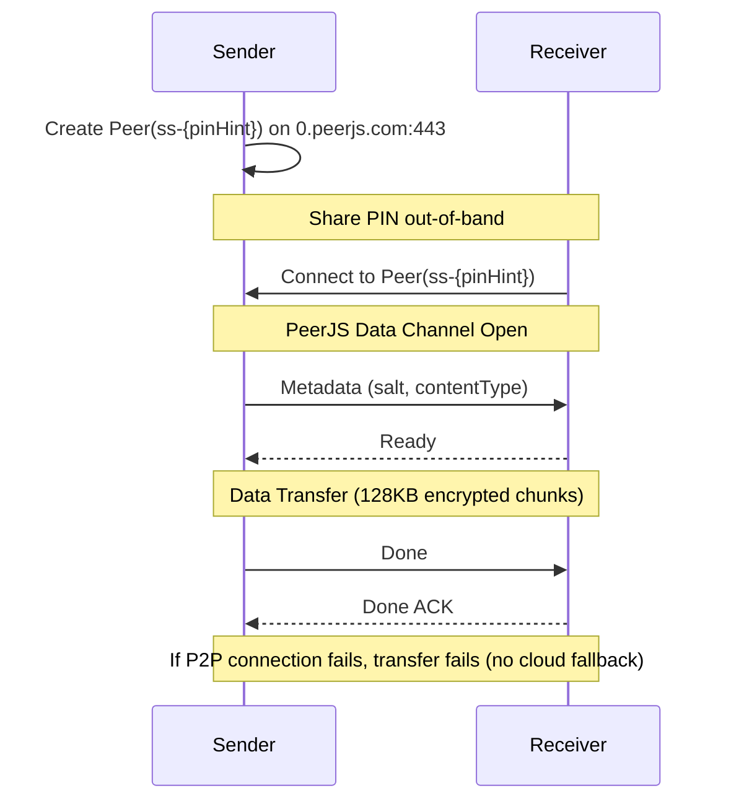
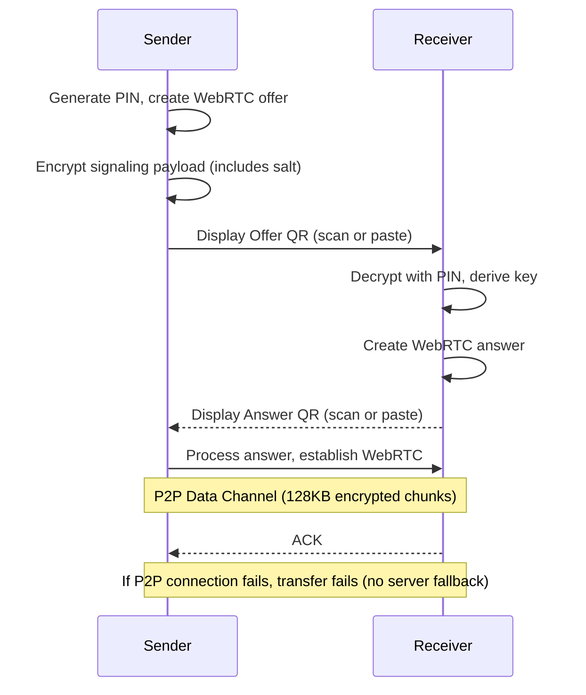
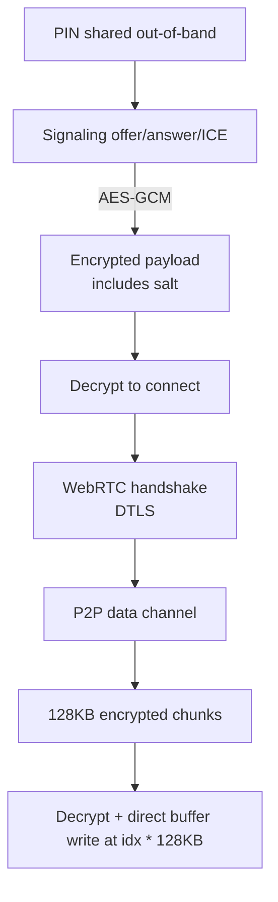

# Architecture

## Overview

Secure Send is a browser-based encrypted file and message transfer application. It uses PIN-based encryption for signaling and cloud transfers, supports three signaling methods (Nostr relays, PeerJS, or QR codes), and enables direct P2P (WebRTC) data transfer with optional cloud fallback (Nostr mode only).

## Core Principles

1. **P2P First**: Direct WebRTC connections are always preferred for data transfer.
2. **Protocol-Agnostic Encryption**: All content is encrypted at the application layer using AES-256-GCM in 128KB chunks, regardless of transport encryption. This provides defense in depth and consistent security across all signaling methods.
3. **Memory-Efficient Streaming**: Content is encrypted/decrypted in streaming chunks. All receivers (P2P and cloud) preallocate buffers and write directly to calculated positions - no intermediate chunk arrays.
4. **Pluggable Signaling**: Signaling (Nostr, PeerJS, QR) is decoupled from the transfer layer. The same encryption/chunking logic is used regardless of signaling method.
5. **PIN-Based Security**: A 12-character PIN serves as the shared secret for key derivation.

## Signaling Methods

By default, Nostr is used for signaling. PeerJS and QR are available as alternatives under "Advanced Options" in the UI. Both sender and receiver must use the same method.

| Feature | Nostr (Default) | PeerJS (Advanced) | Manual Exchange (No Signaling Server) |
|---------|-----------------|-------------------|---------------------------------------|
| Signaling Server | Decentralized relays | Centralized (0.peerjs.com) | None (QR or copy/paste) |
| STUN Server | Yes (Google) | Yes (Google) | Yes (Google, when available) |
| Cloud Fallback | Yes (tmpfiles.org) | No | No |
| Reliability | Higher (fallback available) | P2P only | P2P only |
| Privacy | Better (no central server) | PeerJS server sees peer IDs | Best (no signaling server) |
| Complexity | More complex | Simpler | Manual exchange (QR or copy/paste) |
| Internet Required | Yes | Yes | No |
| Network Requirement | Any (via internet) | Any (via internet) | Same local network (without internet) |
| Recommended For | Unreliable networks, NAT issues | Simple P2P, good connectivity | Offline transfers, local network only |

## Transfer Flow

### Nostr Mode - P2P Success Path (Preferred)


### Cloud Fallback Path (Nostr Mode - When P2P Connection Fails)


### PeerJS Mode (P2P Only - No Cloud Fallback)


### Manual Exchange Mode (No Internet Required)


**Requirements:**
- Both devices need either a working camera OR ability to copy/paste text (camera optional)
- Encrypted signaling data can be exchanged via QR scan or clipboard

**Network Requirements:**
- **With internet**: Works across different networks (STUN server enables NAT traversal)
- **Without internet**: Devices must be on same local network (WiFi, LAN, etc.)
- **Not air-gapped**: Requires some network connectivity between devices

**How it works:**
- With internet: STUN server (stun.l.google.com) enables connections across different networks via NAT traversal
- Without internet: WebRTC discovers local ICE candidates directly, connection establishes via local IP addresses

**QR Code Format:**
- Binary payload: `[4 bytes: "SS01" magic][16 bytes: salt][encrypted deflate-compressed SignalingPayload]`
- QR: binary → binary QR code (8-bit byte mode, ~2000 bytes capacity)
- Copy/paste: base64 encode binary → text string for clipboard

> **Note:** Prior to PR #15, QR codes used base45 encoding with multi-QR chunking.
> For the previous implementation, see commit `89d935b3b61ea37c9f98bc85de4d4c78c7be3891`.

## Key Components

### Cryptography (`src/lib/crypto/`)

| Component | Description |
|-----------|-------------|
| `pin.ts` | PIN generation and validation (12-char, mixed charset) |
| `kdf.ts` | Key derivation using PBKDF2-SHA256 (600,000 iterations) |
| `aes-gcm.ts` | AES-256-GCM encryption/decryption |
| `stream-crypto.ts` | Streaming encryption/decryption (128KB chunks, protocol-agnostic) |
| `constants.ts` | Crypto parameters, size limits, timeouts |

**Key Parameters:**
- `MAX_MESSAGE_SIZE`: 100MB (maximum file size)
- `CLOUD_CHUNK_SIZE`: 10MB (chunk size for cloud uploads)
- `ENCRYPTION_CHUNK_SIZE`: 128KB (application-level encryption chunk size for all methods)
- `PBKDF2_ITERATIONS`: 600,000

### Nostr Signaling (`src/lib/nostr/`)

Uses Nostr protocol for decentralized signaling between sender and receiver.

**Event Kinds:**
| Kind | Purpose |
|------|---------|
| 24243 | PIN Exchange - Contains encrypted transfer metadata |
| 24242 | Data Transfer - ACKs, WebRTC signals, chunk notifications |

**Event Types (via tags):**
- `pin_exchange`: Initial transfer setup
- `ack`: Acknowledgments (seq=0 ready, seq=N chunk, seq=-1 complete)
- `signal`: WebRTC signaling (offer/answer/candidates)
- `chunk_notify`: Cloud chunk URL notification

**Files:**
- `types.ts`: Type definitions for payloads and events
- `events.ts`: Event creation and parsing functions
- `client.ts`: Nostr relay connection management
- `relays.ts`: Default relay configuration
- `discovery.ts`: Backup relay discovery

### PeerJS Signaling (`src/lib/peerjs-signaling.ts`)

Alternative signaling method using PeerJS cloud server instead of Nostr relays.

**How it works:**
- Peer ID derived from PIN: `ss-{SHA256(PIN).slice(0, PIN_HINT_LENGTH)}`
- Both sender and receiver compute same peer ID from PIN
- Sender creates peer, receiver connects to that peer ID
- Uses PeerJS cloud server (`0.peerjs.com:443`) for NAT traversal
- Data channel established directly via PeerJS (wraps WebRTC)

**Message Types:**
| Type | Direction | Purpose |
|------|-----------|---------|
| `metadata` | Sender → Receiver | Transfer info (includes `createdAt` TTL + key derivation `salt`) |
| `ready` | Receiver → Sender | Acknowledge metadata received |
| `chunk` | Sender → Receiver | Data chunk (ArrayBuffer) |
| `done` | Sender → Receiver | Transfer complete |
| `done_ack` | Receiver → Sender | Acknowledge completion |

**Key Differences from Nostr:**
- No cloud fallback - P2P only
- Simpler protocol - no event kinds or tags
- Centralized signaling server (PeerJS cloud)
- Metadata exchange happens over data channel (not signaling)

### Manual Exchange Signaling (`src/lib/manual-signaling.ts`)

Signaling method using QR codes or copy/paste for WebRTC offer/answer exchange. Camera is optional; signaling data can be exchanged via clipboard. **Network requirements:** With internet, works across different networks via STUN. Without internet, devices must be on same local network (not air-gapped - requires network connectivity).

**How it works:**
- Sender generates WebRTC offer with ICE candidates
- Offer payload encrypted with PIN, then encoded as: JSON → gzip → binary QR code
- Receiver scans QR code (or pastes encrypted JSON), decrypts with PIN, creates answer
- Answer encrypted with PIN and sent back via same encoding (QR code or encrypted JSON paste)
- Both peers establish WebRTC connection using exchanged SDP/ICE candidates
- Both offer and answer include a required `createdAt` timestamp; receivers refuse to proceed if the offer is expired or missing TTL

**Binary Payload Format:**
```
[4 bytes: "SS01" magic (0x53 0x53 0x30 0x31)][16 bytes: salt][remaining: AES-GCM encrypted deflate-compressed payload]
```
The "SS01" magic header (Secure Send version 1) identifies the format and allows for future versioning. This compact binary format avoids JSON overhead and double base64 encoding.

**Encoding Pipeline:**
1. `SignalingPayload` object → JSON string
2. Compress with deflate (JSON/SDP compresses well, ~40-50% reduction)
3. Encrypt with PIN-derived key (AES-GCM)
4. Construct binary: `[SS01][salt][encrypted bytes]`

**Output Methods:**
| Method | Encoding | Use Case |
|--------|----------|----------|
| QR Code | Gzip-compressed binary | Camera available, most compact |
| Copy/Paste | Base64-encoded binary | No camera, text-safe for clipboard |

**Key Features:**
- No signaling server required - manual exchange via QR scan or copy/paste
- Camera optional - encrypted payload can be copied as text and pasted on other device
- No internet required when devices are on same local network
- With internet: works across different networks via STUN (stun.l.google.com) for NAT traversal
- Not air-gapped: requires network connectivity between devices (either local network or internet)
- Binary mode QR codes for efficient byte encoding
- Single QR code per payload (no chunking needed)
- Uses `zxing-wasm` for both generation and scanning

**Security Model:**
- **All modes**: PIN encrypts signaling metadata to prevent unauthorized connection establishment
- **QR mode**: Physical QR exchange adds a presence check, but PIN is still required to decrypt signaling
- **All modes**: Once WebRTC connection is established, DTLS encrypts all data in transit

### WebRTC (`src/lib/webrtc.ts`)

Handles direct peer-to-peer connections using WebRTC data channels.

**Features:**
- ICE candidate queuing for reliable connection establishment
- STUN server for NAT traversal (`stun.l.google.com:19302`)
- 16KB chunked data transfer over data channel
- Backpressure support (waits for buffer to drain before sending more data)
- Connection state monitoring

### Cloud Storage (`src/lib/cloud-storage.ts`)

Fallback storage when P2P connection cannot be established (15s timeout). Not used if P2P connects successfully.

**Features:**
- Multiple upload servers with automatic failover
- Multiple CORS proxies for download redundancy
- Service health caching
- Chunked upload/download for files >10MB

**Current Services:**
- Upload: tmpfiles.org
- CORS Proxies: corsproxy.io, leverson83, codetabs, cors-anywhere

### React Hooks (`src/hooks/`)

**Nostr Mode:**

**`use-nostr-send.ts`** - Sender logic (Nostr):
1. Read content (encrypt only if cloud fallback is needed)
2. Publish PIN exchange (without cloud URL)
3. Wait for receiver ready ACK
4. Attempt P2P connection (15s timeout for connection only)
5. If P2P connects: transfer via data channel (all-or-nothing, no cloud fallback)
6. If P2P connection fails: chunked cloud upload with ACK coordination
7. Wait for completion ACK

**`use-nostr-receive.ts`** - Receiver logic (Nostr):
1. Validate PIN and find exchange event
2. Send ready ACK
3. Listen for P2P signals OR chunk notifications
4. If P2P: receive via data channel
5. If cloud: download chunks, send ACKs, combine and decrypt
6. Send completion ACK

**PeerJS Mode:**

**`use-peerjs-send.ts`** - Sender logic (PeerJS):
1. Generate PIN, derive peer ID and encryption key (with salt)
2. Create Peer with derived ID on PeerJS cloud server
3. Wait for receiver connection (5 min timeout)
4. Send metadata (with salt) over data channel
5. Wait for ready acknowledgment
6. Encrypt and transfer data in 128KB chunks with backpressure
7. Wait for done acknowledgment
8. If connection fails at any point: transfer fails (no cloud fallback)

**`use-peerjs-receive.ts`** - Receiver logic (PeerJS):
1. Validate PIN, derive peer ID
2. Connect to sender's peer ID via PeerJS
3. Receive metadata (with salt), derive decryption key
4. Preallocate buffer based on totalBytes
5. Send ready acknowledgment
6. Receive encrypted chunks, decrypt and write directly to buffer position
7. On done: send done acknowledgment
8. If connection fails: transfer fails (no cloud fallback)

**Manual Exchange Mode:**

**`use-manual-send.ts`** - Sender logic (Manual Exchange):
1. Read content (file or text), validate size
2. Generate PIN and salt, derive encryption key
3. Create WebRTC offer with ICE candidates
4. Wait for ICE gathering to complete
5. Encrypt offer payload (includes salt) with PIN: JSON → deflate → encrypt → binary QR code
6. Display QR code and encrypted JSON copy button
7. Wait for user to input receiver's answer (scan or paste)
8. Process answer, establish WebRTC connection
9. Encrypt and send data in 128KB chunks via data channel
10. Wait for receiver ACK

**`use-manual-receive.ts`** - Receiver logic (Manual Exchange):
1. Validate PIN entered by user
2. Wait for user to input sender's offer (scan or paste)
3. Decrypt offer with PIN, extract metadata and salt
4. Derive decryption key from PIN and salt
5. Create WebRTC answer with ICE candidates
6. Encrypt answer payload with PIN: JSON → deflate → encrypt → binary QR code
7. Display QR code and encrypted JSON copy button
8. Wait for WebRTC connection to establish
9. Receive encrypted chunks, store temporarily
10. After transfer complete, decrypt all chunks and write to preallocated buffer
11. Present content

## Data Encryption

### Unified Transfer Layer

All three signaling methods (Nostr, PeerJS, Manual Exchange) share the same encryption middleware. This protocol-agnostic layer provides consistent security regardless of the transport mechanism.

**Why encrypt when WebRTC provides DTLS?**
- **Defense in depth**: Multiple encryption layers protect against implementation bugs
- **Consistent model**: Same encryption for P2P and cloud fallback
- **Key control**: Encryption key derived from user's PIN, not WebRTC keys
- **Verification**: Application-level encryption ensures end-to-end security

### PIN Exchange Payload
```typescript
interface PinExchangePayload {
  contentType: 'text' | 'file'
  transferId: string
  senderPubkey: string
  totalChunks: number
  relays?: string[]
  // File metadata (if file)
  fileName?: string
  fileSize?: number
  mimeType?: string
}
```

### Encryption Flow
1. **PIN Generation**: 12-character from mixed charset (excluding ambiguous chars)
2. **Salt Generation**: 16 random bytes (included in signaling payload for receiver)
3. **Key Derivation**: PBKDF2-SHA256 with 600,000 iterations
4. **Chunk Encryption**: AES-256-GCM with 12-byte nonce per 128KB chunk

### What's Encrypted Where

| Data | All P2P Methods | Cloud Transfer |
|------|-----------------|----------------|
| Signaling Payload | Encrypted (AES-GCM) | N/A |
| WebRTC Signals | Encrypted (AES-GCM) | N/A |
| File/Text Content | Encrypted (AES-GCM, 128KB chunks) | Encrypted (AES-GCM, whole file) |

### Streaming Encryption (All Methods)

All P2P transfers (Nostr, PeerJS, Manual Exchange) encrypt content in 128KB chunks using identical logic:

**Sender side:**
```typescript
for (let i = 0; i < contentBytes.length; i += ENCRYPTION_CHUNK_SIZE) {
  const plainChunk = contentBytes.slice(i, end)
  const encryptedChunk = await encryptChunk(key, plainChunk, chunkIndex)
  await connection.send(encryptedChunk)
  chunkIndex++
}
```

**Receiver side (memory-efficient assembly):**
```typescript
// Preallocate single buffer based on expected size
let contentData = new Uint8Array(totalBytes)

// On each chunk received:
const { chunkIndex, encryptedData } = parseChunkMessage(encryptedChunk)
const decryptedChunk = await decryptChunk(key, encryptedData)
const writePosition = chunkIndex * ENCRYPTION_CHUNK_SIZE
contentData.set(decryptedChunk, writePosition)  // Direct write, no intermediate storage
```

**Encrypted Chunk Format:**
```
[4 bytes: chunk index (big-endian)][12 bytes: nonce][ciphertext][16 bytes: auth tag]
```

**Benefits:**
- **Defense in depth**: AES-GCM on top of WebRTC DTLS
- **Streaming decryption**: Each chunk decrypted as it arrives
- **Memory efficiency**: Preallocated buffer with direct position writes - no intermediate chunk arrays
- **Out-of-order handling**: Chunks can arrive in any order and be placed correctly



### Cloud Transfer Memory Efficiency (Nostr Fallback)

Cloud transfers use the same memory-efficient receiving pattern:

```typescript
// Preallocate buffer based on expected total size
const estimatedSize = totalChunks * CLOUD_CHUNK_SIZE
let cloudBuffer = new Uint8Array(estimatedSize)

// On each cloud chunk downloaded:
const writePosition = chunkIndex * CLOUD_CHUNK_SIZE
cloudBuffer.set(chunkData, writePosition)  // Direct write, no intermediate storage
```

This ensures consistent memory behavior across all transfer modes - P2P and cloud fallback both avoid creating intermediate chunk arrays.

## Size Limits

| Limit | Value | Rationale |
|-------|-------|-----------|
| Max file size | 100MB | Memory constraints, cloud service limits |
| Encryption chunk size | 128KB | Balance of encryption overhead and streaming efficiency |
| Cloud chunk size | 10MB | Per-upload limit, memory efficiency |
| PIN length | 12 chars | Balance of usability and security |

## Timeout Configuration

| Timeout | Duration | Purpose |
|---------|----------|---------|
| P2P connection | 30 seconds | Time to establish WebRTC connection (offer/answer/ICE/channel open) |
| P2P offer retry | 5 seconds | Interval to retry WebRTC offer if no answer received |
| P2P data transfer | Unlimited | Once connected, data transfer has no timeout |
| Chunk ACK | 60 seconds | Time to download and acknowledge a cloud chunk |
| Overall transfer | 10 minutes | Maximum time for entire transfer (receiver side) |
| Transfer TTL | 1 hour | Transfer session validity (`TRANSFER_EXPIRATION_MS`) |
| Receiver PIN inactivity | 5 minutes | Clears PIN input if no changes made |

## TTL / Expiration Spec

Secure Send enforces a hard session TTL. Expired requests MUST NOT establish a session or begin transfer, even if the PIN/key is correct.

**Duration**
- `TRANSFER_EXPIRATION_MS` (currently 1 hour)

**TTL Anchor (start time)**
- **Nostr**: PIN exchange event `created_at` (seconds since epoch)
- **PeerJS**: `PeerJSMetadata.createdAt` (milliseconds since epoch)
- **Manual Exchange**: `SignalingPayload.createdAt` (milliseconds since epoch)

**Enforcement Points (hard fail)**
- **Receiver-side (pre-session)**:
  - Reject expired/missing TTL before acknowledging or establishing a session (no `ready` ACK in PeerJS/Nostr; no WebRTC answer in Manual).
- **Sender-side (pre-transfer)**:
  - Re-check TTL immediately before sending any data (including at WebRTC DataChannel open and before any cloud upload fallback).

**No Backward Compatibility**
- Requests/payloads missing TTL fields are rejected (treated as invalid).
- Nostr P2P completion requires `DONE:N` (legacy `DONE` without chunk count is unsupported).

## Security Considerations

1. **Ephemeral Keys**: New keypair generated for each transfer
2. **Forward Secrecy**: PIN-derived key is unique per transfer (includes random salt) - applies to all modes
3. **No Server Trust**: Cloud storage and relays see only encrypted payloads and minimal routing metadata; plaintext never leaves the device
4. **PIN Entropy**: ~67 bits (11 random chars from 69-char set + 1 checksum)
5. **Brute-Force Resistance**: 600K PBKDF2 iterations (planned: Argon2id)
6. **PIN Role**: PIN encrypts signaling (preventing unauthorized P2P connection) AND content (defense in depth)
7. **Transport Security**: All P2P transfers (Nostr, PeerJS, Manual Exchange) use both AES-256-GCM encryption (128KB chunks) and WebRTC DTLS
8. **Protocol-Agnostic Security**: Same encryption layer used regardless of signaling method - no security difference between Nostr, PeerJS, or Manual Exchange

## File Structure

```
src/
├── lib/
│   ├── crypto/              # Cryptographic functions
│   │   ├── constants.ts     # Parameters and limits
│   │   ├── pin.ts           # PIN generation/validation
│   │   ├── kdf.ts           # Key derivation
│   │   ├── aes-gcm.ts       # Encryption/decryption
│   │   └── stream-crypto.ts # Streaming chunk encryption (P2P)
│   ├── nostr/               # Nostr protocol (signaling option 1)
│   │   ├── types.ts         # Type definitions
│   │   ├── events.ts        # Event creation/parsing
│   │   ├── client.ts        # Relay client
│   │   └── relays.ts        # Default relays
│   ├── peerjs-signaling.ts  # PeerJS wrapper (signaling option 2)
│   ├── manual-signaling.ts  # Manual exchange signaling (signaling option 3)
│   ├── qr-utils.ts          # Binary QR code generation (zxing-wasm)
│   ├── webrtc.ts            # WebRTC connection management
│   ├── cloud-storage.ts     # Cloud fallback (Nostr mode only)
│   └── file-utils.ts        # File reading utilities
├── workers/
│   ├── qrGenerator.worker.ts    # Binary QR generation (zxing-wasm/full)
│   └── zxing-qr-scanner.worker.ts # QR scanning (zxing-wasm/reader)
├── hooks/
│   ├── use-nostr-send.ts    # Sender hook (Nostr mode)
│   ├── use-nostr-receive.ts # Receiver hook (Nostr mode)
│   ├── use-peerjs-send.ts   # Sender hook (PeerJS mode)
│   ├── use-peerjs-receive.ts # Receiver hook (PeerJS mode)
│   ├── use-manual-send.ts   # Sender hook (Manual Exchange mode)
│   ├── use-manual-receive.ts # Receiver hook (Manual Exchange mode)
│   └── useQRScanner.ts      # Camera-based QR scanning hook
├── components/
│   └── secure-send/
│       ├── qr-display.tsx   # Binary QR code display
│       ├── qr-scanner.tsx   # QR scanner (binary mode)
│       └── qr-input.tsx     # Dual input (scan or paste)
└── pages/                   # Page components
```
