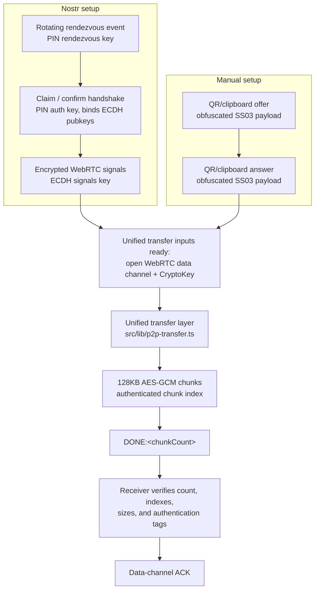
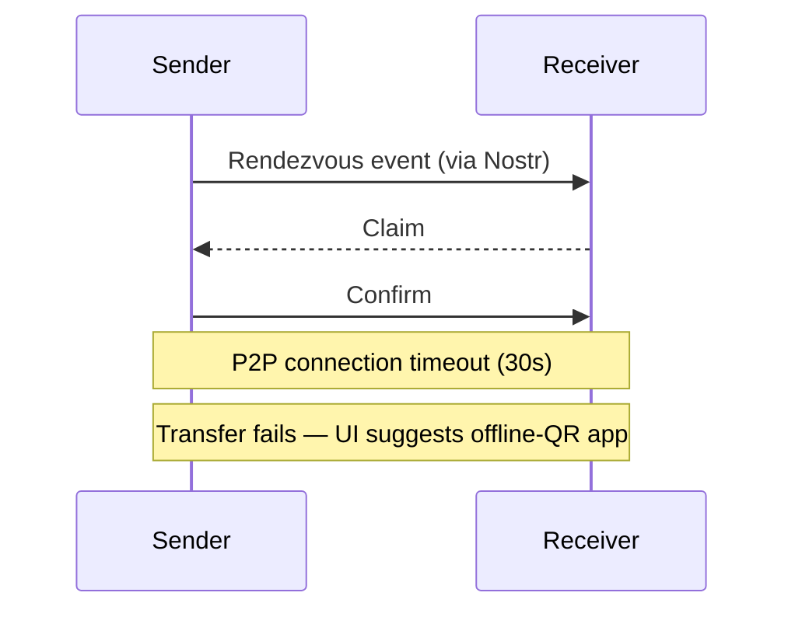
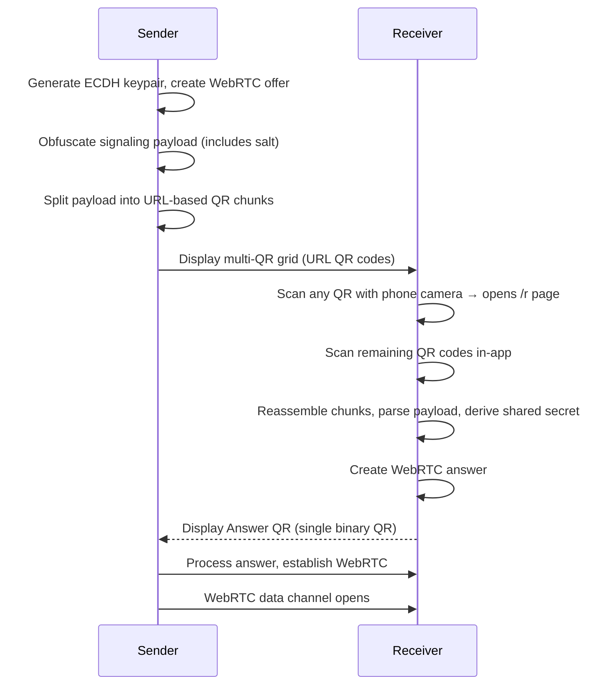
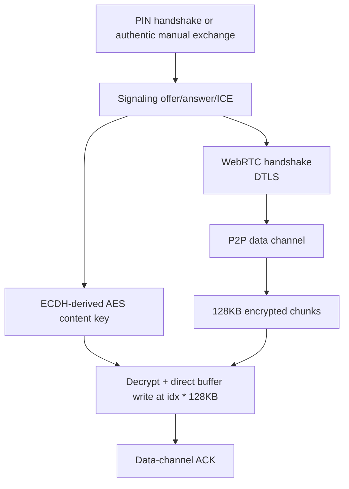

# Architecture

## Overview

Secure Send is a browser-based encrypted file and folder transfer application. It supports rotating-PIN-authenticated Nostr signaling, a manual exchange method (QR or copy/paste with time-bucketed obfuscation), and direct P2P (WebRTC) data transfer. In both modes the content-encryption key comes from an ephemeral ECDH exchange; the Nostr-mode PIN only locates the sender and authenticates that exchange.

## Core Principles

1. **WebRTC-Only File Transfer**: File bytes are transferred only over a direct WebRTC data channel. Nostr and Manual Exchange are signaling methods only; neither carries file content and there is no non-WebRTC transfer path in the app.
2. **Single Data-Channel Transfer Path**: `src/lib/p2p-transfer.ts` is the only implementation of file transfer once signaling has opened a WebRTC data channel. Both signaling methods converge here before any file bytes are sent.
3. **Application-Layer Chunk Encryption**: File content is encrypted at the application layer using AES-256-GCM in 128KB chunks regardless of WebRTC DTLS transport encryption.
4. **Memory-Efficient Receive Path**: Receivers validate the advertised size, preallocate a scratch sink of that size (an in-memory buffer for payloads of 100MB or less, an OPFS scratch file above that), then decrypt, authenticate, and write each chunk directly to its indexed position as it arrives. Nostr cryptographically authenticates its metadata; Manual Exchange relies on the authenticity of the user-controlled QR/clipboard exchange path.
5. **Pluggable Signaling, Fixed Transfer**: Nostr and QR/clipboard flows only exchange setup material: metadata, keys, SDP, and ICE candidates. The encrypted chunk framing, `DONE:<chunkCount>:<byteCount>` terminator, and data-channel `ACK` are identical after signaling completes.
6. **PIN Locates and Authenticates, ECDH Encrypts (Nostr mode)**: A short rotating PIN (10 Crockford base32 characters, not case sensitive, fresh every 2 minutes) locates the sender's rendezvous event and seals a mutual claim/confirm challenge-response. Content and signaling keys are derived from an ephemeral P-256 ECDH exchange that the challenge-response authenticates — never from the PIN itself.

## Signaling Methods

By default, Nostr is used for signaling. Manual Exchange is available as an alternative under the Transfer mode selector in the send/receive UI. Both sender and receiver must use the same method.

| Feature | Nostr (Default) | Manual Exchange (No Signaling Server) |
|---------|-----------------|---------------------------------------|
| Signaling Server | Decentralized relays | None (QR or copy/paste) |
| ICE servers | STUN only (Google + Cloudflare); no TURN | STUN only (same WebRTC config); no TURN |
| Reliability | P2P only | P2P only |
| Privacy | Better (no central server) | No signaling server; QR/clipboard payload is only obfuscated |
| Complexity | More complex | Manual exchange (QR or copy/paste) |
| Internet Required | Yes | No (if on same local network) |
| Network Requirement | Any (via internet) | Same local network (without internet) |
| Recommended For | Remote transfers and automatic signaling | Offline/local transfers, or avoiding signaling relays |

## Transfer Flow

Secure Send has two method-specific signaling paths, but only one file-transfer path. Nostr and Manual Exchange differ only until both peers have enough SDP/ICE/key material to open a WebRTC data channel. After that convergence point, both modes call the same shared transfer layer in `src/lib/p2p-transfer.ts`.

### Unified Transfer Flow (All Signaling Methods)


```mermaid
flowchart TD
    subgraph Nostr[Nostr setup]
        N1[Rotating rendezvous event<br/>PIN rendezvous key]
        N2[Claim / confirm handshake<br/>PIN auth key, binds ECDH pubkeys]
        N3[Encrypted WebRTC signals<br/>ECDH signals key]
        N1 --> N2
        N2 --> N3
    end

    subgraph Manual[Manual setup]
        M1[QR/clipboard offer<br/>obfuscated SS03 payload]
        M2[QR/clipboard answer<br/>obfuscated SS03 payload]
        M1 --> M2
    end

    N3 --> Channel[Unified transfer inputs ready:<br/>open WebRTC data channel + CryptoKey]
    M2 --> Channel

    Channel --> Transfer[Unified transfer layer<br/>src/lib/p2p-transfer.ts]
    Transfer --> Chunks[128KB AES-GCM chunks<br/>authenticated chunk index]
    Chunks --> Done[DONE:&lt;chunkCount&gt;]
    Done --> Verify[Receiver verifies count, indexes,<br/>sizes, and authentication tags]
    Verify --> Ack[Data-channel ACK]
```

Both modes derive the opaque `CryptoKey` from an ephemeral ECDH exchange — the difference is only how that exchange is authenticated: Nostr authenticates it in-band with the PIN-sealed claim/confirm handshake, Manual Exchange relies on the user-controlled QR/clipboard path. `src/lib/p2p-transfer.ts` receives that key plus an open data channel and then runs the same chunk encryption, validation, `DONE:<chunkCount>:<byteCount>` terminator, and final `ACK` flow for every signaling method.

### Signaling Setup Diagrams

### Nostr Mode - Signaling Setup
```mermaid
sequenceDiagram
    participant Sender
    participant Receiver
    loop Every 2 min until claimed (max 30 min)
        Sender->>Receiver: Rendezvous event (fresh PIN, hint, nonce; via Nostr)
    end
    Receiver-->>Sender: Claim (sealed with PIN auth key; receiver ECDH pubkey)
    Sender->>Receiver: Confirm (same auth key; locks transfer to receiver)
    Note over Sender,Receiver: Both derive ECDH session keys (signals + content)
    Sender->>Receiver: WebRTC Offer
    Receiver-->>Sender: WebRTC Answer
    Sender->>Receiver: WebRTC data channel opens
```

### Nostr Mode - P2P Connection Failure

```mermaid
sequenceDiagram
    participant Sender
    participant Receiver
    Sender->>Receiver: Rendezvous event (via Nostr)
    Receiver-->>Sender: Claim
    Sender->>Receiver: Confirm
    Note over Sender,Receiver: P2P connection timeout (30s)
    Note over Sender,Receiver: Transfer fails — UI suggests offline-QR app
```

### Manual Exchange Mode - Signaling Setup

```mermaid
sequenceDiagram
    participant Sender
    participant Receiver
    Sender->>Sender: Generate ECDH keypair, create WebRTC offer
    Sender->>Sender: Obfuscate signaling payload (includes salt)
    Sender->>Sender: Split payload into URL-based QR chunks
    Sender->>Receiver: Display multi-QR grid (URL QR codes)
    Receiver->>Receiver: Scan any QR with phone camera → opens /r page
    Receiver->>Receiver: Scan remaining QR codes in-app
    Receiver->>Receiver: Reassemble chunks, parse payload, derive shared secret
    Receiver->>Receiver: Create WebRTC answer
    Receiver-->>Sender: Display Answer QR (single binary QR)
    Sender->>Receiver: Process answer, establish WebRTC
    Sender->>Receiver: WebRTC data channel opens
```

**Requirements:**
- Receiver needs a phone camera to scan the sender's URL QR codes (or can use clipboard copy/paste as fallback)
- Sender needs a camera OR clipboard to receive the answer back

**Network Requirements:**
- **With internet**: Can work across different networks when ICE finds a direct route; STUN assists discovery but does not relay traffic
- **Without internet**: Devices must be on same local network (WiFi, LAN, etc.)
- **Not air-gapped**: Requires some network connectivity between devices

**How it works:**
- With internet: Google and Cloudflare STUN servers help discover direct ICE candidates. Restrictive NAT or firewall rules can still prevent a connection because TURN relaying is not supported.
- Without internet: WebRTC discovers local ICE candidates directly, connection establishes via local IP addresses

**QR Code Format:**

*Sender → Receiver (Offer):* Multi-QR URL-based chunking
- Offer payload uses `maxDataBytes = 400` payload bytes per chunk (headers are added after payload slicing).
- Chunk wire format (raw bytes before base64url):
  - `chunk_index`: `u8` (1 byte, 0-based)
  - `total_chunks`: `u8` (1 byte, valid range `1..255`)
  - `payload_crc32_be_u32` (carried only in chunk `0`): 4-byte big-endian CRC-32/ISO-HDLC over the full reassembled payload (poly `0x04C11DB7`, reflected input/output, init `0xFFFFFFFF`, xorout `0xFFFFFFFF`; reflected table form `0xEDB88320`)
  - Chunk `0`: `[chunk_index:u8][total_chunks:u8][payload_crc32_be_u32][data]`
  - Chunk `1..N-1`: `[chunk_index:u8][total_chunks:u8][data]`
- Header overhead and usable payload bytes:
  - Chunk `0` header size: `6` bytes (`chunk_index` 1 + `total_chunks` 1 + `payload_crc32_be_u32` 4) -> usable payload data up to `400` bytes, raw chunk bytes up to `406`.
  - Chunk `1..N-1` header size: `2` bytes (`chunk_index` 1 + `total_chunks` 1) -> usable payload data up to `400` bytes, raw chunk bytes up to `402`.
- Chunk data rebalancing (to avoid a tiny last QR payload):
  - After `total_chunks = ceil(payload_bytes / 400)` is chosen, data bytes are distributed evenly: `base_size = floor(payload_bytes / total_chunks)`, `remainder = payload_bytes % total_chunks`.
  - The first `remainder` chunks carry `base_size + 1` data bytes; the remaining chunks carry `base_size` data bytes (difference between chunk payload sizes is at most 1 byte).
- Base64url size expansion (for raw chunk length `n` bytes, unpadded):
  - `n % 3 == 0` -> encoded length `4 * (n / 3)`
  - `n % 3 == 1` -> encoded length `4 * floor(n / 3) + 2`
  - `n % 3 == 2` -> encoded length `4 * floor(n / 3) + 3`
- Typical `1200`-byte payload example:
  - `total_chunks = ceil(1200 / 400) = 3` (data slices are `400`, `400`, `400` bytes).
  - Chunk `0`: `406` raw bytes -> `542` base64url chars in hash payload -> URL fragment `#` length `543` chars (`/r#` length `545`, excluding origin).
  - Chunk `1`: `402` raw bytes -> `536` base64url chars in hash payload -> URL fragment `#` length `537` chars (`/r#` length `539`, excluding origin).
  - Chunk `2`: same as chunk `1`.
- Limits implied by the `u8` headers:
  - Maximum chunks: `255` (`chunk_index` valid range `0..254`, with `chunk_index < total_chunks`)
  - With `400` data bytes per chunk, maximum payload size is `102,000` bytes (`255 * 400`) before base64url encoding.
- CRC32 sequencing and failure handling:
  - Scope: this CRC-32 is a **signaling-payload error-detection** checksum for multi-QR reassembly only (it detects a misread/garbled QR before the offer is parsed). It is **not** file-content integrity and is not a substitute for it — transferred file bytes are protected separately by per-chunk AES-GCM authentication over the WebRTC data channel (see *Streaming Encryption*).
  - CRC32 is carried only in chunk `0`; receivers MUST buffer chunk `1..N-1` data until chunk `0` is received (this spec does not define a streaming-without-chunk-0 mode).
  - CRC32 validation is deferred until full reassembly is complete and chunk `0` (with `payload_crc32_be_u32`) is available.
  - On CRC32 failure after full reassembly, receivers MUST drop the reassembled payload, log a checksum/protocol error, and fail the current transfer attempt (retry/rescan is an implementation-level recovery action).
- Each chunk is base64url-encoded and embedded in a URL: `{origin}/r#{base64url}`
- Deployment requirement: app must be hosted at domain root (no subpath), because chunk URLs are built from `window.location.origin` and append `/r` directly
- Displayed as a grid of URL QR codes, each scannable by a phone's native camera
- For a typical `1200`-byte offer: `3` QR codes. Single-chunk payloads (`≤400` payload bytes) produce `1` QR code.
- Copy/paste fallback: base64-encoded full binary for clipboard

*Receiver → Sender (Answer):* Single binary QR code
- Answer payloads are smaller (no file metadata) and use a single binary QR code (8-bit byte mode)
- The sender is already in-app with scanner active, so URL navigation is unnecessary

## Key Components

### Cryptography (`src/lib/crypto/`)

| Component | Description |
|-----------|-------------|
| `pin.ts` | Rotating 10-char Crockford base32 PIN: generation, weighted checksum, input normalization, PBKDF2 root + HKDF derivations (hint, auth key, rendezvous key, fingerprint) |
| `kdf.ts` | ECDH session-key derivation (HKDF-SHA256, `signals`/`content` labels) and salt generation |
| `ecdh.ts` | ECDH key agreement (non-extractable keys); authenticated by the PIN handshake in Nostr mode and by the QR/clipboard path in manual mode |
| `aes-gcm.ts` | AES-256-GCM encryption/decryption |
| `stream-crypto.ts` | Streaming encryption/decryption (128KB chunks, protocol-agnostic) |
| `constants.ts` | Crypto parameters, PIN charset (Crockford base32), rotation/TTL windows |

### Shared P2P Transfer Layer (`src/lib/p2p-transfer.ts`)

Once signaling establishes an open WebRTC data channel, both Nostr and Manual Exchange use one shared file-transfer protocol:

1. Sender reads a lazy transfer source and coalesces its output into `ENCRYPTION_CHUNK_SIZE` (`128KB`) chunks. For multi-file/folder sends, this source emits ZIP bytes while fflate is still reading and compressing entries.
2. Each slice is encrypted with `encryptChunk`, producing `[chunk_index_be_u16][nonce_12][ciphertext][tag_16]`.
3. Sender sends encrypted chunks with WebRTC backpressure enabled (`bufferedAmountLowThreshold` defaults to 1MB).
4. Sender sends the control string `DONE:<totalChunks>:<totalBytes>`.
5. Receiver waits for all pending decryptions, validates both `DONE` values, verifies that every expected index arrived exactly once, and checks the total plaintext byte count. The final byte count seals streamed ZIPs whose compressed size was unknown during signaling.
6. Receiver sends the control string `ACK` on the same data channel.
7. Sender waits up to `ACK_TIMEOUT_MS` (`30s`) for `ACK`; timeout is a transfer failure.

Both sides run an idle/stall watchdog (`STALL_TIMEOUT_MS`, `60s`) over the active transfer instead of any overall wall-clock deadline. On the sender each chunk hand-off (`sendWithBackpressure`) must complete within the window, so a receiver that stops draining the channel aborts the send. On the receiver the window resets on every incoming data-channel message (armed once the channel opens via `start()`), so a sender that goes quiet mid-stream aborts the receive. Either side timing out rejects with `P2PConnectionError`, which the UI treats as a connection failure.

The receiver rejects duplicate indexes, out-of-range indexes, malformed chunk lengths, transfers exceeding the application limit, and malformed final counts.

### PIN Architecture

The Nostr-mode PIN is a short-lived pairing code, not an encryption root. It has exactly two jobs — *locate* the sender's rendezvous event and *authenticate* the ephemeral ECDH exchange — and it expires minutes after it is shown. Content confidentiality never rests on it.

#### Format
- **Length**: 10 characters, displayed and entered as two symmetric 5-char groups (`XXXXX-XXXXX`).
- **Charset**: Crockford base32 (`0-9` + uppercase letters excluding `I`, `L`, `O`, `U`). Entry is case-insensitive; look-alikes are canonicalized as you type (`O→0`, `I/L→1`) by `normalizePinInput`.
- **Entropy**: 9 random data characters = 45 bits; the 10th character is a checksum.
- **Rotation**: the sender mints a fresh PIN and publishes a new rendezvous event every `PIN_ROTATION_MS` (2 minutes), honoring the `PIN_ACTIVE_GENERATIONS` (3) most recent PINs when verifying a claim — so any displayed PIN stays usable for `PIN_TTL_MS` (6 minutes) and is dead afterwards.

#### Typo Detection (Weighted Checksum)
- **Algorithm**: `sum(char_index * (2 * position + 1)) % 32`.
- **Detection**: every weight is odd (coprime with the charset size 32), so any single-character substitution is always caught; adjacent transpositions are caught unless the two characters sit exactly 16 alphabet positions apart.
- The input UI rejects a mistyped code the moment the 10th character lands, before anything touches the network.

#### Key Derivation (PBKDF2 root + HKDF fan-out)
`importPinRoot` runs the single expensive stretch — `PBKDF2-SHA256(pin, salt = "secure-send:pin-root:v2", 600,000 iterations)` — and locks the result into a non-extractable HKDF key. Every PIN-scoped value is then a cheap HKDF-SHA256 derivation off that root with a distinct info label (shared salt `"secure-send:pin:v2"`), so brute-forcing any published value still costs the full PBKDF2 work factor per PIN guess:

| Derivation | HKDF info | Output | Purpose |
|------------|-----------|--------|---------|
| Wire hint | `hint:<bucket>` | 16 hex chars (64 bits) | `#h` lookup tag on the rendezvous event; `<bucket> = floor(now_ms / PIN_ROTATION_MS)` |
| Auth key | `auth` | AES-256-GCM key | Seals the claim/confirm handshake payloads |
| Rendezvous key | `rendezvous` | AES-256-GCM key | Encrypts the rendezvous payload (metadata, ECDH pubkey, nonce) |
| Fingerprint | `fingerprint` | 8 base32 chars (40 bits) | Local-only human comparison value; never published |

- **Receiver look-back**: the published hint is scoped to the rotation bucket it was minted in, and a rendezvous event is accepted up to `PIN_TTL_MS` old. Because publication is not aligned to bucket boundaries, an event of age exactly `PIN_TTL_MS` can sit `PIN_ACTIVE_GENERATIONS` buckets back, so the receiver derives offsets `0..PIN_HINT_LOOKBACK_BUCKETS` (= 3) and filters `#h` on all of them — provably covering the whole non-expired window.
- **Hint properties**: at 64 bits, the birthday-collision probability among `n` transfers sharing a bucket is about `n²/2⁶⁵` — roughly 3×10⁻⁸ even at a million concurrent transfers — and a collision is tolerated rather than fatal: the receiver queries up to 10 candidates and tries to decrypt each. Per-bucket scoping means the tag rotates every 2 minutes and is never a stable cross-transfer correlator.
- **Fingerprint**: displayed grouped as `XXXX-XXXX` on both ends so humans can confirm they hold the same PIN. It rotates with the sender's PIN — the receiver's fingerprint should match the one under the code currently (or very recently) shown by the sender. Never transmitted.

#### Claim / Confirm Handshake (mutual PIN proof, MITM-proof ECDH)
The rendezvous payload carries the sender's ephemeral P-256 public key and a fresh per-rotation nonce. The handshake then runs over kind-24242 events:

1. **Claim (receiver → sender)**: sealed with the PIN auth key; carries `transferId`, the echoed sender nonce, a fresh receiver nonce, the receiver's ECDH public key, and an echo of the sender's ECDH public key.
2. **Verify + lockout (sender)**: the sender tries its retained (≤3) generations' auth keys. A payload that decrypts *and* matches the generation's nonce, the transfer id, and the sender's own ECDH key is proof the receiver knows a live PIN. The **first verified claim locks the transfer** to that receiver: rotation stops, rendezvous publishing stops, and all other claims are ignored. Invalid claims are silently ignored (transfer tags are public, so treating them as fatal would allow trivial denial of service).
3. **Confirm (sender → receiver)**: sealed with the same auth key; echoes both nonces and the receiver ECDH key the sender locked onto. This is the sender's PIN proof in the reverse direction and tells the receiver its claim won.

Both sides then derive the session keys from `ECDH(shared secret)` via HKDF with the public per-transfer salt (`deriveNostrSessionKeys`: `signals` and `content` labels). A relay man-in-the-middle cannot substitute either ECDH key: the keys are bound inside PIN-sealed payloads in both directions, and forging either seal requires the PIN during its ≤6-minute validity window.

- **Why nonces**: the sender nonce is fresh per rotation and the receiver nonce fresh per claim, so captured handshake payloads cannot be replayed across rotations, transfers, or directions (claim and confirm also differ by their `type` field under the same key).
- **Offline guessing is bounded and low-value**: a captured rendezvous/claim/confirm is an offline PIN-guessing target at 600k PBKDF2 iterations per guess across a 45-bit space (~55 GPU-years on average). Even a success reveals only the rendezvous metadata — content keys are ECDH-derived and never PIN-derived, and after the first claim a recovered PIN cannot join, redirect, or decrypt the transfer.
- **Online guessing is impractical**: an active attacker gets one sealed-claim guess per relay event against a 45-bit space during a ≤6-minute window, with no feedback for failures.

### User Interface Architecture

#### `PinInput` (Receiver Side)
The input component is designed for fast, error-proof manual entry:
- **Two 5-Char Groups**: Entry mirrors the displayed `XXXXX-XXXXX` grouping; focus auto-advances when the first group fills and Backspace on an empty second group returns to the first.
- **Normalization As You Type**: Lowercase is uppercased and Crockford look-alikes are mapped (`O→0`, `I/L→1`); characters outside the charset flash an error and are dropped.
- **Instant Checksum Feedback**: A complete-but-mistyped code is flagged the moment the 10th character lands.
- **Robust Pasting**: A pasted code is normalized (dashes/spaces stripped) and distributed across both groups.
- **No Plaintext Retention**: Once valid, the PIN is immediately stretched into its non-extractable root key and fingerprint (`importPinRoot`), the inputs are masked, and the plaintext is cleared.

#### `PinDisplay` (Sender Side)
The display component focuses on secure and clear communication:
- **Rotation Countdown**: A progress bar and an m:ss countdown under the PIN show the time until the next 2-minute rotation replaces it. The multi-generation grace window is deliberately not surfaced in the UI — it is backend behavior (`PIN_ACTIVE_GENERATIONS`), and mentioning it confused users.
- **On-Demand Refresh**: A "New PIN now" action mints and publishes a fresh PIN immediately. Unlike an automatic rotation, it drops every retained generation (previously shown PINs stop authenticating — their relay events linger until NIP-40 expiry but their claims are no longer honored) and restarts the rotation cadence, while reusing the transfer's file bytes, ephemeral keys, and relay connections. An epoch counter guards against an in-flight rotation publish registering or displaying a pre-reset PIN.
- **Masking**: Automatically masks the PIN after the first copy operation to prevent shoulder surfing.
- **Quiet Backstop**: A muted footnote notes when waiting stops automatically (30 minutes); it is deliberately unobtrusive because rotation, not this window, is the security-relevant timer.
- **Fingerprint**: Shows the current PIN's fingerprint for human comparison with the receiver.

**Key Parameters:**
- `MAX_MESSAGE_SIZE`: 2GB (maximum transferred payload size; every stage streams, see Streaming Encryption)
- `ENCRYPTION_CHUNK_SIZE`: 128KB (application-level encryption chunk size for all methods)
- `PBKDF2_ITERATIONS`: 600,000
- `PIN_ROTATION_MS`: 2 minutes (fresh PIN + rendezvous event cadence)
- `PIN_ACTIVE_GENERATIONS`: 3 (PINs honored at any moment; PIN_TTL_MS = 6 minutes)
- `PIN_WAIT_TIMEOUT_MS`: 30 minutes (sender rotation/wait backstop — a resource bound, not a security control; rotation already caps each PIN's exposure)

### Nostr Signaling (`src/lib/nostr/`)

Uses Nostr protocol for decentralized signaling between sender and receiver.

**Event Kinds:**
| Kind | Purpose |
|------|---------|
| 24243 | Rendezvous - rotating, PIN-encrypted transfer metadata + sender ECDH pubkey + handshake nonce (NIP-40 expiry = PIN_TTL_MS) |
| 24242 | Data Transfer - claim/confirm handshake and WebRTC signals |

**Event Types (via tags):**
- `rendezvous`: Initial transfer setup; republished with a fresh PIN/hint/nonce every 2 minutes until claimed
- `claim`: Receiver's PIN proof + ECDH public key, sealed with the PIN-derived auth key. Tags are plaintext for routing; the sealed body repeats the transfer id and nonces for authentication
- `confirm`: Sender's mutual PIN proof; locks the transfer to the claiming receiver
- `signal`: WebRTC signaling (offer/answer/candidates), encrypted in the event content with the ECDH-derived `signals` key

**Files:**
- `types.ts`: Type definitions for payloads and events
- `events.ts`: Event creation and parsing functions
- `client.ts`: Nostr relay connection management
- `relays.ts`: Default relay configuration
- `availability.ts`: Relay availability probing

### Manual Exchange Signaling (`src/lib/manual-signaling.ts`)

Signaling method using QR codes or copy/paste for WebRTC offer/answer exchange. Camera is optional; signaling data can be exchanged via clipboard. **Network requirements:** With internet, STUN can help devices on different networks discover a direct ICE route, but success is not guaranteed. Without internet, devices must be able to reach each other directly, normally on the same local network (not air-gapped). TURN relaying is not supported.

**How it works:**
- Sender generates WebRTC offer with ICE candidates
- Both offer and answer include a required `createdAt` timestamp; receivers refuse to proceed if the offer is expired or missing TTL
- Payload is obfuscated using a time-bucketed seed to avoid casual inspection.

> [!IMPORTANT]
> **Security boundary**: Manual signaling payloads are not cryptographically confidential. The time-bucketed obfuscation deters casual inspection and the 1-hour TTL prevents stale offers from starting a session, but someone who captures the QR/clipboard payload can potentially recover metadata and SDP/ICE details. File-content confidentiality comes from the ECDH-derived AES-256-GCM key, assuming the offer and answer are exchanged over an authentic QR/clipboard path.

**Binary Payload Format (SS03):**

The payload consists of two distinct layers to balance rapid identification with obfuscation of the content.

| Component | Length | Status | Description |
|-----------|--------|--------|-------------|
| **Outer Magic** | 4 bytes | Plaintext | Fixed header: `"SS03"` (`0x53 0x53 0x30 0x33`) |
| **Inner Buffer** | Variable | **Obfuscated** | Time-bucketed XOR-obfuscated content (detailed below) |

**Obfuscated Inner Buffer Structure:**

The following structure is revealed *after* successful de-obfuscation using the correct hourly seed:

| Component | Length | Status | Description |
|-----------|--------|--------|-------------|
| **Inner Magic** | 4 bytes | Obfuscated | Fixed marker: `"mag!"` (`0x6d 0x61 0x67 0x21`) |
| **Payload** | Variable | Obfuscated | Deflate-compressed `SignalingPayload` JSON |

**Verification Process:**
1. **Identification**: The receiver checks the first 4 bytes for the plaintext `"SS03"` header.
2. **Seed Testing**: The receiver iterates through candidate seeds for the current and previous hour (2-hour sliding window). 
3. **Optimized Check**: For each candidate seed, only the first 4 bytes of the inner buffer are de-obfuscated. If they match the `"mag!"` marker, the correct seed has been found.
4. **Full Processing**: The rest of the buffer is de-obfuscated, decompressed via deflate, and parsed as JSON.

**Time-Bucketed Obfuscation:**

The obfuscation seed changes every hour to make the payload **look more random** and limit casual reuse. This provides several benefits:
- **Casual Protection**: Offers a layer of deterrence against casual non-technical observers by making the raw data unreadable without the correct hourly seed.
- **Stale Session Prevention**: Combined with the explicit `createdAt` TTL checks, stale signaling data cannot start a new transfer session.
- **Payload Randomness**: Ensures that signaling data generated at different times results in significantly different binary outputs.

Primary file-content confidentiality is provided by ECDH + AES-256-GCM (see note above); obfuscation is additive and not a cryptographic control.

- **Bucket Size**: 1 hour (`3600` seconds).
- **Input (`bucketEpoch`)**: `floor(unix_timestamp_seconds / 3600)`.
- **Base Seed**: `0x9e3779b9`.
- **Algorithm**: A 32-bit MurmurHash3-style finalizer/mixer.

**Seed Derivation Steps:**
To ensure cross-implementation compatibility, the seed MUST be derived using the following steps (using 32-bit signed integer multiplication and unsigned right shifts):

1.  Initialize: `h = 0x9e3779b9 ^ bucketEpoch`
2.  Mix 1: `h = (h ^ (h >>> 16)) * 0x85ebca6b`
3.  Mix 2: `h = (h ^ (h >>> 13)) * 0xc2b2ae35`
4.  Finalize: `seed = (h ^ (h >>> 16)) >>> 0`

*Note: In environments like JavaScript, `Math.imul` should be used for the multiplication steps to ensure consistent 32-bit integer behavior.*

**Obfuscation Parse Window & Edge Cases:**
A 2-hour sliding window (current bucket + 1 previous bucket) is used to find the obfuscation seed. This is separate from the hard 1-hour session TTL enforced via `createdAt`.

-   **Session Validity**: A parsed payload is still rejected once `Date.now() - createdAt > TRANSFER_EXPIRATION_MS`.
-   **Parseability Window**: A payload may remain parseable for roughly 1-2 hours depending on bucket boundaries, but parseability does not imply transfer validity.
-   **Clock Relationship**: The receiver accepts payloads encoded in its current hour bucket or the immediately previous bucket. This tolerates a sender clock that falls into the receiver's previous bucket, but it is not symmetric: a sender in the receiver's next/future bucket cannot be decoded.
-   **Boundary Transitions**: When the hour rolls over, the old current bucket becomes the accepted previous bucket and the older bucket is dropped.
-   **Out-of-Sync Clocks**: De-obfuscation fails when the sender encodes into a bucket ahead of the receiver or older than the receiver's immediately previous bucket.

> [!NOTE]
> The obfuscation's goal is simply to avoid casual inspection. It should not be treated as encryption, and expiry is not cryptographic erasure of a captured QR/clipboard payload.

**Encoding Pipeline:**
1. `SignalingPayload` object → JSON string.
2. Compress with deflate (variable length).
3. Prepend fixed-length `"mag!"` marker (4 bytes).
4. XOR-obfuscate this inner buffer with the current hourly seed.
5. Prepend fixed-length plaintext `"SS03"` header (4 bytes).
6. Result: Final binary payload.


**Output Methods:**

*Offer (Sender → Receiver):*
| Method | Encoding | Use Case |
|--------|----------|----------|
| Multi-QR URL | Chunked payload → base64url → URL QR codes | Primary: receiver scans with phone camera to open app |
| Copy/Paste | Base64-encoded full binary | Fallback: no camera, text-safe for clipboard |

*Answer (Receiver → Sender):*
| Method | Encoding | Use Case |
|--------|----------|----------|
| QR Code | SS03 obfuscated binary (single QR) | Camera available, sender already in-app |
| Copy/Paste | Base64-encoded binary | No camera, text-safe for clipboard |

**Key Features:**
- No signaling server required - manual exchange via QR scan or copy/paste
- Multi-QR offer: payload split into URL-based QR codes (~400 bytes each) for easy phone scanning
- Receiver scans any QR code with phone camera → app opens at `/r` route with first chunk → scans remaining codes in-app
- Copy/paste fallback for environments without camera
- No internet required when devices are on same local network
- With internet: STUN can assist direct candidate discovery across different networks; a restrictive NAT/firewall can still make the connection fail
- Not air-gapped: requires network connectivity between devices (either local network or internet)
- URL QR codes are generated from URL text with auto-selected QR encoding; answer QR uses binary mode (8-bit byte)
- Uses the bundled QR WASM packages for generation and scanning

**Security Model:**
- **Nostr**: The rotating PIN encrypts rendezvous metadata and seals the mutual claim/confirm handshake that authenticates the ephemeral ECDH exchange; signals and content are encrypted with the ECDH session keys, so public transfer IDs cannot start the sender state machine and a leaked PIN decrypts no content
- **Manual**: Signaling is obfuscated and time-limited, not encrypted; content confidentiality is provided by ECDH-derived AES-256-GCM over the data channel when the QR/clipboard exchange is authentic
- **All modes**: Once WebRTC connection is established, DTLS encrypts all data in transit, and file content is additionally encrypted with the shared chunk protocol

### WebRTC (`src/lib/webrtc.ts`)

Handles direct peer-to-peer connections using WebRTC data channels.

**Features:**
- ICE candidate queuing for reliable connection establishment
- Google and Cloudflare STUN servers for direct ICE candidate discovery; TURN relay candidates are never configured
- 128KB encrypted chunk messages with backpressure (WebRTC handles fragmentation)
- Backpressure support (waits for buffer to drain before sending more data)
- Connection state monitoring

### React Hooks (`src/hooks/`)

**`use-nostr-send.ts`** - Sender logic (Nostr):
1. Read content; generate transfer salt, ephemeral Nostr identity, and ephemeral ECDH key pair
2. Rotate: every 2 minutes mint a fresh PIN and publish a rendezvous event (up to 30 minutes)
3. Wait for a claim sealed with one of the 3 retained PIN auth keys; verify nonce/transfer/ECDH bindings; first verified claim locks the transfer (invalid claims are ignored)
4. Publish confirm under the same auth key; derive ECDH session keys
5. Attempt P2P connection (30s timeout for connection only)
6. If P2P connects: transfer via data channel
7. If P2P connection fails: transfer fails — no TURN or automatic transfer fallback; a `P2PConnectionError` is surfaced so the UI can suggest the offline-QR app ([src/lib/errors.ts](../src/lib/errors.ts))
8. Wait for the receiver's data-channel `ACK` after `DONE:<chunkCount>:<byteCount>`

**`use-nostr-receive.ts`** - Receiver logic (Nostr):
1. Stretch the entered PIN into its root key; derive look-back hints and locate a fresh (≤6 min old, the `PIN_TTL_MS` validity window) rendezvous event
2. Decrypt and validate the rendezvous payload (author/transfer binding, metadata)
3. Publish a claim with an ephemeral ECDH public key; wait (30s) for the sender's confirm and verify it
4. Derive ECDH session keys; listen for P2P signals
5. Receive via data channel
6. Send data-channel `ACK` after all chunks authenticate and reassemble; no relay completion event is published

**Manual Exchange Mode:**

**`use-manual-send.ts`** - Sender logic (Manual Exchange):
1. Read content (file), validate size
2. Generate ECDH keypair and salt
3. Create WebRTC offer with ICE candidates
4. Wait for ICE gathering to complete
5. Obfuscate offer payload (includes salt, ECDH public key, file metadata): JSON → deflate → obfuscate → binary
6. Display as multi-QR URL grid (chunked into ~400-byte URL QR codes) + base64 copy button
7. Wait for user to input receiver's answer (scan or paste)
8. Process answer, derive shared secret from ECDH, establish WebRTC connection
9. Encrypt and send data in 128KB chunks via data channel
10. Wait for receiver `ACK` on the data channel

**`use-manual-receive.ts`** - Receiver logic (Manual Exchange):
1. Wait for offer data (from multi-QR chunk collector or paste)
2. De-obfuscate offer, extract metadata, ECDH public key, and salt
3. Generate ECDH keypair, derive shared secret and AES key
4. Create WebRTC answer with ICE candidates
5. Obfuscate answer payload: JSON → deflate → obfuscate → single binary QR code
6. Display QR code and base64 copy button
7. Wait for WebRTC connection to establish
8. Receive encrypted chunks, decrypt/authenticate each chunk as it arrives, and write it to the receive sink (in memory ≤100MB, OPFS above)
9. After `DONE:<chunkCount>:<byteCount>` validates, send data-channel `ACK`
10. Present content

**`use-chunk-collector.ts`** - Multi-QR chunk collection (used by `/r` receive page):
1. Parse incoming chunks (from URL fragment or scanned QR codes)
2. Track collection progress with `Map<index, data>`
3. Reject chunks with mismatched `total` (guards against mixing different offers)
4. Auto-reassemble when all chunks collected

## Data Encryption

### Unified Transfer Layer

Both signaling methods (Nostr, Manual Exchange) enter the same transfer code path with an open WebRTC data channel and an already-derived AES-GCM `CryptoKey`. In both modes that key is ECDH-derived — Nostr authenticates the exchange with the PIN handshake, Manual with the QR/clipboard path — and the unified transfer layer treats it as an opaque AES key with the same encrypted chunk framing for file content.

**Why encrypt when WebRTC provides DTLS?**
- **Defense in depth**: Multiple encryption layers protect against implementation bugs
- **Consistent chunk format**: P2P file data uses the same authenticated chunk layout in both modes
- **Key control**: File encryption keys are application-managed (ECDH-derived in both modes), not WebRTC keys
- **Verification**: Application-level encryption authenticates each chunk and its write position

### Rendezvous Payload

In Nostr mode, the entire rendezvous payload is encrypted with the PIN-derived `rendezvous` AES-GCM key before it is published to relays. The payload carries:

- **Transfer identity**: a `transferId` and the sender's ephemeral Nostr public key (which must match the event author), used to route and authenticate subsequent handshake/signal events.
- **Handshake material**: the sender's ephemeral ECDH public key and a fresh per-rotation nonce.
- **Content type**: currently always `file`.
- **Sender relay hints**: an optional list of preferred relays for signaling.
- **File metadata**: file name, size, and MIME type — never exposed to relays in plaintext.

### Encryption Flow

**Nostr Mode:**
1. **PIN Generation**: fresh 10-character Crockford base32 PIN every 2 minutes (9 random chars + check digit)
2. **Salt Generation**: 16 random bytes (public, in the rendezvous event tags; HKDF salt for the session keys)
3. **PIN Derivations**: PBKDF2-SHA256 (600,000 iterations) stretches the PIN into a root; HKDF fans out the hint, `auth`, `rendezvous`, and fingerprint values
4. **Session Key Derivation**: after the claim/confirm handshake, both sides derive `signals` and `content` AES-GCM keys from the ephemeral P-256 ECDH shared secret via HKDF with the transfer salt
5. **Chunk Encryption**: AES-256-GCM with 12-byte nonce per 128KB chunk using the ECDH-derived `content` key

### What's Encrypted Where

| Data | Nostr P2P | Manual P2P |
|------|-----------|------------|
| Signaling Payload | Encrypted (AES-GCM with PIN `rendezvous` key) | Obfuscated only; metadata and SDP/ICE are not cryptographically confidential |
| Handshake (claim/confirm) | Sealed (AES-GCM with PIN `auth` key; binds nonces + both ECDH pubkeys; tags remain plaintext for relay filtering) | No relay event; authenticity comes from the QR/clipboard path |
| WebRTC Signals | Encrypted (AES-GCM with ECDH `signals` key) | Included in obfuscated QR/clipboard offer/answer |
| Transfer completion | Plain `ACK` control string on the WebRTC data channel after authenticated chunk reassembly | Plain `ACK` control string on the WebRTC data channel after authenticated chunk reassembly |
| File Content | Encrypted (AES-GCM with ECDH `content` key, 128KB chunks, authenticated chunk index) | Encrypted (AES-GCM, 128KB chunks, authenticated chunk index) |

### Streaming Encryption (All Methods)

All P2P transfers (Nostr, Manual Exchange) encrypt content in 128KB chunks using identical logic:

- **Sender side**: a lazy source is coalesced into 128KB chunks, so only bounded in-flight data is materialized. A picked `File` streams from the browser; a multi-file/folder source feeds fflate output directly into the same chunker. Each chunk is encrypted with the transfer key and its own authenticated index, then sent in order.
- **Receiver side (all P2P modes)**: exact-size files use positional writes. ZIPs with an unknown compressed size append in reliable data-channel order to an adaptive sink, which starts in memory and migrates to OPFS before crossing 100MB. There is no intermediate encrypted-chunk storage; each authenticated chunk is written and dropped immediately.
- **Completion**: the sender finishes with `DONE:<totalChunks>:<totalBytes>`. The receiver verifies the chunk count, received index set, and final decrypted byte count before sending `ACK` on the data channel.

**OPFS scratch lifecycle (privacy):** for received payloads over 100MB, plaintext transiently touches browser-managed disk in `transfer-scratch` files until the transfer is reset. Senders do not create scratch files. Payloads of 100MB or less stay in memory and never touch disk. Every receiver abandonment path (cancel mid-transfer, transfer error, reset, starting a new receive) discards its scratch file, and a boot-time sweep plus a pre-transfer sweep remove files that crashed or closed sessions left behind, so leftovers never outlive the next visit.

**Streamed archive creation:** multi-file and folder sends are packaged with fflate's streaming `Zip`/`ZipDeflate`. Each input file is read and deflated chunk by chunk into a backpressured `TransformStream`; generated ZIP bytes flow immediately into encryption and WebRTC. The sender never assembles the ZIP in memory or OPFS, and later entries need not be read before earlier archive bytes are sent.

**No whole-file checksum:** File-content integrity relies solely on per-chunk AES-GCM authentication (auth tag + authenticated chunk index) together with the completeness checks above and the final `ACK`. There is deliberately **no digest/hash computed over the assembled file** — neither sender nor receiver hashes the whole file, and no metadata/manifest carries a file digest. This avoids an additional integrity value and verification pass. An incremental digest could be added without materializing the whole file, but it is not part of this protocol and would be redundant with the protocol's authenticated-chunk and completeness checks.

**Encrypted Chunk Format:**
```
[2 bytes: chunk index (big-endian)][12 bytes: nonce][ciphertext][16 bytes: auth tag]
```

The 2-byte chunk index is also passed to AES-GCM as additional authenticated data. A receiver rejects the chunk if the index prefix is changed or swapped with another chunk's ciphertext.

**Benefits:**
- **Defense in depth**: AES-GCM on top of WebRTC DTLS
- **Streaming decryption in all P2P modes**: Each chunk is decrypted as it arrives
- **Memory efficiency**: the sender always needs only bounded chunk buffers, including while generating ZIPs; the receiver streams payloads over 100MB to disk and buffers smaller payloads in memory
- **Order handling**: exact-size files support positional out-of-order writes; unknown-size ZIP streams require the data channel's reliable default ordering so they can append without seeking


```mermaid
flowchart TD
    Secret[PIN handshake or authentic manual exchange] --> Signaling[Signaling offer/answer/ICE]
    Signaling --> Key[ECDH-derived AES content key]
    Signaling --> DTLS[WebRTC handshake<br/>DTLS]
    DTLS --> Channel[P2P data channel]
    Channel --> Chunks[128KB encrypted chunks]
    Key --> Write[Decrypt + direct buffer write at idx * 128KB]
    Chunks --> Write
    Write --> Ack[Data-channel ACK]
```

Both receive modes reject extra, duplicate, out-of-range, malformed, and oversized encrypted chunks against the advertised transfer size before completion is acknowledged.

## Size Limits

| Limit | Value | Rationale |
|-------|-------|-----------|
| Max transferred payload size | 2GB (`MAX_MESSAGE_SIZE`) | Bounded by the application limit and disk quota, not RAM: multi-file/folder sends are zipped directly into the encrypted data channel, and the receiver writes decrypted chunks to an adaptive memory/OPFS sink. Payloads at or below 100MB (`MEMORY_SINK_MAX_BYTES`) are buffered in memory; larger received payloads require OPFS. `FileSystemFileHandle.createWritable` is feature-detected at runtime, so unsupported receivers fail with a clear error only if the payload crosses the threshold. |
| Encryption chunk size | 128KB | Balance of encryption overhead and streaming efficiency |
| PIN length | 10 chars (9 data + check digit, ~45 bits) | Easy to type/read aloud; the 2-minute rotation, 6-minute validity, first-claim lockout, and ECDH content keys carry the security the old long PIN used to |

## Timeout Configuration

| Timeout | Duration | Purpose |
|---------|----------|---------|
| Nostr P2P connection | 30 seconds | Time to establish WebRTC connection after relay signaling starts |
| Manual P2P connection | 120 seconds | Time to establish WebRTC connection after the answer is scanned/pasted |
| ICE gathering | 5 seconds | Bounded wait while preparing Manual offer/answer QR payloads |
| Nostr P2P offer retry | 5 seconds | Interval to retry WebRTC offer if no answer event has been processed |
| Data-channel ACK wait | 30 seconds | Sender wait after `DONE:<chunkCount>:<byteCount>` for receiver `ACK` |
| P2P transfer stall | 60 seconds | Idle/stall window (`STALL_TIMEOUT_MS`) applied to both sides of an active transfer. The receiver arms it via the watchdog's `start()` when the data channel opens (not only after the first chunk arrives); the sender applies it per chunk hand-off. It resets on each chunk sent / message received, so a steadily-progressing transfer of any size never trips it; a peer that goes quiet aborts after this span. There is no overall transfer deadline. |
| PIN rotation | 2 minutes | Fresh PIN + rendezvous event cadence (`PIN_ROTATION_MS`) |
| PIN validity | 6 minutes | How long any single PIN is honored (`PIN_TTL_MS` = 3 generations); also the rendezvous NIP-40 expiry and the receiver's rendezvous freshness bound |
| Sender confirm wait | 30 seconds | Receiver wait for the sender's confirm after publishing a claim |
| Sender PIN rotation/wait backstop | 30 minutes | Resource bound on an unclaimed transfer (relay publishing + retained file handle) before it is canceled (`PIN_WAIT_TIMEOUT_MS`); not a security window — rotation caps each PIN at 6 minutes regardless |
| Manual transfer TTL | 1 hour | Manual Exchange session validity (`TRANSFER_EXPIRATION_MS`) |
| Receiver PIN inactivity | 5 minutes | Clears PIN input if no changes made |

## TTL / Expiration Spec

Secure Send enforces hard session TTLs. Expired requests MUST NOT establish a session or begin transfer, even if the PIN/key is correct.

**Duration**
- **Nostr**: `PIN_TTL_MS` (currently 6 minutes) per PIN generation, inside a `PIN_WAIT_TIMEOUT_MS` (30 minute) resource-backstop wait window
- **Manual Exchange**: `TRANSFER_EXPIRATION_MS` (currently 1 hour)

**TTL Anchor (start time)**
- **Nostr**: rendezvous event `created_at` (seconds since epoch), one event per rotation
- **Manual Exchange**: `SignalingPayload.createdAt` (milliseconds since epoch)

**Enforcement Points (hard fail)**
- **Receiver-side (pre-session)**:
  - Reject rendezvous events older than `PIN_TTL_MS` before claiming (Nostr); reject expired/missing TTL before answering (Manual).
- **Sender-side (pre-transfer)**:
  - Only honor claims sealed with one of the `PIN_ACTIVE_GENERATIONS` retained PIN auth keys, each of which existed for at most `PIN_TTL_MS`; stop publishing and honoring PINs at the first verified claim and at the 30-minute backstop.

**No Backward Compatibility**
- Requests/payloads missing TTL fields are rejected (treated as invalid).
- Shared P2P data-channel completion requires `DONE:<chunkCount>:<byteCount>` followed by receiver `ACK`.
- Multi-QR offer links require `/r#...` (raw hash payload, no `d=` prefix) and first-chunk CRC32 metadata; older URL or chunk formats are rejected.

## Leaked-PIN Exposure (Including After Expiry)

PIN rotation and the NIP-40 `expiration` tag are **liveness controls, not cryptographic erasure**: they stop a PIN from authenticating anything new, but they cannot delete events a relay already received and chose to retain. So "what if a PIN leaks (or is brute-forced offline) later?" reduces to "what do the PIN's derived keys unlock among retained events?" — and the answer is deliberately small:

- **File content is never recoverable from a PIN — before or after expiry.** Content and signaling keys are derived from the ephemeral ECDH exchange, not the PIN, and file bytes travel over WebRTC/DTLS without ever touching a relay. A leaked PIN yields *no* content ciphertext and *no* content keys.
- **What a leaked PIN can decrypt** (from retained events of its own ≤6-minute generation): the rendezvous payload — transfer metadata (`fileName`/`fileSize`/`mimeType`, `transferId`, sender pubkey), the sender's ECDH *public* key, and a handshake nonce — plus the claim/confirm bodies (nonces and ECDH public keys). WebRTC signaling (SDP/ICE, i.e. participant **IP addresses**) is encrypted with the ECDH `signals` key, so unlike the previous protocol it is **not** exposed by a PIN leak. The residual exposure is *what* and *who published*, not the content or the peers' addresses.
- **A recovered PIN grants no access.** After the first verified claim the sender ignores all other claims, so a PIN cracked minutes (or years) later can neither join, redirect, nor decrypt the transfer — it is a privacy leak of one rendezvous record, bounded to one transfer (fresh PIN, keypairs, and salt per rotation/transfer).

**Takeaway:** the "content keys from ECDH + rotating single-transfer PIN + first-claim lockout" design means a PIN leak or offline crack recovers only one generation's rendezvous metadata, mitigated (best-effort) by NIP-40 deletion.

## Security Considerations

1. **Ephemeral Keys**: New Nostr keypair and ECDH key pair generated for each transfer; in Nostr mode the ECDH exchange gives per-transfer session keys that no long-lived secret can later unlock (forward secrecy relative to the PIN — a recovered PIN never decrypts content)
2. **PIN Role — Locate and Authenticate Only**: The Nostr PIN derives the rendezvous lookup hint, the rendezvous payload key, and the handshake auth key. It derives **no** signaling or content keys; those come from ECDH.
3. **No Server Trust for File Content**: Relays see only routing tags and PIN-encrypted rendezvous/handshake ciphertext; file plaintext never leaves the device and is transferred directly peer-to-peer
4. **PIN Entropy and Windows**: 45 bits (9 random Crockford chars; the check digit is deterministic). Security comes from the combination: 600k-iteration PBKDF2 per offline guess (~2^44 × 600k SHA-256 on average to crack one captured record), one relay event per online guess with no failure feedback, 2-minute rotation with only 3 generations honored, and first-claim lockout making any later recovery worthless.
5. **Relay MITM Resistance**: Both ECDH public keys are bound inside PIN-sealed payloads in both directions (claim and confirm), so a relay that substitutes keys cannot produce valid seals without the live PIN
6. **Denial-of-Service Posture**: Invalid claims are ignored rather than fatal — transfer tags are public, so failing hard on a bad claim would let any observer kill transfers. The cost is that the attacker gets online guesses; the 45-bit space and relay throughput make that irrelevant.
7. **Transport Security**: All P2P transfers (Nostr, Manual Exchange) use both AES-256-GCM encryption (128KB chunks) and WebRTC DTLS
8. **Manual Authentication Caveat**: Manual ECDH is unauthenticated by itself. An attacker who can substitute the QR/clipboard offer or answer can mount a man-in-the-middle attack. Use a direct visual/local exchange path when active tampering matters.
9. **Shared Chunk Security**: P2P file chunks use the same AES-GCM chunk framing in both modes, including authenticated chunk indices
10. **XSS Protection**: Sensitive cryptographic material (shared secrets, key derivation functions) stored in closure scope, not on global `window` object; the entered PIN is stretched into non-extractable key material and wiped as soon as it validates
11. **Resource Cleanup**: All error paths properly clean up timeouts, intervals, and subscriptions to prevent resource leaks
12. **Input Validation**: Cryptographic functions and receive paths validate sizes/counts before expensive operations where possible

## Crypto Parameters

Key tunables like `PBKDF2_ITERATIONS` and `ENCRYPTION_CHUNK_SIZE` live in [src/lib/crypto/constants.ts](../src/lib/crypto/constants.ts) for quick lookup.
