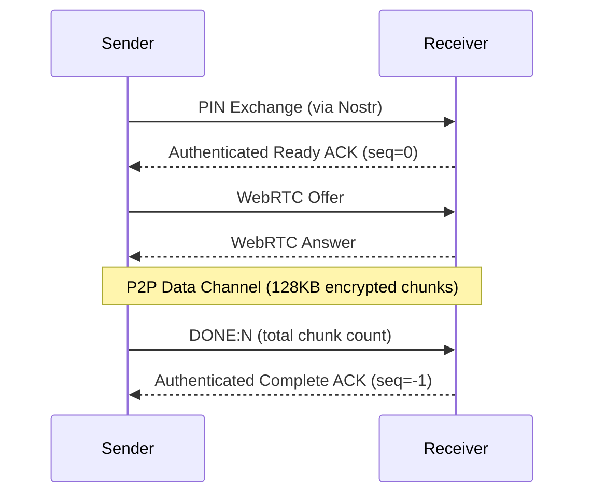
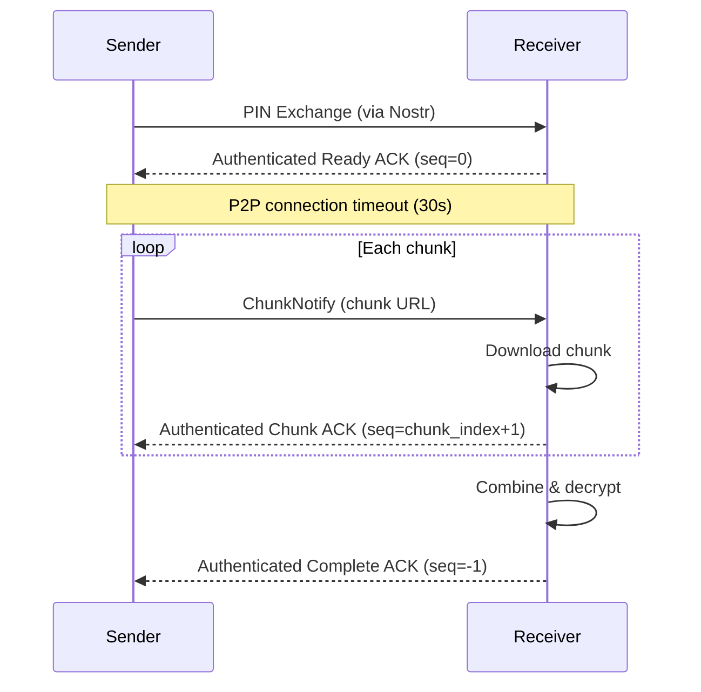
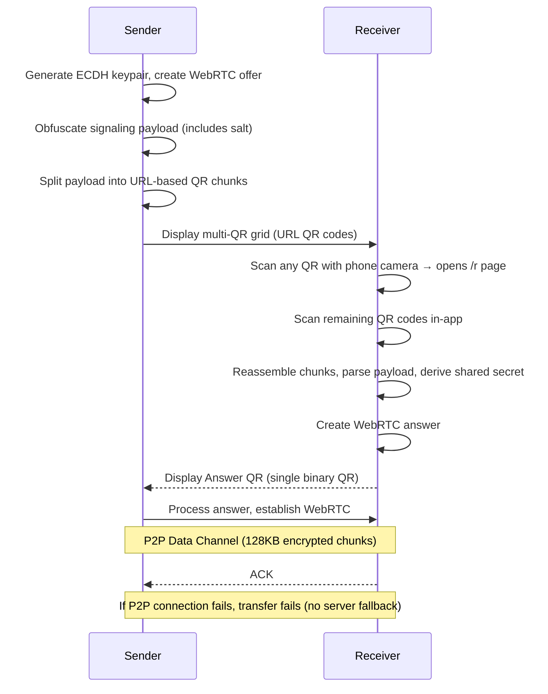
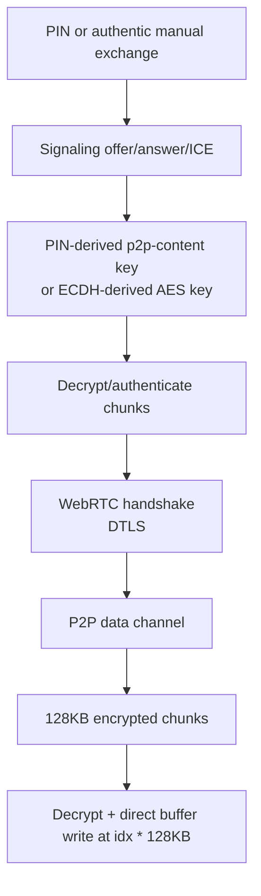

# Architecture

## Overview

Secure Send is a browser-based encrypted file and folder transfer application. It supports PIN-based encryption for Nostr signaling, a manual exchange method (QR or copy/paste with time-bucketed obfuscation), and direct P2P (WebRTC) data transfer with optional cloud fallback (Nostr mode only).

## Core Principles

1. **P2P First**: Direct WebRTC connections are always preferred for data transfer.
2. **Shared P2P Chunk Encryption**: P2P content is encrypted at the application layer using AES-256-GCM in 128KB chunks regardless of transport encryption. Cloud fallback encrypts the whole file first, then uploads in 10MB chunks.
3. **Memory-Efficient Streaming**: P2P receive paths write decrypted chunks directly into a growing buffer. Manual Exchange receive temporarily buffers encrypted chunks before decrypting into a preallocated output buffer.
4. **Pluggable Signaling**: Signaling (Nostr, QR) is decoupled from the transfer layer. The same encrypted chunk framing is used for file content regardless of signaling method.
5. **Dual PIN Representation (Nostr mode)**: A 12-character alphanumeric PIN serves as the Nostr shared secret. To improve shareability (e.g., via voice), this PIN can be bijectively mapped to a 7-word sequence from the BIP-39 wordlist.

## Signaling Methods

By default, Nostr is used for signaling. QR/Manual exchange is available as an alternative under "Advanced Options" in the UI. Both sender and receiver must use the same method.

| Feature | Nostr (Default) | Manual Exchange (No Signaling Server) |
|---------|-----------------|---------------------------------------|
| Signaling Server | Decentralized relays | None (QR or copy/paste) |
| STUN/TURN | Yes (Google + Cloudflare STUN; optional TURN) | Yes (same WebRTC config) |
| Cloud Fallback | Yes (multi-provider upload fallback) | No |
| Reliability | Higher (fallback available) | P2P only |
| Privacy | Better (no central server) | No signaling server; QR/clipboard payload is only obfuscated |
| Complexity | More complex | Manual exchange (QR or copy/paste) |
| Internet Required | Yes | No (if on same local network) |
| Network Requirement | Any (via internet) | Same local network (without internet) |
| Recommended For | Unreliable networks, NAT issues | Offline transfers, local network only |

## Transfer Flow

### Nostr Mode - P2P Success Path (Preferred)

```mermaid
sequenceDiagram
    participant Sender
    participant Receiver
    Sender->>Receiver: PIN Exchange (via Nostr)
    Receiver-->>Sender: Authenticated Ready ACK (seq=0)
    Sender->>Receiver: WebRTC Offer
    Receiver-->>Sender: WebRTC Answer
    Note over Sender,Receiver: P2P Data Channel (128KB encrypted chunks)
    Sender->>Receiver: DONE:N (total chunk count)
    Receiver-->>Sender: Authenticated Complete ACK (seq=-1)
```

### Cloud Fallback Path (Nostr Mode - When P2P Connection Fails)

```mermaid
sequenceDiagram
    participant Sender
    participant Receiver
    Sender->>Receiver: PIN Exchange (via Nostr)
    Receiver-->>Sender: Authenticated Ready ACK (seq=0)
    Note over Sender,Receiver: P2P connection timeout (30s)
    loop Each chunk
        Sender->>Receiver: ChunkNotify (chunk URL)
        Receiver->>Receiver: Download chunk
        Receiver-->>Sender: Authenticated Chunk ACK (seq=chunk_index+1)
    end
    Receiver->>Receiver: Combine & decrypt
    Receiver-->>Sender: Authenticated Complete ACK (seq=-1)
```

### Manual Exchange Mode (No Internet Required)

```mermaid
sequenceDiagram
    participant Sender
    participant Receiver
    Sender->>Sender: Generate ECDH keypair, create WebRTC offer
    Sender->>Sender: Obfuscate signaling payload (includes salt)
    Sender->>Sender: Split payload into URL-based QR chunks
    Sender->>Receiver: Display multi-QR grid (URL QR codes)
    Receiver->>Receiver: Scan any QR with phone camera → opens /r page
    Receiver->>Receiver: Scan remaining QR codes in-app
    Receiver->>Receiver: Reassemble chunks, parse payload, derive shared secret
    Receiver->>Receiver: Create WebRTC answer
    Receiver-->>Sender: Display Answer QR (single binary QR)
    Sender->>Receiver: Process answer, establish WebRTC
    Note over Sender,Receiver: P2P Data Channel (128KB encrypted chunks)
    Receiver-->>Sender: ACK
    Note over Sender,Receiver: If P2P connection fails, transfer fails (no server fallback)
```

**Requirements:**
- Receiver needs a phone camera to scan the sender's URL QR codes (or can use clipboard copy/paste as fallback)
- Sender needs a camera OR clipboard to receive the answer back

**Network Requirements:**
- **With internet**: Works across different networks (STUN server enables NAT traversal)
- **Without internet**: Devices must be on same local network (WiFi, LAN, etc.)
- **Not air-gapped**: Requires some network connectivity between devices

**How it works:**
- With internet: STUN server (stun.l.google.com) enables connections across different networks via NAT traversal
- Without internet: WebRTC discovers local ICE candidates directly, connection establishes via local IP addresses

**QR Code Format:**

*Sender → Receiver (Offer):* Multi-QR URL-based chunking
- Offer payload uses `maxDataBytes = 400` payload bytes per chunk (headers are added after payload slicing).
- Chunk wire format (raw bytes before base64url):
  - `chunk_index`: `u8` (1 byte, 0-based)
  - `total_chunks`: `u8` (1 byte, valid range `1..255`)
  - `payload_crc32_be_u32` (carried only in chunk `0`): 4-byte big-endian CRC-32/ISO-HDLC over the full reassembled payload (poly `0x04C11DB7`, reflected input/output, init `0xFFFFFFFF`, xorout `0xFFFFFFFF`; reflected table form `0xEDB88320`)
  - Chunk `0`: `[chunk_index:u8][total_chunks:u8][payload_crc32_be_u32][data]`
  - Chunk `1..N-1`: `[chunk_index:u8][total_chunks:u8][data]`
- Header overhead and usable payload bytes:
  - Chunk `0` header size: `6` bytes (`chunk_index` 1 + `total_chunks` 1 + `payload_crc32_be_u32` 4) -> usable payload data up to `400` bytes, raw chunk bytes up to `406`.
  - Chunk `1..N-1` header size: `2` bytes (`chunk_index` 1 + `total_chunks` 1) -> usable payload data up to `400` bytes, raw chunk bytes up to `402`.
- Chunk data rebalancing (to avoid a tiny last QR payload):
  - After `total_chunks = ceil(payload_bytes / 400)` is chosen, data bytes are distributed evenly: `base_size = floor(payload_bytes / total_chunks)`, `remainder = payload_bytes % total_chunks`.
  - The first `remainder` chunks carry `base_size + 1` data bytes; the remaining chunks carry `base_size` data bytes (difference between chunk payload sizes is at most 1 byte).
- Base64url size expansion (for raw chunk length `n` bytes, unpadded):
  - `n % 3 == 0` -> encoded length `4 * (n / 3)`
  - `n % 3 == 1` -> encoded length `4 * floor(n / 3) + 2`
  - `n % 3 == 2` -> encoded length `4 * floor(n / 3) + 3`
- Typical `1200`-byte payload example:
  - `total_chunks = ceil(1200 / 400) = 3` (data slices are `400`, `400`, `400` bytes).
  - Chunk `0`: `406` raw bytes -> `542` base64url chars in hash payload -> URL fragment `#` length `543` chars (`/r#` length `545`, excluding origin).
  - Chunk `1`: `402` raw bytes -> `536` base64url chars in hash payload -> URL fragment `#` length `537` chars (`/r#` length `539`, excluding origin).
  - Chunk `2`: same as chunk `1`.
- Limits implied by the `u8` headers:
  - Maximum chunks: `255` (`chunk_index` valid range `0..254`, with `chunk_index < total_chunks`)
  - With `400` data bytes per chunk, maximum payload size is `102,000` bytes (`255 * 400`) before base64url encoding.
- CRC32 sequencing and failure handling:
  - CRC32 is carried only in chunk `0`; receivers MUST buffer chunk `1..N-1` data until chunk `0` is received (this spec does not define a streaming-without-chunk-0 mode).
  - CRC32 validation is deferred until full reassembly is complete and chunk `0` (with `payload_crc32_be_u32`) is available.
  - On CRC32 failure after full reassembly, receivers MUST drop the reassembled payload, log a checksum/protocol error, and fail the current transfer attempt (retry/rescan is an implementation-level recovery action).
- Each chunk is base64url-encoded and embedded in a URL: `{origin}/r#{base64url}`
- Deployment requirement: app must be hosted at domain root (no subpath), because chunk URLs are built from `window.location.origin` and append `/r` directly
- Displayed as a grid of text-mode QR codes, each scannable by a phone's native camera
- For a typical `1200`-byte offer: `3` QR codes. Single-chunk payloads (`≤400` payload bytes) produce `1` QR code.
- Copy/paste fallback: base64-encoded full binary for clipboard

*Receiver → Sender (Answer):* Single binary QR code
- Answer payloads are smaller (no file metadata) and use a single binary QR code (8-bit byte mode)
- The sender is already in-app with scanner active, so URL navigation is unnecessary
## Key Components

### Cryptography (`src/lib/crypto/`)

| Component | Description |
|-----------|-------------|
| `pin.ts` | Alphanumeric (12-char) and Word (7-word) PIN handling, weighted checksums, signaling detection |
| `kdf.ts` | Key derivation using PBKDF2-SHA256 (600,000 iterations) |
| `ecdh.ts` | Unauthenticated ECDH key agreement (non-extractable keys) used by manual exchange mode |
| `aes-gcm.ts` | AES-256-GCM encryption/decryption |
| `stream-crypto.ts` | Streaming encryption/decryption (128KB chunks, protocol-agnostic) |
| `constants.ts` | Crypto parameters, charsets (69 chars), BIP-39 wordlist (2048 words) |

### PIN Architecture

Secure Send uses a sophisticated PIN system designed for both security and user-friendliness.

#### Alphanumeric Representation (Base-69)
- **Length**: 12 characters.
- **Charset**: 69 URL-safe characters (mixed case + digits + symbols).
- **Entropy**: ~65.6 bits for generated Nostr PINs (`23 * 69^10`).
- **First Character**: Encodes the signaling method in the PIN helper layer. Nostr uses 23 uppercase letters excluding I/L/O. The `'2'` manual/QR prefix is reserved by the PIN helpers, but the current Manual Exchange flow uses QR/clipboard payloads rather than PIN authentication.
- **Last Character**: Weighted position-based checksum character.

#### Word-Based Representation (Base-2048)
- **mapping**: 7 words from the standard English BIP-39 wordlist.
- **Bijective**: Mapping between alphanumeric and word forms is lossless and 1:1, achieved using BigInt-based base conversion.
- **Validation**: Each word is individually validated against the 2048-word dictionary.

#### Typo Detection (Weighted Checksum)
To protect against manual entry errors, the PIN includes a custom checksum:
- **Algorithm**: `sum(char_index * (position + 1)) % charset_size`.
- **Detection**: Effectively catches single-character errors and swaps (transpositions).
- **Independent Validation**: Both characters and word sequences are validated against the same underlying checksum logic.

#### PIN Hint / Fingerprint
Two **separate** one-way derivations of the PIN, deliberately using **different algorithms** suited to their threat models (`computePinHint` / `computePinHintFromKey` / `computePinFingerprint` in `src/lib/crypto/pin.ts`). Both expose nothing about the PIN itself, both truncate to the first **16 hex characters (64 bits)**, and both are salted distinctly from the per-transfer random salt used for labeled transfer keys, so neither is ever equal to any transfer key-derivation output. The **wire hint** (which is published) uses the slow 600,000-iteration `PBKDF2-SHA256`; the **fingerprint** (which is never published) uses a single fast `SHA-256` — see the rationale in each bullet below.

- **Wire hint — time-bucketed Nostr lookup tag** (`computePinHint`): salt = `"secure-send:pin-hint:v1:<bucket>"`, where `<bucket> = floor(now_seconds / PIN_HINT_BUCKET_SEC)` and `PIN_HINT_BUCKET_SEC = 3600` (1 hour). Published as the `['h', hint]` tag on the PIN exchange event (kind 24243). Bucketing the salt rotates the published tag every hour so it cannot be used as a stable long-lived correlator across transfers — the same per-time-bucket treatment the manual QR/clipboard payload gets from its XOR obfuscation.
  - **Receiver look-back**: because the sender's tag is tied to the bucket it published in, the receiver derives **both** the current bucket (offset 0) and the previous bucket (offset 1) from its imported PIN key material (`computePinHintFromKey`) and filters `#h` on `[currentHint, prevHint]`. Since the bucket width equals the transfer lifetime (`TRANSFER_EXPIRATION_MS = 1 hour`), a non-expired event's bucket is **always** the receiver's current or immediately-previous bucket, so this single look-back provably covers the whole valid window (it handles the boundary case where the sender published just before a rollover). The ACK echoes back the exact hint that matched.
  - 64 bits is birthday-collision-free at any realistic concurrent-transfer scale; the receiver queries up to 10 matching events and tries to decrypt each, so the rare collision is tolerated rather than fatal.
- **Fingerprint — stable visible checksum** (`computePinFingerprint`): `SHA-256("secure-send:pin-hint:v1:" ‖ pin)` (the fixed `PIN_HINT_SALT`, **no** time bucket, **no** PBKDF2 stretching). Displayed to both parties (grouped as `XXXX-XXXX-XXXX-XXXX` by `formatPinHint`) as a one-way checksum; the receiver computes it locally after entering the PIN and matching fingerprints confirm both sides derived the same secret. It is **never published to relays** — it exists only for human visual comparison — so it is kept time-independent (both sides always display the same value, even across an hour-bucket rollover). Because no attacker ever receives the fingerprint, the PBKDF2 work-factor would protect nothing here, so a fast hash is used to keep PIN entry/display snappy; it still cannot be reversed to recover the PIN or used to decrypt any data.
- **Why two values / two algorithms**: the wire hint sits on a public relay, so it must (a) rotate hourly to avoid being a stable cross-transfer correlator and (b) carry the full 600k-iteration PBKDF2 work-factor so that reversing the *published* tag back to a PIN is as expensive as attacking the ciphertext. The fingerprint has neither concern — it never leaves the device — so it must instead stay **constant** (a rotating fingerprint would intermittently mismatch between sender and receiver near a bucket boundary) and can skip the expensive stretching entirely. The fixed public salt still domain-separates the fingerprint from every other PIN derivation.
- **Not the security boundary**: neither value gates confidentiality — the hint only *locates* the event and the fingerprint only *confirms* the PIN. Confidentiality rests entirely on the labeled PIN-derived AES keys. The published wire hint gives an attacker no shortcut: reversing it to a PIN requires brute-forcing the full PIN space (~65.6 bits, Nostr) at 600,000 iterations per guess — the same cost as attacking the ciphertext directly. The fingerprint is cheap to reverse *if obtained*, but it is never transmitted or stored off-device, so it is not an attack surface.
- **Scope — PIN-exchange lookup only**: the wire hint is used as the `#h` filter *solely* to locate the initial PIN exchange event (kind 24243). Everything afterward — WebRTC signaling, ACKs, and the **cloud-fallback `chunk_notify` events** — is filtered by `transferId` (`#t`), never by the hint. ACK bodies are separately encrypted with the PIN-derived `signals` key, so a public `transferId` cannot spoof receiver progress. The cloud path does not use the PIN hint at all, and the file content is never relayed through Nostr regardless. The hint therefore gates neither content nor cloud routing; it only needs to (a) avoid lookup collisions and (b) be a non-reversible, non-correlatable lookup tag. **A future maintainer should not harden the hint as if it were a content-confidentiality control — that would be solving a problem the hint does not own.**

### User Interface Architecture

#### `PinInput` (Receiver Side)
The input component is designed for high-performance manual entry:
- **Independent State**: Alphanumeric and Word modes maintain separate internal buffers (`charPinRef` and `wordPinRef`). Toggling does not convert contents; it switches context.
- **7-Box Word Grid**: Word entry uses individual inputs for each of the 7 slots.
- **Smart Focus**: Automatically advances to the next box upon entry of a valid word, space, or enter key.
- **Real-time Autocomplete**: 
  - Consults the BIP-39 wordlist starting from the first character.
  - Supports keyboard navigation (Arrows) and quick selection (Tab/Enter).
- **Robust Pasting**: 
  - Handles multi-word strings (comma/space/newline separated).
  - Validates all words in the pasted sequence before populating the grid.

#### `PinDisplay` (Sender Side)
The display component focuses on secure and clear communication:
- **Masking**: Automatically masks the PIN after the first copy operation to prevent shoulder surfing.
- **Contextual Copy**: The "Copy" button copies whichever format is currently visible (characters or words).
- **Ephemeral Visibility**: Includes a countdown progress bar showing remaining TTL until the local display expires.

**Key Parameters:**
- `MAX_MESSAGE_SIZE`: 100MB (maximum file size)
- `CLOUD_CHUNK_SIZE`: 10MB (chunk size for cloud uploads)
- `ENCRYPTION_CHUNK_SIZE`: 128KB (application-level encryption chunk size for all methods)
- `PBKDF2_ITERATIONS`: 600,000

### Nostr Signaling (`src/lib/nostr/`)

Uses Nostr protocol for decentralized signaling between sender and receiver.

**Event Kinds:**
| Kind | Purpose |
|------|---------|
| 24243 | PIN Exchange - Contains encrypted transfer metadata |
| 24242 | Data Transfer - ACKs, WebRTC signals, chunk notifications |

**Event Types (via tags):**
- `pin_exchange`: Initial transfer setup
- `ack`: Acknowledgments (seq=0 ready, seq=N chunk, seq=-1 complete); tags are plaintext for filtering, while the event body is AES-GCM encrypted with the PIN-derived `signals` key and repeats the transfer/sequence for authentication
- `signal`: WebRTC signaling (offer/answer/candidates)
- `chunk_notify`: Cloud chunk URL notification

**Files:**
- `types.ts`: Type definitions for payloads and events
- `events.ts`: Event creation and parsing functions
- `client.ts`: Nostr relay connection management
- `relays.ts`: Default relay configuration
- `availability.ts`: Relay availability probing

### Manual Exchange Signaling (`src/lib/manual-signaling.ts`)

Signaling method using QR codes or copy/paste for WebRTC offer/answer exchange. Camera is optional; signaling data can be exchanged via clipboard. **Network requirements:** With internet, works across different networks via STUN. Without internet, devices must be on same local network (not air-gapped - requires network connectivity).

**How it works:**
- Sender generates WebRTC offer with ICE candidates
- Both offer and answer include a required `createdAt` timestamp; receivers refuse to proceed if the offer is expired or missing TTL
- Payload is obfuscated using a time-bucketed seed to avoid casual inspection.

> [!IMPORTANT]
> **Security boundary**: Manual signaling payloads are not cryptographically confidential. The time-bucketed obfuscation deters casual inspection and the 1-hour TTL prevents stale offers from starting a session, but someone who captures the QR/clipboard payload can potentially recover metadata and SDP/ICE details. File-content confidentiality comes from the ECDH-derived AES-256-GCM key, assuming the offer and answer are exchanged over an authentic QR/clipboard path.

**Binary Payload Format (SS03):**

The payload consists of two distinct layers to balance rapid identification with obfuscation of the content.

| Component | Length | Status | Description |
|-----------|--------|--------|-------------|
| **Outer Magic** | 4 bytes | Plaintext | Fixed header: `"SS03"` (`0x53 0x53 0x30 0x33`) |
| **Inner Buffer** | Variable | **Obfuscated** | Time-bucketed XOR-obfuscated content (detailed below) |

**Obfuscated Inner Buffer Structure:**

The following structure is revealed *after* successful de-obfuscation using the correct hourly seed:

| Component | Length | Status | Description |
|-----------|--------|--------|-------------|
| **Inner Magic** | 4 bytes | Obfuscated | Fixed marker: `"mag!"` (`0x6d 0x61 0x67 0x21`) |
| **Payload** | Variable | Obfuscated | Deflate-compressed `SignalingPayload` JSON |

**Verification Process:**
1. **Identification**: The receiver checks the first 4 bytes for the plaintext `"SS03"` header.
2. **Seed Testing**: The receiver iterates through candidate seeds for the current and previous hour (2-hour sliding window). 
3. **Optimized Check**: For each candidate seed, only the first 4 bytes of the inner buffer are de-obfuscated. If they match the `"mag!"` marker, the correct seed has been found.
4. **Full Processing**: The rest of the buffer is de-obfuscated, decompressed via deflate, and parsed as JSON.

**Time-Bucketed Obfuscation:**

The obfuscation seed changes every hour to make the payload **look more random** and limit casual reuse. This provides several benefits:
- **Casual Protection**: Offers a layer of deterrence against casual non-technical observers by making the raw data unreadable without the correct hourly seed.
- **Stale Session Prevention**: Combined with the explicit `createdAt` TTL checks, stale signaling data cannot start a new transfer session.
- **Payload Randomness**: Ensures that signaling data generated at different times results in significantly different binary outputs.

Primary file-content confidentiality is provided by ECDH + AES-256-GCM (see note above); obfuscation is additive and not a cryptographic control.

- **Bucket Size**: 1 hour (`3600` seconds).
- **Input (`bucketEpoch`)**: `floor(unix_timestamp_seconds / 3600)`.
- **Base Seed**: `0x9e3779b9`.
- **Algorithm**: A 32-bit MurmurHash3-style finalizer/mixer.

**Seed Derivation Steps:**
To ensure cross-implementation compatibility, the seed MUST be derived using the following steps (using 32-bit signed integer multiplication and unsigned right shifts):

1.  Initialize: `h = 0x9e3779b9 ^ bucketEpoch`
2.  Mix 1: `h = (h ^ (h >>> 16)) * 0x85ebca6b`
3.  Mix 2: `h = (h ^ (h >>> 13)) * 0xc2b2ae35`
4.  Finalize: `seed = (h ^ (h >>> 16)) >>> 0`

*Note: In environments like JavaScript, `Math.imul` should be used for the multiplication steps to ensure consistent 32-bit integer behavior.*

**Obfuscation Parse Window & Edge Cases:**
A 2-hour sliding window (current bucket + 1 previous bucket) is used to find the obfuscation seed. This is separate from the hard 1-hour session TTL enforced via `createdAt`.

-   **Session Validity**: A parsed payload is still rejected once `Date.now() - createdAt > TRANSFER_EXPIRATION_MS`.
-   **Parseability Window**: A payload may remain parseable for roughly 1-2 hours depending on bucket boundaries, but parseability does not imply transfer validity.
-   **Clock Drift Tolerance**: The window provides inherent tolerance for clock drift (+/- 1 hour).
-   **Boundary Transitions**: When the hour rolls over, the previous bucket is dropped, and the new hour becomes the current bucket.
-   **Out-of-Sync Clocks**: If the sender and receiver clocks differ by more than the window's tolerance (e.g., >1 hour fast or slow), de-obfuscation will fail.

> [!NOTE]
> The obfuscation's goal is simply to avoid casual inspection. It should not be treated as encryption, and expiry is not cryptographic erasure of a captured QR/clipboard payload.

**Encoding Pipeline:**
1. `SignalingPayload` object → JSON string.
2. Compress with deflate (variable length).
3. Prepend fixed-length `"mag!"` marker (4 bytes).
4. XOR-obfuscate this inner buffer with the current hourly seed.
5. Prepend fixed-length plaintext `"SS03"` header (4 bytes).
6. Result: Final binary payload.


**Output Methods:**

*Offer (Sender → Receiver):*
| Method | Encoding | Use Case |
|--------|----------|----------|
| Multi-QR URL | Chunked payload → base64url → URL QR codes | Primary: receiver scans with phone camera to open app |
| Copy/Paste | Base64-encoded full binary | Fallback: no camera, text-safe for clipboard |

*Answer (Receiver → Sender):*
| Method | Encoding | Use Case |
|--------|----------|----------|
| QR Code | SS03 obfuscated binary (single QR) | Camera available, sender already in-app |
| Copy/Paste | Base64-encoded binary | No camera, text-safe for clipboard |

**Key Features:**
- No signaling server required - manual exchange via QR scan or copy/paste
- Multi-QR offer: payload split into URL-based QR codes (~400 bytes each) for easy phone scanning
- Receiver scans any QR code with phone camera → app opens at `/r` route with first chunk → scans remaining codes in-app
- Copy/paste fallback for environments without camera
- No internet required when devices are on same local network
- With internet: works across different networks via STUN (stun.l.google.com) for NAT traversal
- Not air-gapped: requires network connectivity between devices (either local network or internet)
- URL QR codes use text mode (alphanumeric); answer QR uses binary mode (8-bit byte)
- Uses the bundled QR WASM packages for generation and scanning

**Security Model:**
- **Nostr**: PIN-derived labeled keys encrypt metadata/WebRTC signals/content and authenticate relay ACK bodies so public transfer IDs cannot advance the sender state machine
- **Manual**: Signaling is obfuscated and time-limited, not encrypted; content confidentiality is provided by ECDH-derived AES-256-GCM over the data channel when the QR/clipboard exchange is authentic
- **All modes**: Once WebRTC connection is established, DTLS encrypts all data in transit

### WebRTC (`src/lib/webrtc.ts`)

Handles direct peer-to-peer connections using WebRTC data channels.

**Features:**
- ICE candidate queuing for reliable connection establishment
- STUN servers for NAT traversal (`stun.l.google.com`, `stun.cloudflare.com`) with optional TURN via env vars
- 128KB encrypted chunk messages with backpressure (WebRTC handles fragmentation)
- Backpressure support (waits for buffer to drain before sending more data)
- Connection state monitoring

### Cloud Storage (`src/lib/cloud-storage.ts`)

Fallback storage when P2P connection cannot be established (30s timeout window). Not used if P2P connects successfully.

**Features:**
- Multiple upload servers with automatic failover
- Multiple CORS proxies for download redundancy
- Service health caching
- Chunked upload/download for files >10MB

**Current Services:**
- Upload: tmpfiles.org, litterbox.catbox.moe, uguu.se, x0.at
- CORS Proxies: corsproxy.io, cors.leverson83.org, api.codetabs.com, api.allorigins.win

### React Hooks (`src/hooks/`)

**`use-nostr-send.ts`** - Sender logic (Nostr):
1. Read content (encrypt only if cloud fallback is needed)
2. Publish PIN exchange (without cloud URL)
3. Wait for receiver ready ACK authenticated with the PIN-derived `signals` key
4. Attempt P2P connection (30s timeout for connection only)
5. If P2P connects: transfer via data channel (all-or-nothing, no cloud fallback)
6. If P2P connection fails: chunked cloud upload with authenticated ACK coordination
7. Wait for authenticated completion ACK

**`use-nostr-receive.ts`** - Receiver logic (Nostr):
1. Validate PIN and find exchange event
2. Validate decrypted metadata, then send authenticated ready ACK
3. Listen for P2P signals OR chunk notifications
4. If P2P: receive via data channel
5. If cloud: validate chunk notifications against decrypted metadata, download chunks, send authenticated ACKs, combine and decrypt
6. Send authenticated completion ACK

**Manual Exchange Mode:**

**`use-manual-send.ts`** - Sender logic (Manual Exchange):
1. Read content (file), validate size
2. Generate ECDH keypair and salt
3. Create WebRTC offer with ICE candidates
4. Wait for ICE gathering to complete
5. Obfuscate offer payload (includes salt, ECDH public key, file metadata): JSON → deflate → obfuscate → binary
6. Display as multi-QR URL grid (chunked into ~400-byte URL QR codes) + base64 copy button
7. Wait for user to input receiver's answer (scan or paste)
8. Process answer, derive shared secret from ECDH, establish WebRTC connection
9. Encrypt and send data in 128KB chunks via data channel
10. Wait for receiver ACK

**`use-manual-receive.ts`** - Receiver logic (Manual Exchange):
1. Wait for offer data (from multi-QR chunk collector or paste)
2. De-obfuscate offer, extract metadata, ECDH public key, and salt
3. Generate ECDH keypair, derive shared secret and AES key
4. Create WebRTC answer with ICE candidates
5. Obfuscate answer payload: JSON → deflate → obfuscate → single binary QR code
6. Display QR code and base64 copy button
7. Wait for WebRTC connection to establish
8. Receive encrypted chunks, store temporarily
9. After transfer complete, decrypt all chunks and write to preallocated buffer
10. Present content

**`use-chunk-collector.ts`** - Multi-QR chunk collection (used by `/r` receive page):
1. Parse incoming chunks (from URL fragment or scanned QR codes)
2. Track collection progress with `Map<index, data>`
3. Reject chunks with mismatched `total` (guards against mixing different offers)
4. Auto-reassemble when all chunks collected

## Data Encryption

### Unified Transfer Layer

Both signaling methods (Nostr, Manual Exchange) share the same encrypted chunk framing for P2P file content. The key source differs: Nostr uses the PIN-derived `p2p-content` AES key, while Manual Exchange uses an ECDH-derived AES key.

**Why encrypt when WebRTC provides DTLS?**
- **Defense in depth**: Multiple encryption layers protect against implementation bugs
- **Consistent chunk format**: P2P file data uses the same authenticated chunk layout in both modes
- **Key control**: File encryption keys are application-managed (PIN-derived for Nostr, ECDH-derived for Manual), not WebRTC keys
- **Verification**: Application-level encryption authenticates each chunk and its write position

### PIN Exchange Payload

In Nostr/PIN mode, the entire PIN exchange payload is encrypted with the PIN-derived `metadata` AES-GCM key before it is published to relays. This includes the file metadata fields (`fileName`, `fileSize`, and `mimeType`).

```typescript
interface PinExchangePayload {
  contentType: 'file'
  transferId: string
  senderPubkey: string
  totalChunks: number
  relays?: string[]
  // File metadata (if file)
  fileName?: string
  fileSize?: number
  mimeType?: string
}
```

### Encryption Flow

**PIN Mode:**
1. **PIN Generation**: 12-character from mixed charset (excluding ambiguous chars)
2. **Salt Generation**: 16 random bytes (included in signaling payload for receiver)
3. **Key Derivation**: PBKDF2-SHA256 with 600,000 iterations derives four domain-separated AES-GCM keys: `metadata`, `signals`, `p2p-content`, and `cloud-content`
4. **Chunk Encryption**: AES-256-GCM with 12-byte nonce per 128KB chunk using the `p2p-content` key

### What's Encrypted Where

| Data | Nostr P2P | Manual P2P | Cloud Transfer |
|------|-----------|------------|----------------|
| Signaling Payload | Encrypted (AES-GCM with PIN `metadata` key) | Obfuscated only; metadata and SDP/ICE are not cryptographically confidential | N/A |
| WebRTC Signals | Encrypted (AES-GCM with PIN `signals` key) | Included in obfuscated QR/clipboard offer/answer | N/A |
| ACK body | Encrypted/authenticated (AES-GCM with PIN `signals` key; tags remain plaintext for relay filtering) | Plain data-channel ACK after authenticated chunk reassembly | Encrypted/authenticated Nostr ACK body with PIN `signals` key |
| File Content | Encrypted (AES-GCM with PIN `p2p-content` key, 128KB chunks, authenticated chunk index) | Encrypted (AES-GCM, 128KB chunks, authenticated chunk index) | Encrypted (AES-GCM with PIN `cloud-content` key, whole file) |
| Cloud chunk URL (`chunk_notify`) | N/A | N/A | **Plaintext** (relay sees it) |

> [!NOTE]
> The cloud `chunk_notify` event publishes the upload URL in **plaintext**, unlike the WebRTC signals in Nostr P2P mode. This is intentional and safe on its own: the blob at that URL is itself AES-256-GCM encrypted with the PIN-derived `cloud-content` key, so the URL is useless without the PIN, and the blob lives only briefly on a third-party host. The receiver accepts only sender-signed notifications whose transfer id, chunk count, index, and size match the already-decrypted metadata. A relay observer can still learn *where* a cloud blob is (and its size) without the PIN — it cannot decrypt the content. See [Leaked-PIN Exposure](#leaked-pin-exposure-including-after-expiry) for how this interacts with a later PIN leak.

### Streaming Encryption (All Methods)

All P2P transfers (Nostr, Manual Exchange) encrypt content in 128KB chunks using identical logic:

**Sender side:**
```typescript
for (let i = 0; i < contentBytes.length; i += ENCRYPTION_CHUNK_SIZE) {
  const plainChunk = contentBytes.slice(i, end)
  const encryptedChunk = await encryptChunk(key, plainChunk, chunkIndex)
  await connection.send(encryptedChunk)
  chunkIndex++
}
```

**Receiver side (Nostr P2P direct assembly):**
```typescript
// Preallocate single buffer based on expected size
let contentData = new Uint8Array(totalBytes)

// On each chunk received:
const { chunkIndex, encryptedData } = parseChunkMessage(encryptedChunk)
const decryptedChunk = await decryptChunk(key, encryptedData, chunkIndex)
const writePosition = chunkIndex * ENCRYPTION_CHUNK_SIZE
contentData.set(decryptedChunk, writePosition)  // Direct write, no intermediate storage
```

**Encrypted Chunk Format:**
```
[2 bytes: chunk index (big-endian)][12 bytes: nonce][ciphertext][16 bytes: auth tag]
```

The 2-byte chunk index is also passed to AES-GCM as additional authenticated data. A receiver rejects the chunk if the index prefix is changed or swapped with another chunk's ciphertext.

**Benefits:**
- **Defense in depth**: AES-GCM on top of WebRTC DTLS
- **Streaming decryption in Nostr P2P**: Each chunk is decrypted as it arrives
- **Bounded manual receive buffering**: Manual Exchange currently buffers encrypted chunks until `DONE:N`, validates the advertised chunk count/size, then decrypts into a preallocated output buffer
- **Memory efficiency**: Nostr P2P and cloud fallback use preallocated buffers with direct position writes; Manual Exchange avoids plaintext buffering before authentication but keeps encrypted chunks temporarily
- **Out-of-order handling**: Chunks can arrive in any order and be placed correctly


```mermaid
flowchart TD
    Secret[PIN or authentic manual exchange] --> Signaling[Signaling offer/answer/ICE]
    Signaling --> Key[PIN-derived p2p-content key<br/>or ECDH-derived AES key]
    Key --> Decrypt[Decrypt/authenticate chunks]
    Decrypt --> DTLS[WebRTC handshake<br/>DTLS]
    DTLS --> Channel[P2P data channel]
    Channel --> Chunks[128KB encrypted chunks]
    Chunks --> Write[Decrypt + direct buffer write at idx * 128KB]
```

### Cloud Transfer Memory Efficiency (Nostr Fallback)

Cloud transfers use the same memory-efficient receiving pattern:

```typescript
// Preallocate buffer based on decrypted metadata plus AES-GCM overhead
const expectedEncryptedCloudSize = fileSize + AES_NONCE_LENGTH + AES_TAG_LENGTH
let cloudBuffer = new Uint8Array(expectedEncryptedCloudSize)

// On each cloud chunk downloaded:
const writePosition = chunkIndex * CLOUD_CHUNK_SIZE
cloudBuffer.set(chunkData, writePosition)  // Direct write, no intermediate storage
```

Cloud notifications are accepted only when the sender-signed chunk index, count, and size match the decrypted transfer metadata, so the receiver preallocates the exact encrypted blob size instead of trusting relay-visible notification values. Manual Exchange receive still temporarily buffers encrypted chunks before decrypting, but it rejects extra, duplicate, out-of-range, and oversized encrypted chunks against the advertised transfer size.

## Size Limits

| Limit | Value | Rationale |
|-------|-------|-----------|
| Max file size | 100MB | Memory constraints, cloud service limits |
| Encryption chunk size | 128KB | Balance of encryption overhead and streaming efficiency |
| Cloud chunk size | 10MB | Per-upload limit, memory efficiency |
| PIN length | 12 chars | Balance of usability and security |

## Timeout Configuration

| Timeout | Duration | Purpose |
|---------|----------|---------|
| P2P connection | 30 seconds | Time to establish WebRTC connection (offer/answer/ICE/channel open) |
| P2P offer retry | 5 seconds | Interval to retry WebRTC offer if no answer received |
| P2P data transfer | Unlimited | Once connected, data transfer has no timeout |
| Chunk ACK | 5 minutes | Time to download and acknowledge a cloud chunk |
| Overall transfer | 10 minutes | Maximum time for entire transfer (receiver side) |
| Transfer TTL | 1 hour | Transfer session validity (`TRANSFER_EXPIRATION_MS`) |
| Receiver PIN inactivity | 5 minutes | Clears PIN input if no changes made |

## TTL / Expiration Spec

Secure Send enforces a hard session TTL. Expired requests MUST NOT establish a session or begin transfer, even if the PIN/key is correct.

**Duration**
- `TRANSFER_EXPIRATION_MS` (currently 1 hour)

**TTL Anchor (start time)**
- **Nostr**: PIN exchange event `created_at` (seconds since epoch)
- **Manual Exchange**: `SignalingPayload.createdAt` (milliseconds since epoch)

**Enforcement Points (hard fail)**
- **Receiver-side (pre-session)**:
  - Reject expired/missing TTL before acknowledging or establishing a session (no `ready` ACK in Nostr; no WebRTC answer in Manual).
- **Sender-side (pre-transfer)**:
  - Re-check TTL immediately before sending any data (including at WebRTC DataChannel open and before any cloud upload fallback).

**No Backward Compatibility**
- Requests/payloads missing TTL fields are rejected (treated as invalid).
- Nostr P2P completion requires `DONE:N` (legacy `DONE` without chunk count is unsupported).
- Multi-QR offer links require `/r#...` (raw hash payload, no `d=` prefix) and first-chunk CRC32 metadata; older URL or chunk formats are rejected.

## Leaked-PIN Exposure (Including After Expiry)

The session TTL is a **liveness control, not cryptographic erasure**: it stops the sender from starting/continuing a transfer past the hour and sets a NIP-40 `expiration` tag (relays *may* auto-delete), but it does not re-key or guarantee deletion of events a relay already received. So "what if the PIN leaks *after* the session expires?" reduces to "what does the PIN decrypt among events a relay chose to retain?" — and expiry does not change that answer.

- **File content is never recoverable from Nostr — before or after expiry.** P2P data travels over WebRTC/DTLS and never touches a relay. A leaked PIN therefore yields *no* file ciphertext from Nostr; there is simply nothing there to decrypt.
- **What a leaked PIN can decrypt** (from retained, PIN-encrypted events): transfer metadata (`fileName`/`fileSize`/`mimeType`, `transferId`, sender pubkey) and WebRTC signaling (SDP + ICE candidates, which reveal the peers' **IP addresses**). This is the real residual exposure — *what* and *who*, not the content.
- **Cloud fallback is bounded by the cloud host, not the Nostr TTL.** The encrypted file blob is uploaded to a third-party host (tmpfiles/litterbox/etc.), never to a relay; only its `chunk_notify` URL is published (in clear). A leaked PIN can decrypt such a blob *only while it remains live on the cloud host* (short retention, e.g. ~1h). Once the host expires it, the PIN unlocks nothing.
- **Single-use PIN bounds the blast radius to one transfer.** Each transfer has its own PIN, ephemeral keypair, and random key-derivation salt (the salt rides in the clear `'s'` tag, so the relay always has it — the PIN is the only missing factor). A leaked PIN compromises only that transfer's retained artifacts and gives zero leverage against any other transfer. (Per-transfer key uniqueness, not PFS — see Security Considerations.)

**Takeaway:** the "data off-Nostr + single-use PIN" design means a post-expiry PIN leak cannot recover file content for P2P transfers, and only within the cloud host's short window for the fallback path. The exposure it *does* carry is per-transfer metadata and participant IPs from retained signaling, mitigated (best-effort) by NIP-40 deletion.

## Security Considerations

1. **Ephemeral Keys**: New keypair generated for each transfer
2. **Per-transfer Labeled Keys**: Nostr PIN-derived keys are unique per transfer through random salts and domain-separated labels (`metadata`, `signals`, `p2p-content`, `cloud-content`), but this is not true Perfect Forward Secrecy (PFS). Manual mode uses ephemeral ECDH keys, but peer authentication still depends on the QR/clipboard exchange path.
3. **No Server Trust for File Content**: Cloud storage sees encrypted file payloads, while relays see signaling/routing metadata; file plaintext never leaves the device
4. **PIN Entropy**: ~65.6 bits for Nostr (`23 * 69^10`). The first character is restricted (signaling-method encoding) and the trailing checksum character is deterministic, so neither contributes full entropy.
5. **Brute-Force Resistance**: 600K PBKDF2 iterations for PIN mode
6. **PIN Role**: In Nostr mode, the PIN derives separate keys for metadata, signaling/control, P2P content, and cloud content
7. **Authenticated Nostr Progress**: Nostr ACK bodies are encrypted with the PIN-derived `signals` key and checked against their plaintext routing tags, so relay observers cannot spoof ready/chunk/completion progress with only the public transfer id
8. **Transport Security**: All P2P transfers (Nostr, Manual Exchange) use both AES-256-GCM encryption (128KB chunks) and WebRTC DTLS
9. **Manual Authentication Caveat**: Manual ECDH is unauthenticated by itself. An attacker who can substitute the QR/clipboard offer or answer can mount a man-in-the-middle attack. Use a direct visual/local exchange path when active tampering matters.
10. **Shared Chunk Security**: P2P file chunks use the same AES-GCM chunk framing in both modes, including authenticated chunk indices
11. **XSS Protection**: Sensitive cryptographic material (shared secrets, key derivation functions) stored in closure scope, not on global `window` object
12. **Resource Cleanup**: All error paths properly clean up timeouts and subscriptions to prevent resource leaks
13. **Input Validation**: Cryptographic functions and receive paths validate sizes/counts before expensive operations where possible

## File Structure

```
src/
├── lib/
│   ├── crypto/              # Cryptographic functions
│   │   ├── constants.ts     # Parameters and limits
│   │   ├── pin.ts           # PIN generation/validation
│   │   ├── kdf.ts           # Key derivation (PBKDF2)
│   │   ├── ecdh.ts          # ECDH key exchange (manual exchange mode)
│   │   ├── aes-gcm.ts       # Encryption/decryption
│   │   └── stream-crypto.ts # Streaming chunk encryption (P2P)
│   ├── nostr/               # Nostr protocol (signaling option 1)
│   │   ├── types.ts         # Type definitions
│   │   ├── events.ts        # Event creation/parsing
│   │   ├── client.ts        # Relay client
│   │   └── relays.ts        # Default relays
│   ├── manual-signaling.ts  # Manual exchange signaling (signaling option 2)
│   ├── chunk-utils.ts       # Multi-QR chunking/reassembly utilities
│   ├── qr-utils.ts          # QR code generation wrapper (fast-qr-wasm worker)
│   ├── webrtc.ts            # WebRTC connection management
│   ├── cloud-storage.ts     # Cloud fallback (Nostr mode only)
│   └── file-utils.ts        # File reading utilities
├── workers/
│   ├── qrGenerator.worker.ts    # QR generation (fast-qr-wasm)
│   └── rxing-qr-scanner.worker.ts # QR scanning (rxing-wasm)
├── hooks/
│   ├── use-nostr-send.ts    # Sender hook (Nostr mode)
│   ├── use-nostr-receive.ts # Receiver hook (Nostr mode)
│   ├── use-manual-send.ts   # Sender hook (Manual Exchange mode)
│   ├── use-manual-receive.ts # Receiver hook (Manual Exchange mode)
│   ├── use-chunk-collector.ts # Multi-QR chunk collection state management
│   └── useQRScanner.ts      # Camera-based QR scanning hook
├── components/
│   └── secure-send/
│       ├── qr-display.tsx   # Binary QR code display (single QR, used for answer)
│       ├── multi-qr-display.tsx # Multi-QR URL grid display (used for offer)
│       ├── qr-scanner.tsx   # QR scanner (binary mode)
│       └── qr-input.tsx     # Dual input (scan or paste)
└── pages/
    ├── send.tsx             # Send page
    ├── receive.tsx          # Receive page
    ├── receive-chunked.tsx  # Multi-QR chunked receive page (/r route)
    └── about.tsx            # About page
```

**Crypto parameters**: Key tunables like `PBKDF2_ITERATIONS`, `ENCRYPTION_CHUNK_SIZE`, and `CLOUD_CHUNK_SIZE` live in [src/lib/crypto/constants.ts](src/lib/crypto/constants.ts) for quick lookup.
