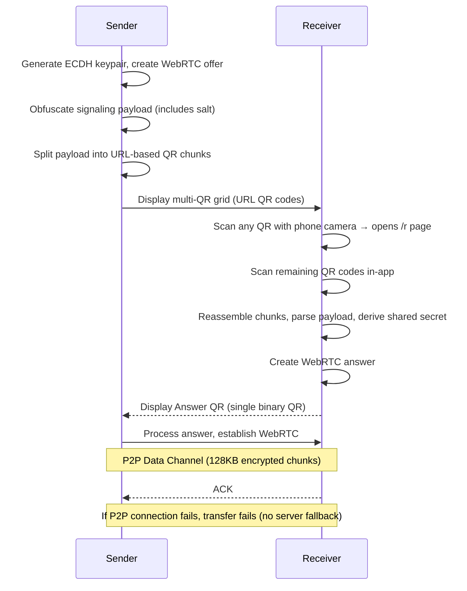

# Architecture

## Overview

Secure Send is a browser-based encrypted file and folder transfer application. It supports PIN-based or passkey-based encryption for Nostr signaling, a manual exchange method (QR or copy/paste with time-bucketed obfuscation), and direct P2P (WebRTC) data transfer with optional cloud fallback (Nostr mode only).

## Core Principles

1. **P2P First**: Direct WebRTC connections are always preferred for data transfer.
2. **Protocol-Agnostic Encryption**: P2P content is encrypted at the application layer using AES-256-GCM in 128KB chunks regardless of transport encryption. Cloud fallback encrypts the whole file first, then uploads in 10MB chunks.
3. **Memory-Efficient Streaming**: P2P receive paths write decrypted chunks directly into a growing buffer. Manual Exchange receive temporarily buffers encrypted chunks before decrypting into a preallocated output buffer.
4. **Pluggable Signaling**: Signaling (Nostr, QR) is decoupled from the transfer layer. The same encryption/chunking logic is used regardless of signaling method.
5. **Dual PIN Representation**: A 12-character alphanumeric PIN serves as the shared secret. To improve shareability (e.g., via voice), this PIN can be bijectively mapped to a 7-word sequence from the BIP-39 wordlist.
6. **Passkey Support**: Alternative to PIN-based authentication using WebAuthn PRF extension. Keys are derived from hardware-backed secure elements (Touch ID, Face ID, Windows Hello) when passkeys are synced via password managers. See [Passkey Architecture](./PASSKEY_ARCHITECTURE.md#how-it-works) for details.

## Signaling Methods

By default, Nostr is used for signaling. QR/Manual exchange is available as an alternative under "Advanced Options" in the UI. Both sender and receiver must use the same method.

| Feature | Nostr (Default) | Manual Exchange (No Signaling Server) |
|---------|-----------------|---------------------------------------|
| Signaling Server | Decentralized relays | None (QR or copy/paste) |
| STUN/TURN | Yes (Google + Cloudflare STUN; optional TURN) | Yes (same WebRTC config) |
| Cloud Fallback | Yes (tmpfiles.org) | No |
| Reliability | Higher (fallback available) | P2P only |
| Privacy | Better (no central server) | Best (no signaling server) |
| Complexity | More complex | Manual exchange (QR or copy/paste) |
| Internet Required | Yes | No (if on same local network) |
| Network Requirement | Any (via internet) | Same local network (without internet) |
| Recommended For | Unreliable networks, NAT issues | Offline transfers, local network only |

## Transfer Flow

### Nostr Mode - P2P Success Path (Preferred)


### Cloud Fallback Path (Nostr Mode - When P2P Connection Fails)


### Manual Exchange Mode (No Internet Required)


**Requirements:**
- Receiver needs a phone camera to scan the sender's URL QR codes (or can use clipboard copy/paste as fallback)
- Sender needs a camera OR clipboard to receive the answer back

**Network Requirements:**
- **With internet**: Works across different networks (STUN server enables NAT traversal)
- **Without internet**: Devices must be on same local network (WiFi, LAN, etc.)
- **Not air-gapped**: Requires some network connectivity between devices

**How it works:**
- With internet: STUN server (stun.l.google.com) enables connections across different networks via NAT traversal
- Without internet: WebRTC discovers local ICE candidates directly, connection establishes via local IP addresses

**QR Code Format:**

*Sender → Receiver (Offer):* Multi-QR URL-based chunking
- Offer payload is split into ~400-byte chunks with a 2-byte header: `[chunk_index][total_chunks][data]`
- Each chunk is base64url-encoded and embedded in a URL: `{origin}/r?d={base64url}` (or `{origin}/#/r?d={...}` for HashRouter)
- Deployment requirement: app must be hosted at domain root (no subpath), because chunk URLs are built from `window.location.origin` and append `/r` or `/#/r` directly
- Displayed as a grid of text-mode QR codes, each scannable by a phone's native camera
- For a typical ~1200 byte offer: 3 QR codes. Single-chunk payloads (≤400 bytes) produce 1 QR code.
- Copy/paste fallback: base64-encoded full binary for clipboard

*Receiver → Sender (Answer):* Single binary QR code
- Answer payloads are smaller (no file metadata) and use a single binary QR code (8-bit byte mode)
- The sender is already in-app with scanner active, so URL navigation is unnecessary
## Key Components

### Cryptography (`src/lib/crypto/`)

| Component | Description |
|-----------|-------------|
| `pin.ts` | Alphanumeric (12-char) and Word (7-word) PIN handling, weighted checksums, signaling detection |
| `kdf.ts` | Key derivation using PBKDF2-SHA256 (600,000 iterations) |
| `passkey.ts` | WebAuthn PRF extension for passkey-based key derivation. See [Key Derivation Flow](./PASSKEY_ARCHITECTURE.md#key-derivation-flow) |
| `ecdh.ts` | ECDH key exchange (non-extractable keys), fingerprints, key confirmation, public key commitment, constant-time comparison. See [Passkey Fingerprint](./PASSKEY_ARCHITECTURE.md#passkey-fingerprint) |
| `aes-gcm.ts` | AES-256-GCM encryption/decryption |
| `stream-crypto.ts` | Streaming encryption/decryption (128KB chunks, protocol-agnostic) |
| `constants.ts` | Crypto parameters, charsets (69 chars), BIP-39 wordlist (2048 words) |

### PIN Architecture

Secure Send uses a sophisticated PIN system designed for both security and user-friendliness.

#### Alphanumeric Representation (Base-69)
- **Length**: 12 characters.
- **Charset**: 69 URL-safe characters (mixed case + digits + symbols).
- **Entropy**: ~65.6 bits for Nostr (`23 * 69^10`), ~61.1 bits for Manual (`69^10`).
- **First Character**: Encodes the signaling method (Nostr uses 23 uppercase letters excluding I/L/O; Manual uses `'2'`).
- **Last Character**: Weighted position-based checksum character.

#### Word-Based Representation (Base-2048)
- **mapping**: 7 words from the standard English BIP-39 wordlist.
- **Bijective**: Mapping between alphanumeric and word forms is lossless and 1:1, achieved using BigInt-based base conversion.
- **Validation**: Each word is individually validated against the 2048-word dictionary.

#### Typo Detection (Weighted Checksum)
To protect against manual entry errors, the PIN includes a custom checksum:
- **Algorithm**: `sum(char_index * (position + 1)) % charset_size`.
- **Detection**: Effectively catches single-character errors and swaps (transpositions).
- **Independent Validation**: Both characters and word sequences are validated against the same underlying checksum logic.

### Passkey Architecture

Passkeys provide an alternative to PIN-based authentication using the WebAuthn PRF extension for hardware-backed key derivation. Passkey mode is designed for self-transfer (sending files to yourself across devices using the same synced passkey).

**Why self-transfer only?** Cross-user passkey transfers were previously supported via **pairing keys**—a cryptographic mechanism where both parties exchange invite codes and sign a shared token to establish trust between different passkeys. This required significant complexity:

- Invite code exchange with TTL validation
- HMAC signatures from both parties
- Verification secrets for identity binding
- Handshake proofs to prevent impersonation
- Two round trips instead of one

This complexity existed without a compelling use case since PIN mode already handles cross-user transfers simply. Passkey mode is now scoped to self-transfer where the same user owns both devices and has the same passkey synced via their password manager. This provides a streamlined single-round-trip experience with stronger security guarantees (hardware-backed keys, PFS, non-extractable secrets).

> **Historical reference**: The cross-user passkey transfer implementation (pairing keys) is preserved at git tag [`before-removing-pairing-key`](https://github.com/andrewtheguy/secure-send-web/releases/tag/before-removing-pairing-key) for reference.

**Mode selection guidance:**

| Mode | Benefits | Trade-offs |
|------|----------|------------|
| **Passkey** | Hardware-backed keys, PFS, non-extractable secrets, no PIN to share | Initial setup complexity, requires same passkey synced across devices |
| **PIN** | Works with anyone, no prior setup needed | Requires receiver to manually type the PIN from sender screen |

For detailed documentation on the passkey system, including key derivation, security properties, and perfect forward secrecy, see [Passkey Architecture](./PASSKEY_ARCHITECTURE.md).

### User Interface Architecture

#### `PinInput` (Receiver Side)
The input component is designed for high-performance manual entry:
- **Independent State**: Alphanumeric and Word modes maintain separate internal buffers (`charPinRef` and `wordPinRef`). Toggling does not convert contents; it switches context.
- **7-Box Word Grid**: Word entry uses individual inputs for each of the 7 slots.
- **Smart Focus**: Automatically advances to the next box upon entry of a valid word, space, or enter key.
- **Real-time Autocomplete**: 
  - Consults the BIP-39 wordlist starting from the first character.
  - Supports keyboard navigation (Arrows) and quick selection (Tab/Enter).
- **Robust Pasting**: 
  - Handles multi-word strings (comma/space/newline separated).
  - Validates all words in the pasted sequence before populating the grid.

#### `PinDisplay` (Sender Side)
The display component focuses on secure and clear communication:
- **Masking**: Automatically masks the PIN after the first copy operation to prevent shoulder surfing.
- **Contextual Copy**: The "Copy" button copies whichever format is currently visible (characters or words).
- **Ephemeral Visibility**: Includes a countdown progress bar showing remaining TTL until the local display expires.

**Key Parameters:**
- `MAX_MESSAGE_SIZE`: 100MB (maximum file size)
- `CLOUD_CHUNK_SIZE`: 10MB (chunk size for cloud uploads)
- `ENCRYPTION_CHUNK_SIZE`: 128KB (application-level encryption chunk size for all methods)
- `PBKDF2_ITERATIONS`: 600,000

### Nostr Signaling (`src/lib/nostr/`)

Uses Nostr protocol for decentralized signaling between sender and receiver.

**Event Kinds:**
| Kind | Purpose |
|------|---------|
| 24243 | PIN Exchange - Contains encrypted transfer metadata |
| 24242 | Data Transfer - ACKs, WebRTC signals, chunk notifications |

**Event Types (via tags):**
- `pin_exchange`: Initial transfer setup
- `ack`: Acknowledgments (seq=0 ready, seq=N chunk, seq=-1 complete)
- `signal`: WebRTC signaling (offer/answer/candidates)
- `chunk_notify`: Cloud chunk URL notification

**Files:**
- `types.ts`: Type definitions for payloads and events
- `events.ts`: Event creation and parsing functions
- `client.ts`: Nostr relay connection management
- `relays.ts`: Default relay configuration
- `availability.ts`: Relay availability probing

### Manual Exchange Signaling (`src/lib/manual-signaling.ts`)

Signaling method using QR codes or copy/paste for WebRTC offer/answer exchange. Camera is optional; signaling data can be exchanged via clipboard. **Network requirements:** With internet, works across different networks via STUN. Without internet, devices must be on same local network (not air-gapped - requires network connectivity).

**How it works:**
- Sender generates WebRTC offer with ICE candidates
- Both offer and answer include a required `createdAt` timestamp; receivers refuse to proceed if the offer is expired or missing TTL
- Payload is obfuscated using a time-bucketed seed to avoid casual inspection.

> [!IMPORTANT]
> **Real protection**: Manual signaling confidentiality comes from the 1-hour TTL plus ECDH key exchange and AES-256-GCM on the data channel. Obfuscation is only a secondary deterrent against casual inspection; expired payloads are useless even if seen.

**Binary Payload Format (SS02):**

The payload consists of two distinct layers to balance rapid identification with obfuscation of the content.

| Component | Length | Status | Description |
|-----------|--------|--------|-------------|
| **Outer Magic** | 4 bytes | Plaintext | Fixed header: `"SS02"` (`0x53 0x53 0x30 0x32`) |
| **Inner Buffer** | Variable | **Obfuscated** | Time-bucketed XOR-obfuscated content (detailed below) |

**Obfuscated Inner Buffer Structure:**

The following structure is revealed *after* successful de-obfuscation using the correct hourly seed:

| Component | Length | Status | Description |
|-----------|--------|--------|-------------|
| **Inner Magic** | 4 bytes | Obfuscated | Fixed marker: `"mag!"` (`0x6d 0x61 0x67 0x21`) |
| **Payload** | Variable | Obfuscated | Deflate-compressed `SignalingPayload` JSON |

**Verification Process:**
1. **Identification**: The receiver checks the first 4 bytes for the plaintext `"SS02"` header.
2. **Seed Testing**: The receiver iterates through candidate seeds for the current and previous hour (2-hour sliding window). 
3. **Optimized Check**: For each candidate seed, only the first 4 bytes of the inner buffer are de-obfuscated. If they match the `"mag!"` marker, the correct seed has been found.
4. **Full Processing**: The rest of the buffer is de-obfuscated, decompressed via deflate, and parsed as JSON.

**Time-Bucketed Obfuscation:**

The obfuscation seed changes every hour to ensure the **ephemerality** of signaling data and to make the payload **look more random**. This provides several benefits:
- **Casual Protection**: Offers a layer of deterrence against casual non-technical observers by making the raw data unreadable without the correct hourly seed.
- **Stale Data Prevention**: Prevents the utility of stale signaling data, such as a photograph of a QR code, a screenshot, or lingering clipboard contents.
- **Payload Randomness**: Ensures that signaling data generated at different times results in significantly different binary outputs.

Primary confidentiality is provided by the 1-hour TTL and ECDH + AES-256-GCM (see note above); obfuscation is additive, not the core control.

- **Bucket Size**: 1 hour (`3600` seconds).
- **Input (`bucketEpoch`)**: `floor(unix_timestamp_seconds / 3600)`.
- **Base Seed**: `0x9e3779b9`.
- **Algorithm**: A 32-bit MurmurHash3-style finalizer/mixer.

**Seed Derivation Steps:**
To ensure cross-implementation compatibility, the seed MUST be derived using the following steps (using 32-bit signed integer multiplication and unsigned right shifts):

1.  Initialize: `h = 0x9e3779b9 ^ bucketEpoch`
2.  Mix 1: `h = (h ^ (h >>> 16)) * 0x85ebca6b`
3.  Mix 2: `h = (h ^ (h >>> 13)) * 0xc2b2ae35`
4.  Finalize: `seed = (h ^ (h >>> 16)) >>> 0`

*Note: In environments like JavaScript, `Math.imul` should be used for the multiplication steps to ensure consistent 32-bit integer behavior.*

**Verification Window & Edge Cases:**
A 2-hour sliding window (current bucket + 1 previous bucket) is used to verify incoming payloads. This design has several implications:

-   **Validity Duration**: A payload's effective validity is between **1 and 2 hours**, aligning with the 1-hour backend TTL. If generated at the start of a bucket, it remains valid for 2 hours. If generated at the end, it remains valid for just over 1 hour.
-   **Clock Drift Tolerance**: The window provides inherent tolerance for clock drift (+/- 1 hour).
-   **Boundary Transitions**: When the hour rolls over, the previous bucket is dropped, and the new hour becomes the current bucket.
-   **Out-of-Sync Clocks**: If the sender and receiver clocks differ by more than the window's tolerance (e.g., >1 hour fast or slow), de-obfuscation will fail.

> [!NOTE]
| The obfuscation's goal is simply to avoid casual inspection. The actual security of the transfer is provided by ECDH mutual exchange and AES-256-GCM encryption of the data channel.

**Encoding Pipeline:**
1. `SignalingPayload` object → JSON string.
2. Compress with deflate (variable length).
3. Prepend fixed-length `"mag!"` marker (4 bytes).
4. XOR-obfuscate this inner buffer with the current hourly seed.
5. Prepend fixed-length plaintext `"SS02"` header (4 bytes).
6. Result: Final binary payload.


**Output Methods:**

*Offer (Sender → Receiver):*
| Method | Encoding | Use Case |
|--------|----------|----------|
| Multi-QR URL | Chunked payload → base64url → URL QR codes | Primary: receiver scans with phone camera to open app |
| Copy/Paste | Base64-encoded full binary | Fallback: no camera, text-safe for clipboard |

*Answer (Receiver → Sender):*
| Method | Encoding | Use Case |
|--------|----------|----------|
| QR Code | Deflate-compressed binary (single QR) | Camera available, sender already in-app |
| Copy/Paste | Base64-encoded binary | No camera, text-safe for clipboard |

**Key Features:**
- No signaling server required - manual exchange via QR scan or copy/paste
- Multi-QR offer: payload split into URL-based QR codes (~400 bytes each) for easy phone scanning
- Receiver scans any QR code with phone camera → app opens at `/r` route with first chunk → scans remaining codes in-app
- Copy/paste fallback for environments without camera
- No internet required when devices are on same local network
- With internet: works across different networks via STUN (stun.l.google.com) for NAT traversal
- Not air-gapped: requires network connectivity between devices (either local network or internet)
- URL QR codes use text mode (alphanumeric); answer QR uses binary mode (8-bit byte)
- Uses `zxing-wasm` for both generation and scanning

**Security Model:**
- **Nostr**: PIN or passkey encrypts signaling metadata to prevent unauthorized connection establishment
- **Manual**: Signaling is obfuscated and time-limited; confidentiality of content is provided by ECDH-derived AES-256-GCM over the data channel
- **All modes**: Once WebRTC connection is established, DTLS encrypts all data in transit

### WebRTC (`src/lib/webrtc.ts`)

Handles direct peer-to-peer connections using WebRTC data channels.

**Features:**
- ICE candidate queuing for reliable connection establishment
- STUN servers for NAT traversal (`stun.l.google.com`, `stun.cloudflare.com`) with optional TURN via env vars
- 128KB encrypted chunk messages with backpressure (WebRTC handles fragmentation)
- Backpressure support (waits for buffer to drain before sending more data)
- Connection state monitoring

### Cloud Storage (`src/lib/cloud-storage.ts`)

Fallback storage when P2P connection cannot be established (30s timeout window). Not used if P2P connects successfully.

**Features:**
- Multiple upload servers with automatic failover
- Multiple CORS proxies for download redundancy
- Service health caching
- Chunked upload/download for files >10MB

**Current Services:**
- Upload: tmpfiles.org, litterbox.catbox.moe, uguu.se, x0.at
- CORS Proxies: corsproxy.io, cors.leverson83.org, api.codetabs.com, api.allorigins.win

### React Hooks (`src/hooks/`)

**`use-nostr-send.ts`** - Sender logic (Nostr):
1. Read content (encrypt only if cloud fallback is needed)
2. Publish PIN exchange (without cloud URL)
3. Wait for receiver ready ACK
4. Attempt P2P connection (30s timeout for connection only)
5. If P2P connects: transfer via data channel (all-or-nothing, no cloud fallback)
6. If P2P connection fails: chunked cloud upload with ACK coordination
7. Wait for completion ACK

**`use-nostr-receive.ts`** - Receiver logic (Nostr):
1. Validate PIN and find exchange event
2. Send ready ACK
3. Listen for P2P signals OR chunk notifications
4. If P2P: receive via data channel
5. If cloud: download chunks, send ACKs, combine and decrypt
6. Send completion ACK

**Manual Exchange Mode:**

**`use-manual-send.ts`** - Sender logic (Manual Exchange):
1. Read content (file), validate size
2. Generate ECDH keypair and salt
3. Create WebRTC offer with ICE candidates
4. Wait for ICE gathering to complete
5. Obfuscate offer payload (includes salt, ECDH public key, file metadata): JSON → deflate → obfuscate → binary
6. Display as multi-QR URL grid (chunked into ~400-byte URL QR codes) + base64 copy button
7. Wait for user to input receiver's answer (scan or paste)
8. Process answer, derive shared secret from ECDH, establish WebRTC connection
9. Encrypt and send data in 128KB chunks via data channel
10. Wait for receiver ACK

**`use-manual-receive.ts`** - Receiver logic (Manual Exchange):
1. Wait for offer data (from multi-QR chunk collector or paste)
2. De-obfuscate offer, extract metadata, ECDH public key, and salt
3. Generate ECDH keypair, derive shared secret and AES key
4. Create WebRTC answer with ICE candidates
5. Obfuscate answer payload: JSON → deflate → obfuscate → single binary QR code
6. Display QR code and base64 copy button
7. Wait for WebRTC connection to establish
8. Receive encrypted chunks, store temporarily
9. After transfer complete, decrypt all chunks and write to preallocated buffer
10. Present content

**`use-chunk-collector.ts`** - Multi-QR chunk collection (used by `/r` receive page):
1. Parse incoming chunks (from URL query param or scanned QR codes)
2. Track collection progress with `Map<index, data>`
3. Reject chunks with mismatched `total` (guards against mixing different offers)
4. Auto-reassemble when all chunks collected

## Data Encryption

### Unified Transfer Layer

Both signaling methods (Nostr, Manual Exchange) share the same encryption middleware. This protocol-agnostic layer provides consistent security regardless of the transport mechanism.

**Why encrypt when WebRTC provides DTLS?**
- **Defense in depth**: Multiple encryption layers protect against implementation bugs
- **Consistent model**: Same encryption for P2P and cloud fallback
- **Key control**: Encryption key derived from user's PIN, not WebRTC keys
- **Verification**: Application-level encryption ensures end-to-end security

### PIN Exchange Payload
```typescript
interface PinExchangePayload {
  contentType: 'file'
  transferId: string
  senderPubkey: string
  totalChunks: number
  relays?: string[]
  // File metadata (if file)
  fileName?: string
  fileSize?: number
  mimeType?: string
}
```

### Encryption Flow

**PIN Mode:**
1. **PIN Generation**: 12-character from mixed charset (excluding ambiguous chars)
2. **Salt Generation**: 16 random bytes (included in signaling payload for receiver)
3. **Key Derivation**: PBKDF2-SHA256 with 600,000 iterations
4. **Chunk Encryption**: AES-256-GCM with 12-byte nonce per 128KB chunk

**Passkey Mode:** (See [Key Derivation Flow](./PASSKEY_ARCHITECTURE.md#key-derivation-flow) for details)
1. **Passkey Authentication**: WebAuthn prompt (biometric/device unlock)
2. **Master Key**: PRF extension output imported as HKDF key
3. **Salt Generation**: 16 random bytes (included in signaling payload)
4. **Key Derivation**: HKDF-SHA256 with salt derives per-transfer AES key
5. **Chunk Encryption**: Same AES-256-GCM with 12-byte nonce per 128KB chunk
6. **Perfect Forward Secrecy**: Ephemeral ECDH session keys protect each transfer. See [PFS](./PASSKEY_ARCHITECTURE.md#perfect-forward-secrecy-pfs)

### What's Encrypted Where

| Data | All P2P Methods | Cloud Transfer |
|------|-----------------|----------------|
| Signaling Payload | Encrypted (AES-GCM) | N/A |
| WebRTC Signals | Encrypted (AES-GCM) | N/A |
| File Content | Encrypted (AES-GCM, 128KB chunks) | Encrypted (AES-GCM, whole file) |

### Streaming Encryption (All Methods)

All P2P transfers (Nostr, Manual Exchange) encrypt content in 128KB chunks using identical logic:

**Sender side:**
```typescript
for (let i = 0; i < contentBytes.length; i += ENCRYPTION_CHUNK_SIZE) {
  const plainChunk = contentBytes.slice(i, end)
  const encryptedChunk = await encryptChunk(key, plainChunk, chunkIndex)
  await connection.send(encryptedChunk)
  chunkIndex++
}
```

**Receiver side (memory-efficient assembly):**
```typescript
// Preallocate single buffer based on expected size
let contentData = new Uint8Array(totalBytes)

// On each chunk received:
const { chunkIndex, encryptedData } = parseChunkMessage(encryptedChunk)
const decryptedChunk = await decryptChunk(key, encryptedData)
const writePosition = chunkIndex * ENCRYPTION_CHUNK_SIZE
contentData.set(decryptedChunk, writePosition)  // Direct write, no intermediate storage
```

**Encrypted Chunk Format:**
```
[4 bytes: chunk index (big-endian)][12 bytes: nonce][ciphertext][16 bytes: auth tag]
```

**Benefits:**
- **Defense in depth**: AES-GCM on top of WebRTC DTLS
- **Streaming decryption**: Each chunk decrypted as it arrives
- **Memory efficiency**: Preallocated buffer with direct position writes - no intermediate chunk arrays
- **Out-of-order handling**: Chunks can arrive in any order and be placed correctly


### Cloud Transfer Memory Efficiency (Nostr Fallback)

Cloud transfers use the same memory-efficient receiving pattern:

```typescript
// Preallocate buffer based on expected total size
const estimatedSize = totalChunks * CLOUD_CHUNK_SIZE
let cloudBuffer = new Uint8Array(estimatedSize)

// On each cloud chunk downloaded:
const writePosition = chunkIndex * CLOUD_CHUNK_SIZE
cloudBuffer.set(chunkData, writePosition)  // Direct write, no intermediate storage
```

This ensures consistent memory behavior across all transfer modes - P2P and cloud fallback avoid large intermediate arrays where possible, but manual exchange receive temporarily buffers encrypted chunks before decrypting.

## Size Limits

| Limit | Value | Rationale |
|-------|-------|-----------|
| Max file size | 100MB | Memory constraints, cloud service limits |
| Encryption chunk size | 128KB | Balance of encryption overhead and streaming efficiency |
| Cloud chunk size | 10MB | Per-upload limit, memory efficiency |
| PIN length | 12 chars | Balance of usability and security |

## Timeout Configuration

| Timeout | Duration | Purpose |
|---------|----------|---------|
| P2P connection | 30 seconds | Time to establish WebRTC connection (offer/answer/ICE/channel open) |
| P2P offer retry | 5 seconds | Interval to retry WebRTC offer if no answer received |
| P2P data transfer | Unlimited | Once connected, data transfer has no timeout |
| Chunk ACK | 5 minutes | Time to download and acknowledge a cloud chunk |
| Overall transfer | 10 minutes | Maximum time for entire transfer (receiver side) |
| Transfer TTL | 1 hour | Transfer session validity (`TRANSFER_EXPIRATION_MS`) |
| Receiver PIN inactivity | 5 minutes | Clears PIN input if no changes made |

## TTL / Expiration Spec

Secure Send enforces a hard session TTL. Expired requests MUST NOT establish a session or begin transfer, even if the PIN/key is correct.

**Duration**
- `TRANSFER_EXPIRATION_MS` (currently 1 hour)

**TTL Anchor (start time)**
- **Nostr**: PIN exchange event `created_at` (seconds since epoch)
- **Manual Exchange**: `SignalingPayload.createdAt` (milliseconds since epoch)

**Enforcement Points (hard fail)**
- **Receiver-side (pre-session)**:
  - Reject expired/missing TTL before acknowledging or establishing a session (no `ready` ACK in Nostr; no WebRTC answer in Manual).
- **Sender-side (pre-transfer)**:
  - Re-check TTL immediately before sending any data (including at WebRTC DataChannel open and before any cloud upload fallback).

**No Backward Compatibility**
- Requests/payloads missing TTL fields are rejected (treated as invalid).
- Nostr P2P completion requires `DONE:N` (legacy `DONE` without chunk count is unsupported).

## Security Considerations

1. **Ephemeral Keys**: New keypair generated for each transfer
2. **Forward Secrecy**: PIN/passkey-derived key is unique per transfer (includes random salt) - applies to all modes. Note: This provides per-transfer key uniqueness but not true Perfect Forward Secrecy (PFS). PIN mode achieves key isolation through random salts; passkey mode additionally provides PFS via ephemeral ECDH session keys (see item 15)
3. **No Server Trust**: Cloud storage and relays see only encrypted payloads and minimal routing metadata; plaintext never leaves the device
4. **PIN Entropy**: ~67 bits (11 random chars from 69-char set + 1 checksum)
5. **Brute-Force Resistance**: 600K PBKDF2 iterations for PIN mode; hardware rate limiting for passkey mode
6. **PIN/Passkey Role**: Encrypts signaling (preventing unauthorized P2P connection) AND content (defense in depth)
7. **Transport Security**: All P2P transfers (Nostr, Manual Exchange) use both AES-256-GCM encryption (128KB chunks) and WebRTC DTLS
8. **Protocol-Agnostic Security**: Same encryption layer used regardless of signaling method - no security difference between Nostr or Manual Exchange
9. **Passkey Security**: WebAuthn PRF extension provides hardware-backed key derivation with origin-bound credentials and phishing resistance
10. **Passkey Sync**: For self-transfer scenarios (both devices owned by same user), requires same passkey synced via password manager (1Password, iCloud Keychain, Google Password Manager) - no out-of-band PIN sharing needed. Cross-user transfers require PIN mode since different users cannot share passkey credentials.
11. **XSS Protection**: Sensitive cryptographic material (shared secrets, key derivation functions) stored in closure scope, not on global `window` object
12. **Resource Cleanup**: All error paths properly clean up timeouts and subscriptions to prevent resource leaks
13. **Input Validation**: Cryptographic functions validate inputs (nonce length, key confirmation size) before operations to provide deterministic errors
14. **Non-Extractable Keys**: In passkey mutual trust mode, the passkey master key and the ephemeral ECDH shared secret are kept as non-extractable `CryptoKey` objects - raw bytes never exposed to JavaScript, preventing exfiltration via XSS or memory inspection. See [Mutual Trust Key Derivation](./PASSKEY_ARCHITECTURE.md#mutual-trust-key-derivation-non-extractable-keys)
15. **Perfect Forward Secrecy (PFS)**: Passkey mode uses ephemeral session keys generated via Web Crypto's `generateKey()` - raw private key material is NEVER exposed to JavaScript. Compromising the passkey public ID or a single session's memory does not help decrypt past or future sessions. PFS is mandatory in passkey mode. See [PFS](./PASSKEY_ARCHITECTURE.md#perfect-forward-secrecy-pfs)

### Security Properties by Mode

| Property | PIN Mode | Passkey Mode (Self-Transfer) |
|----------|----------|------------------------------|
| Key Source | User-memorized PIN | Hardware secure element |
| Brute Force Resistance | 600K PBKDF2 iterations | Hardware rate limiting |
| Phishing Resistance | None | Origin-bound credentials |
| Sync Method | Out-of-band sharing | Password manager sync |
| Verification | PIN match | Fingerprint comparison |
| Key Confirmation | N/A | HKDF-derived hash |
| Relay MITM Protection | N/A | Public ID commitment |
| Replay Protection | TTL only | TTL + nonce |
| Session Binding Verification | N/A | Yes (same master key) |
| Shared Secret Protection | Raw bytes in memory | Non-extractable CryptoKey |
| Perfect Forward Secrecy | No | Yes (ephemeral ECDH) |
| Round Trips | 1 | 1 |

## File Structure

```
src/
├── lib/
│   ├── crypto/              # Cryptographic functions
│   │   ├── constants.ts     # Parameters and limits
│   │   ├── pin.ts           # PIN generation/validation
│   │   ├── kdf.ts           # Key derivation (PBKDF2)
│   │   ├── passkey.ts       # Passkey/WebAuthn PRF key derivation
│   │   ├── ecdh.ts          # ECDH key exchange, fingerprints
│   │   ├── aes-gcm.ts       # Encryption/decryption
│   │   └── stream-crypto.ts # Streaming chunk encryption (P2P)
│   ├── nostr/               # Nostr protocol (signaling option 1)
│   │   ├── types.ts         # Type definitions
│   │   ├── events.ts        # Event creation/parsing
│   │   ├── client.ts        # Relay client
│   │   └── relays.ts        # Default relays
│   ├── manual-signaling.ts  # Manual exchange signaling (signaling option 2)
│   ├── chunk-utils.ts       # Multi-QR chunking/reassembly utilities
│   ├── qr-utils.ts          # Binary QR code generation (zxing-wasm)
│   ├── webrtc.ts            # WebRTC connection management
│   ├── cloud-storage.ts     # Cloud fallback (Nostr mode only)
│   └── file-utils.ts        # File reading utilities
├── workers/
│   ├── qrGenerator.worker.ts    # Binary QR generation (zxing-wasm/full)
│   └── zxing-qr-scanner.worker.ts # QR scanning (zxing-wasm/reader)
├── hooks/
│   ├── use-nostr-send.ts    # Sender hook (Nostr mode)
│   ├── use-nostr-receive.ts # Receiver hook (Nostr mode)
│   ├── use-manual-send.ts   # Sender hook (Manual Exchange mode)
│   ├── use-manual-receive.ts # Receiver hook (Manual Exchange mode)
│   ├── use-chunk-collector.ts # Multi-QR chunk collection state management
│   └── useQRScanner.ts      # Camera-based QR scanning hook
├── components/
│   └── secure-send/
│       ├── qr-display.tsx   # Binary QR code display (single QR, used for answer)
│       ├── multi-qr-display.tsx # Multi-QR URL grid display (used for offer)
│       ├── qr-scanner.tsx   # QR scanner (binary mode)
│       └── qr-input.tsx     # Dual input (scan or paste)
└── pages/
    ├── send.tsx             # Send page
    ├── receive.tsx          # Receive page
    ├── receive-chunked.tsx  # Multi-QR chunked receive page (/r route)
    ├── about.tsx            # About page
    └── passkey.tsx          # Passkey setup/test page
```

**Crypto parameters**: Key tunables like `PBKDF2_ITERATIONS`, `ENCRYPTION_CHUNK_SIZE`, and `CLOUD_CHUNK_SIZE` live in [src/lib/crypto/constants.ts](src/lib/crypto/constants.ts) for quick lookup.
