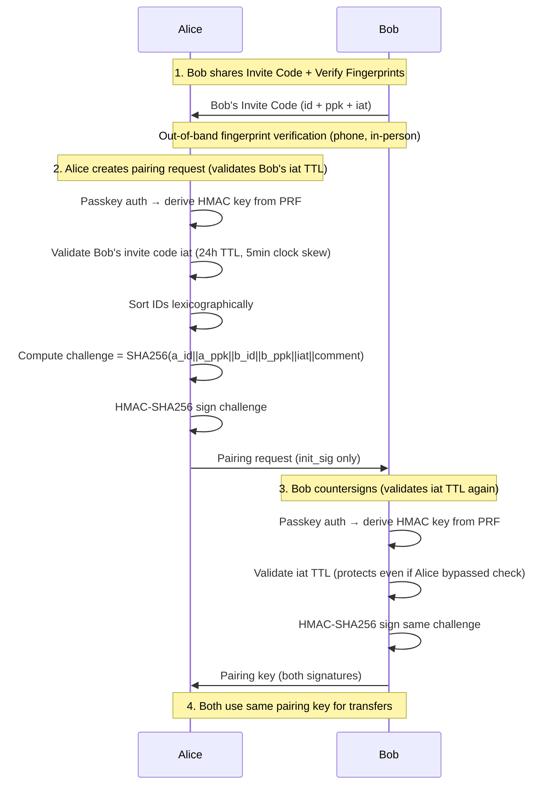
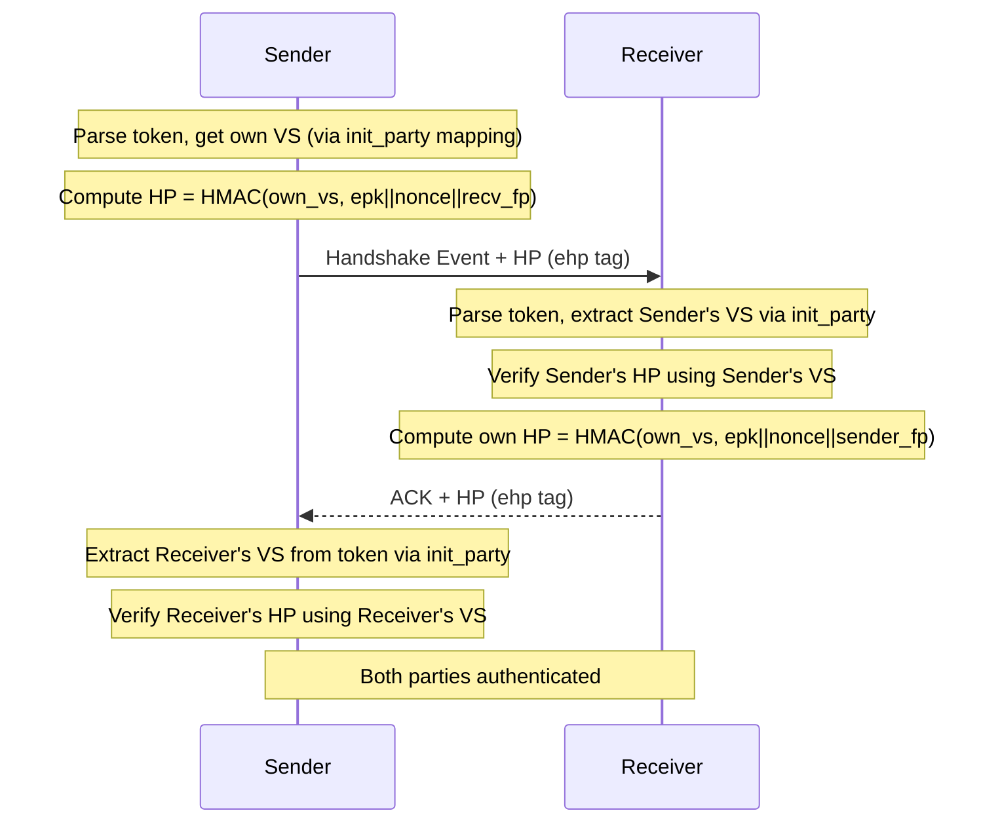
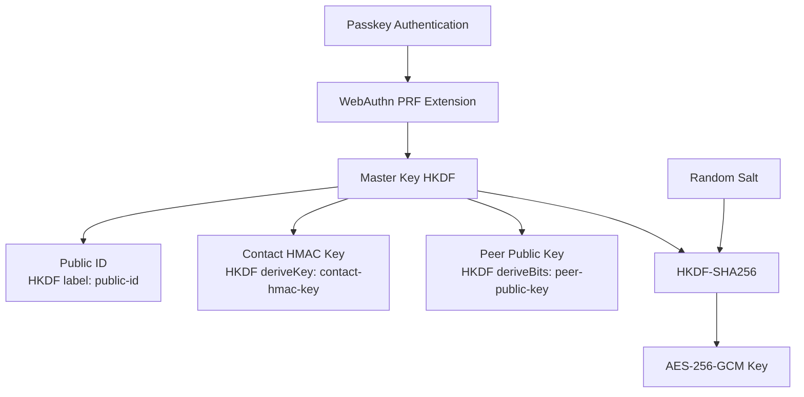
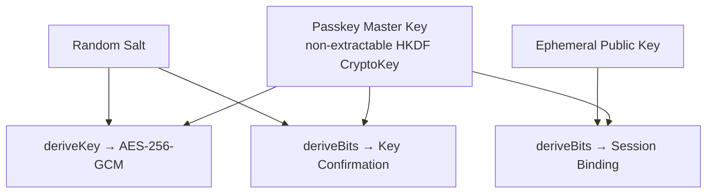
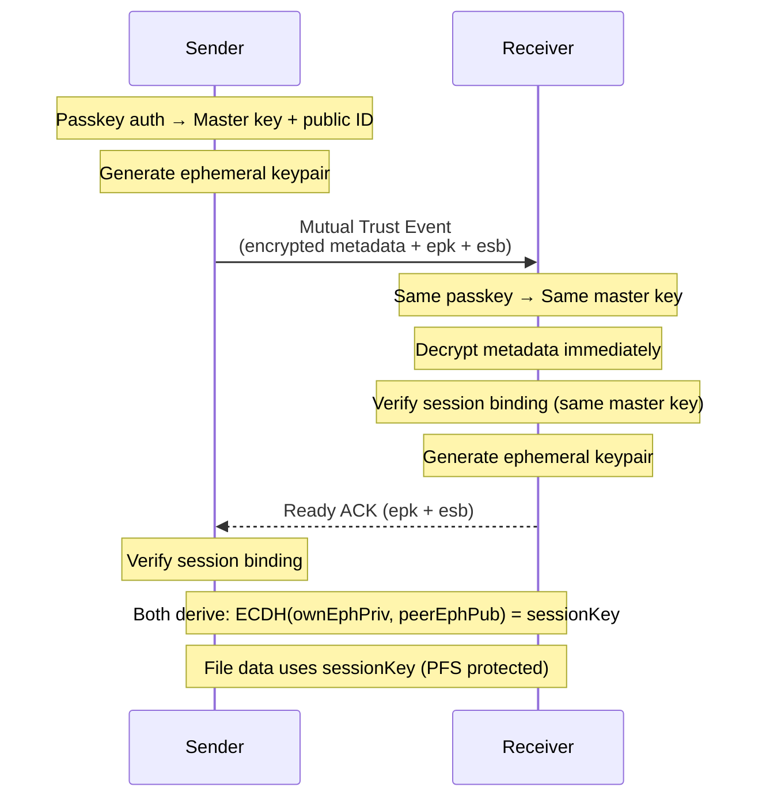
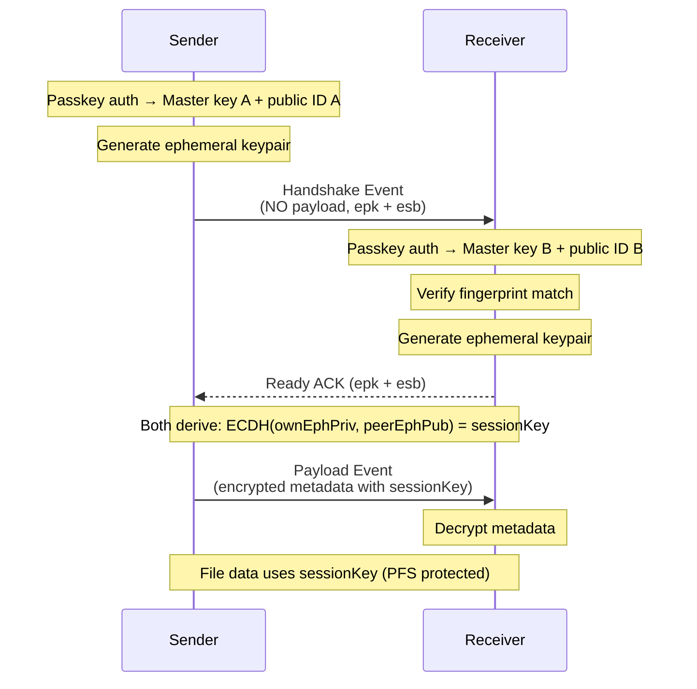

# Passkey Architecture

Passkeys provide an alternative to PIN-based authentication using the WebAuthn PRF extension for hardware-backed key derivation.

## How It Works

1. **Credential Creation**: User creates a passkey at `/passkey`, stored in their password manager (1Password, iCloud Keychain, Google Password Manager)
2. **Passkey Sync**: Both sender and receiver must have the same passkey synced via their password manager
3. **PRF Extension**: WebAuthn PRF (Pseudo-Random Function) extension derives encryption keys from the passkey
4. **Hardware-Backed**: Keys are derived from device secure elements (Touch ID, Face ID, Windows Hello)

## Passkey Fingerprint

- **Fingerprint**: Truncated SHA-256 hash of the passkey public ID (32 bytes derived via HKDF). We take the first 8 bytes (64 bits) of the hash and encode as 16 hex characters (formatted as `XXXX-XXXX-XXXX-XXXX` for display).
- **Purpose**: Used for Nostr event filtering and verification that sender/receiver have the same passkey

## Passkey Public ID

- **Public ID**: 32 bytes derived from the passkey master key via HKDF (shareable, non-secret), encoded as base64 for copy/QR
- **Purpose**: Shared with contacts to target Nostr events and validate receiver commitments (`rpkc`)

## Pairing Keys (Cross-User Mode)

For cross-user passkey transfers (different passkeys), a **pairing key** establishes trust between parties. Both parties sign the same key, creating a cryptographic proof of mutual agreement.

**Invite Code Format:**
```json
{
  "id": "<base64 public ID, 32 bytes>",
  "ppk": "<base64 peer public key, 32 bytes HKDF-derived>",
  "iat": "<Unix timestamp in seconds, issued-at time>"
}
```

**Invite Code TTL:**
- Invite codes are valid for **24 hours** from creation (`INVITE_CODE_TTL_SECONDS = 86400`)
- A maximum clock skew of **5 minutes** is allowed (`MAX_ACCEPTABLE_CLOCK_SKEW_SECONDS = 300`)
- TTL is validated at two points:
  1. **Initiator (Step 2)**: When creating the pairing request from peer's invite code
  2. **Confirmer (Step 3)**: When confirming the pairing request (protects even if initiator bypassed check)
- The `iat` timestamp is included in the challenge hash, making it tamper-proof

**Why two separate 32-byte identifiers?**

Both `id` (public ID) and `ppk` (peer public key) are derived from the passkey PRF master key via HKDF, but serve distinct purposes:

| Field | HKDF Info String | Purpose | Published? |
|-------|------------------|---------|------------|
| `id` (public ID) | `secure-send-passkey-public-id-v1` | Event addressing/filtering on Nostr relays | Yes (in Nostr events) |
| `ppk` (peer public key) | `secure-send-peer-public-key-v1` | Identity binding in token challenge; verification secret derivation | Yes (in invite codes/tokens) |

**Why both are required (cannot reuse one identifier):**
- **Separation of concerns**: The public ID is used for Nostr event routing (`rpkc` commitment, fingerprint filtering). The ppk is used exclusively in the authentication protocol (token challenge, handshake proofs).
- **Unlinkability potential**: Different HKDF derivations allow future protocol changes to rotate one identifier without affecting the other.
- **Defense in depth**: Compromising the public ID (visible in Nostr events) reveals nothing about the ppk used in cryptographic proofs.

**Pairing Request (after initiator signs):**
```typescript
interface PairingRequest {
  a_id: string       // Party A's public ID (lexicographically smaller)
  a_ppk: string      // Party A's peer public key (32 bytes)
  b_id: string       // Party B's public ID (lexicographically larger)
  b_ppk: string      // Party B's peer public key (32 bytes)
  iat: number        // Invite code issued-at timestamp (Unix seconds, valid for 24 hours)
  init_party: 'a' | 'b'  // Who initiated (for VS mapping)
  init_sig: string   // Initiator's HMAC-SHA256 MAC (base64, 32 bytes)
  init_vs: string    // Initiator's verification secret (base64, 32 bytes)
  comment?: string   // Optional comment (max 256 bytes UTF-8)
}
```

**Pairing Key (after countersigning):**
```typescript
interface PairingKeyPayload extends PairingRequest {
  counter_sig: string  // Countersigner's HMAC-SHA256 MAC (base64, 32 bytes)
  counter_vs: string   // Countersigner's verification secret (base64, 32 bytes)
}
```

The `init_party` field tracks who initiated ('a' or 'b'), which is needed to correctly map verification secrets to parties during handshake authentication. The `init_vs` and `counter_vs` fields contain verification secrets used for Handshake Proofs (see below).

**Challenge Computation:**
```
challenge = SHA256(a_id || a_ppk || b_id || b_ppk || iat || comment_bytes)
                   32     32       32      32       8     0-256 bytes
```
- IDs sorted lexicographically to ensure deterministic ordering
- Both parties compute MACs over the same challenge with their respective HMAC keys
- The `iat` timestamp (8 bytes, big-endian) is included in the challenge, making it tamper-proof
- Comment is optional; if present, it is UTF-8 encoded (max 256 bytes) and appended to the challenge input

**Tamper Protection:**

The entire token payload is tamper-proof via different mechanisms:
- **Challenge-covered fields** (`a_id`, `a_ppk`, `b_id`, `b_ppk`, `iat`, `comment`): Included in the SHA256 challenge. Tampering invalidates both MACs (detected during `verifyOwnSignature()`).
- **MAC fields** (`init_sig`, `counter_sig`): HMAC-SHA256 MACs over the challenge. Each party can verify only their own MAC via `verifyOwnSignature()` (requires passkey authentication). Trust in the counterparty's MAC is established via out-of-band fingerprint verification.
- **Verification secret fields** (`init_vs`, `counter_vs`): Derived deterministically from each party's HMAC key. Tampering causes handshake proof verification to fail.
- **Mapping field** (`init_party`): Not included in the challenge, but tampering is detected during handshake. This field maps `init_vs`/`counter_vs` to parties A/B. If tampered, the VS mapping becomes incorrect, causing handshake proof verification to fail (the counterparty's HP will use the wrong VS).

**Result:** Modifying any field in the token is detected — challenge-covered fields via MAC verification, other fields via handshake proof verification.

**Token Creation Flow:**


**Fingerprint Verification Details:**

The out-of-band fingerprint verification in step 1 is the primary trust anchor for cross-user passkey mode. This section details the fingerprint format, exchange methods, and verification requirements.

*Fingerprint Format:*
- **Length**: 16 uppercase hexadecimal characters (64 bits)
- **Derivation**: First 8 bytes of SHA-256 hash of the public ID
- **Display format**: Hyphenated groups for readability: `XXXX-XXXX-XXXX-XXXX` (e.g., `A1B2-C3D4-E5F6-7890`)
- **Collision resistance**: 64 bits provides ~2^32 resistance to birthday attacks, sufficient for personal contact verification

*Supported Exchange Methods:*
| Method | Description | Best For |
|--------|-------------|----------|
| **Verbal comparison** | Read fingerprint aloud over phone/video call | Remote contacts with voice channel |
| **QR code scan** | Scan invite code QR code (contains id + ppk + iat) | In-person exchange |
| **Copy/paste** | Copy invite code JSON and send via secure channel | Existing encrypted chat (Signal, iMessage) |

*Verification Requirements:*
- **Not mandatory for functionality**: The token creation flow works without fingerprint verification. Verification is a security best practice, not a technical requirement.
- **When verification matters**: Fingerprint verification is critical for **cross-user mode** (different passkeys) but not applicable to **self-transfer mode** (same passkey synced via password manager, where both parties are you).
- **No enforcement**: The UI does not block or prompt for explicit fingerprint confirmation before proceeding
- **User responsibility**: Verification is manual and relies on user diligence
- **Current UX behavior**:
  - Contact cards and fingerprints are displayed in the UI (`passkey.tsx`)
  - Warning banner shown: "⚠ Unverified fingerprints (will be verified via handshake proof)"
  - Users can proceed with token creation at any time
- **Risk of skipping verification (cross-user only)**: If fingerprints are not verified and an attacker substitutes their contact card (MITM during exchange), the attacker can create a valid token and impersonate the intended party. Handshake Proofs (HP) detect impersonation with *stolen* tokens but cannot detect MITM during initial contact exchange. This risk does not apply to self-transfer mode since there is no counterparty to impersonate—both sender and receiver are the same person using the same synced passkey.

*Implementation References:*
| Function | File | Description |
|----------|------|-------------|
| `publicKeyToFingerprint()` | `src/lib/crypto/ecdh.ts:26-34` | SHA-256 hash → first 8 bytes → hex |
| `formatFingerprint()` | `src/lib/crypto/ecdh.ts:42-55` | Add hyphen separators for display |
| `getPasskeyIdentity()` | `src/lib/crypto/passkey.ts:188-213` | Returns `publicIdFingerprint` |
| `parseToken()` | `src/lib/crypto/contact-token.ts:640-720` | Extracts `partyAFingerprint`, `partyBFingerprint` |
| Contact card display | `src/pages/passkey.tsx:474-545` | UI for contact card + fingerprint |
| Fingerprint tests | `src/lib/crypto/passkey.test.ts:5-53` | Unit tests for determinism/uniqueness |

**Verification Process:**

With HMAC signatures, each party can only verify their own signature:

1. **Parse token** (`parseToken()`): Validate JSON structure, field lengths, lexicographic ordering
2. **Check party membership**: Verify caller's public ID matches either `a_id` or `b_id`
3. **Verify own signature** (`verifyOwnSignature()`): Requires passkey auth to derive HMAC key, then verify signature matches
4. **Trust counterparty**: The other party's signature cannot be verified without their passkey. Trust is established via out-of-band fingerprint verification during contact exchange.

**Security Properties:**
- Both parties must control their passkey to sign
- Tampering with any field invalidates both signatures
- Lexicographic ordering prevents ambiguity
- Same token used by both parties (no separate tokens)
- **Only the two parties in the token can use it** - `parseToken()` checks that the caller's public ID matches either `a_id` or `b_id`; third parties are rejected with "You are not a party to this token"
- **Token verified at multiple points:**
  1. UI validation (send-tab/receive-tab) - immediate format check when entering token
  2. Before transfer starts (`use-nostr-send.ts`, `use-nostr-receive.ts`) - verifies party membership
  3. During handshake - sender's token parsed by receiver, counterparty fingerprint verified against sender's claimed identity
  4. **Handshake-time authentication** - both parties prove passkey control via ephemeral handshake proofs (see below)
- **Trust model**: Security relies on out-of-band fingerprint verification during contact exchange, not on verifying the counterparty's signature

## Handshake-Time Authentication (Impersonation Prevention)

The pairing key proves that both parties agreed to communicate, but possession of the key alone does not prove identity. An attacker who obtains a stolen pairing key could impersonate either party. To prevent this, both sender and receiver must prove they control the original passkey used to sign the pairing key during every handshake.

**Verification Secret (VS):**

Each party computes a verification secret when creating/countersigning the pairing key:

```
VS = HMAC(contact_hmac_key, "verification-secret" || counterparty_ppk)
```

- `contact_hmac_key`: Non-extractable HMAC key derived from passkey PRF
- `counterparty_ppk`: The other party's peer public key (32 bytes)
- The VS is included in the pairing key so the counterparty can verify handshake proofs

The verification secret fields (`init_vs`, `counter_vs`) and initiator tracking (`init_party`) are included in the pairing key format defined above (see `PairingRequest` and `PairingKeyPayload`).

**Handshake Proof (HP):**

At handshake time, each party computes a proof binding their identity to the session:

```
HP = HMAC(verification_secret, ephemeral_pub || nonce || counterparty_fingerprint)
```

- `verification_secret`: Their own VS (derived from their passkey)
- `ephemeral_pub`: Their ephemeral ECDH public key for this session (65 bytes)
- `nonce`: The replay protection nonce for this handshake (16 bytes)
- `counterparty_fingerprint`: The fingerprint of the party they're connecting to

**Handshake Flow:**


**VS Extraction via init_party:**

Each party verifies the counterparty's HP using the counterparty's VS extracted from the token. The `init_party` field ('a' or 'b') determines which VS belongs to which party:
- If `init_party = 'a'`: Party A was the initiator → `init_vs` = A's VS, `counter_vs` = B's VS
- If `init_party = 'b'`: Party B was the initiator → `init_vs` = B's VS, `counter_vs` = A's VS

The receiver uses `getCounterpartyVerificationSecret()` to extract the sender's VS, then calls `verifyHandshakeProof(sender_vs, sender_hp, ...)`. The sender does the same to verify the receiver's HP.

**Event Tags:**
```
['ehp', handshakeProof]  // Base64-encoded 32-byte HMAC
```

**Security Properties:**
- **Stolen token is useless**: Attacker cannot compute valid HP without the passkey-derived HMAC key
- **Session binding**: HP includes ephemeral key and nonce, preventing replay
- **Bidirectional**: Both parties prove their identity, not just one
- **Non-extractable**: VS is computed from non-extractable HMAC key; raw key never exposed

**Implementation:**
- `computeVerificationSecret()`: Computes VS during token creation
- `getOwnVerificationSecret()`: Retrieves caller's VS from token
- `getCounterpartyVerificationSecret()`: Retrieves counterparty's VS from token
- `computeHandshakeProof()`: Computes HP at handshake time
- `verifyHandshakeProof()`: Verifies counterparty's HP

**Role in Encryption:**
- The pairing key is **NOT used for encryption key derivation** - encryption uses ephemeral ECDH session keys (PFS)
- However, the token is **required for the protocol to function**:
  - Provides the counterparty's public ID for Nostr event targeting (`rpkc` commitment)
  - Handshake fails if token is invalid or caller is not a party
  - Without a valid token, you cannot establish a connection with the counterparty
- This is authentication/authorization, not encryption - proving *who* you're communicating with, not *how* the data is encrypted

## Key Derivation Flow



**Non-extractable keys**: Keys marked as non-extractable cannot be exported from the Web Crypto key store, preventing extraction via XSS attacks or memory exfiltration and keeping raw key material confined to the browser's secure runtime.

1. **Master Key**: Single passkey prompt derives HKDF master key via PRF
2. **Public ID**: HKDF with label derives a 32-byte shareable identifier
3. **Contact HMAC Key**: HKDF `deriveKey()` derives a non-extractable HMAC-SHA256 key for token signing
4. **Peer Public Key**: HKDF `deriveBits()` derives a 32-byte identifier for identity binding in tokens
5. **Per-Transfer Key**: HKDF with random salt derives unique AES key per transfer
6. **No PIN Required**: Biometric/device unlock replaces PIN entry

## Pairing Key Signing: Security Model

**HMAC-SHA256 signatures** are used for pairing key signing. This choice prioritizes **key protection** by keeping all signing keys as **non-extractable CryptoKeys** derived directly from the WebAuthn PRF output.

**Trust Model:**
Security relies on two layers:
1. **Out-of-band fingerprint verification** provides the root of trust (binding Public ID to human).
2. **Handshake Proofs (HP)** prevent impersonation by requiring active passkey control during every connection.

**Comparison with ECDSA:**

| Aspect | ECDSA | HMAC (Selected) |
|--------|-------|-----------------|
| **Key Protection** | Private key often momentarily exposed in memory | **Never exposed** (CryptoKey enforced) |
| **XSS Resistance** | Vulnerable during key derivation window | **Immune** (keys managed by browser) |
| **Verification** | Publicly verifiable by anyone | Verifiable only by the signer (requires auth) |

**Rationale:**
While ECDSA allows verifying the counterparty's signature, this adds little security value in a self-signed model where trust ultimately comes from fingerprints. By choosing HMAC, we eliminate the risk of private key exfiltration via XSS/memory-scanning. The inability to cryptographically verify the counterparty's signature is mitigated by **Handshake Proofs**, which mandate that both parties prove identity at connection time.

**HP Independence**:
The concept of "proving passkey control at handshake time" is algorithm-independent. We implement it using the existing non-extractable HMAC infrastructure for efficiency, but the security guarantee (impersonation defense) would be identical if implemented with ECDSA signatures.

**Operational implications of "Verify without auth: No"**:

The requirement to authenticate for verification has important operational consequences:

| Aspect | Implication |
|--------|-------------|
| When is auth required? | **Every handshake** - both parties must compute handshake proofs (HP) that require deriving their HMAC key via passkey authentication |
| Offline token validation | Not possible - cannot verify token validity without passkey access |
| Passkey loss | Token becomes unusable - cannot derive HMAC key to compute handshake proofs |

**Recovery path if passkey is lost:**

Passkeys in this application are intentionally **disposable** - they bind to pairing keys, not to persistent identity:

1. **Generate new passkey** at `/passkey`
2. **Re-exchange invite codes** with counterparty (new public ID, new ppk)
3. **Create new pairing key** with fresh signatures
4. **Old pairing keys are abandoned** - they cannot be used without the original passkey

This design prioritizes security (non-extractable keys) over convenience (offline verification). The trade-off is acceptable because:
- Pairing key creation is a one-time setup cost per relationship
- Passkey loss is an exceptional event, not routine operation
- No "recovery phrase" or key escrow is needed - just redo the exchange

## Mutual Trust Key Derivation (Non-Extractable Keys)

When using passkey mutual trust mode, the passkey master key is kept as a **non-extractable CryptoKey** and used directly for key confirmation and session binding:



**Security benefit**: No raw private key material is exposed to JavaScript. The passkey master key stays inside Web Crypto as a non-extractable `CryptoKey`, and all derived keys are produced via `deriveKey`/`deriveBits`. This prevents:
- XSS attacks from reading raw secret material via memory inspection
- Accidental logging or serialization of raw keys
- Side-channel exposure of raw private bytes

**Implementation**: `getPasskeyMasterKey()`, `derivePasskeyPublicId()`, `generateEphemeralSessionKeypair()`, and `deriveSessionEncryptionKey()` in `src/lib/crypto/passkey.ts`

## Perfect Forward Secrecy (PFS)

Passkey mutual trust mode provides **Perfect Forward Secrecy** via ephemeral session keys, similar to TLS/HTTPS ECDHE. There are two flows depending on whether sender and receiver share the same passkey. For details on RPKC (receiver public key commitment), key confirmation, and nonce handling, see [Mutual Trust Security Enhancements](#mutual-trust-security-enhancements) below.

### Self-Transfer Flow (Same Passkey - Optimized Single Round Trip)

When sender and receiver share the same passkey (e.g., synced via password manager), they derive the same PRF output and can encrypt/decrypt immediately:



### Cross-User Flow (Different Passkeys - Two Round Trips)

When sender and receiver have different passkeys, there's no shared secret initially. Both parties must have a **pairing key** (see above) establishing their agreement to communicate. An extra handshake round trip establishes the session key before metadata can be sent:



**Why two flows?**

| Aspect | Self-Transfer | Cross-User |
|--------|---------------|------------|
| Shared secret exists? | Yes (same PRF output) | No (different passkeys) |
| Round trips | 1 | 2 |
| Metadata encryption | Passkey-derived key | Session key (from ECDH) |
| Session binding verification | Yes (same master key) | N/A (different master keys prevent verification) |

**How it works:**

1. **Identity Material**: Passkey PRF derives a non-extractable master key and a public ID (for fingerprint verification)
2. **Ephemeral Keys**: Each session generates fresh ECDH keypairs using `crypto.subtle.generateKey()` - raw private key material is **NEVER** exposed to JavaScript
3. **Session Binding**: `HKDF(masterKey, ephemeralPub)` proves ephemeral keys are authorized by the passkey identity
   - **Self-transfer**: Both parties can verify each other's binding (same master key)
   - **Cross-user**: Binding cannot be verified (different master keys), security relies on fingerprint verification, RPKC, and pairing key signature
4. **Session Key**: `ECDH(ownEphemeralPriv, peerEphemeralPub)` derives the actual encryption key

**Security benefit**: Compromising the passkey public ID or a single session's memory does NOT help decrypt past or future sessions because:
- Ephemeral private keys are generated via Web Crypto and never exposed as raw bytes
- Each session uses unique ephemeral keys that are discarded after use
- Even memory inspection during one session only reveals that session's ephemeral keys

**PFS is mandatory**: In passkey mode, both sender and receiver MUST provide ephemeral keys. Events/ACKs without ephemeral keys are rejected.

**Time-bound validity / clock tolerance**:
- Ephemeral keys have **no separate lifetime** beyond the transfer TTL; there is no explicit timestamp on `epk`/`esb`.
- Validity is **bounded by the exchange event TTL** (`TRANSFER_EXPIRATION_MS`, currently 1 hour) using `created_at` timestamps.
- Implementations should **reject session bindings** if the associated exchange event is expired; **no additional clock-skew window** is currently defined beyond the existing TTL check.

**Implementation**: `generateEphemeralSessionKeypair()`, `verifySessionBinding()`, `deriveSessionEncryptionKey()`, `getPasskeySessionKeypair()` in `src/lib/crypto/passkey.ts`

## Dual Mode (Sender)

When passkey mode is enabled, the sender generates BOTH:
- Normal PIN + PIN-derived key
- Passkey fingerprint + passkey-derived key

Two PIN exchange events are published to Nostr (one for each mode). Receiver chooses their preferred authentication method, and the ACK includes a hint indicating which key was used.

## Mutual Trust Security Enhancements

When using passkey mode, additional cryptographic protections are applied:

| Enhancement | Event Tag | Purpose |
|-------------|-----------|---------|
| Key Confirmation | `kc` | HKDF-derived hash proves both parties derived same shared secret (MITM detection) |
| Receiver Public ID Commitment | `rpkc` | SHA-256 of receiver's public ID prevents relay substitution attacks |
| Replay Nonce | `n` | 16-byte random nonce (base64) echoed in ACK prevents replay attacks within TTL |
| Constant-Time Comparison | N/A | All security-critical string comparisons use timing-attack-resistant comparison |
| Input Validation | N/A | Nonce must decode to exactly 16 bytes; key confirmation input validated as 16-byte Uint8Array |

**Mutual Trust Event Tags (Self-Transfer):**
```
['h', receiverFingerprint]     // For event filtering
['spk', senderFingerprint]     // Sender verification
['kc', keyConfirmHash]         // Key confirmation (MITM detection)
['rpkc', receiverPkCommitment] // Receiver public ID commitment (relay MITM prevention)
['n', nonce]                   // Replay nonce (base64, 16 bytes)
['s', salt]                    // Per-transfer salt
['t', transferId]              // Transfer ID
['type', 'mutual_trust']       // Event type
['expiration', timestamp]      // TTL (NIP-40)
['epk', ephemeralPubKey]       // PFS: Ephemeral public key (base64, 65 bytes)
['esb', sessionBinding]        // PFS: Session binding proof (base64, 32 bytes)
```

**Mutual Trust Handshake Event Tags (Cross-User - Phase 1):**
```
['h', receiverFingerprint]     // For event filtering
['spk', senderFingerprint]     // Sender verification
['rpkc', receiverPkCommitment] // Receiver public ID commitment
['n', nonce]                   // Replay nonce (base64, 16 bytes)
['s', salt]                    // Per-transfer salt
['t', transferId]              // Transfer ID
['type', 'mutual_trust_handshake'] // Event type
['expiration', timestamp]      // TTL (NIP-40)
['epk', ephemeralPubKey]       // Ephemeral public key (base64, 65 bytes)
['esb', sessionBinding]        // Session binding proof (base64, 32 bytes)
```
Note: No `['kc', ...]` tag - key confirmation requires shared secret which doesn't exist for cross-user transfers.

**Mutual Trust Payload Event Tags (Cross-User - Phase 2):**
```
['p', receiverPubkey]          // Receiver's Nostr pubkey
['t', transferId]              // Transfer ID
['type', 'mutual_trust_payload'] // Event type
['expiration', timestamp]      // TTL (NIP-40)
```
Note: Encrypted payload in event content, encrypted with session key from ephemeral ECDH.

**Ready ACK Tags (PFS):**
```
['epk', ephemeralPubKey]       // PFS: Receiver's ephemeral public key
['esb', sessionBinding]        // PFS: Receiver's session binding proof
```

**Verification Flow:**
1. Sender computes key confirmation hash, receiver public ID commitment, and random nonce
2. Receiver verifies RPKC matches own public ID (prevents relay MITM)
3. Receiver verifies key confirmation hash matches (detects shared secret mismatch)
4. Receiver echoes nonce in ready ACK
5. Sender verifies nonce match using constant-time comparison (prevents replay)

**Constant-Time Comparison Implementation:**

The `constantTimeEqual()` function in `src/lib/crypto/ecdh.ts` provides timing-attack-resistant string comparison:

- **Single loop**: Always iterates `maxLen = Math.max(a.length, b.length)` times
- **No early returns**: Length mismatch is detected via XOR (`a.length ^ b.length`) accumulated into result
- **Bounds checking**: Uses `i < a.length ? a.charCodeAt(i) : 0` instead of modulo indexing
- **Bitwise accumulation**: All differences accumulated with `result |= charA ^ charB`

> **Note:** This is a best-effort constant-time mitigation in JavaScript. True constant-time guarantees are not possible in JS due to JIT optimization, garbage collection, and string implementation details. However, this approach avoids obvious timing leaks from early returns or variable iteration counts.

**Input Validation:**

Security-critical functions validate inputs before cryptographic operations:

- `hashKeyConfirmation()`: Validates input is exactly 16-byte Uint8Array before SHA-256 digest
- `parseMutualTrustEvent()`: Validates nonce decodes to exactly 16 bytes, salt decodes to at least 16 bytes

## Security Properties

| Property | PIN Mode | Passkey Self-Transfer | Passkey Cross-User |
|----------|----------|----------------------|-------------------|
| Key Source | User-memorized PIN | Hardware secure element | Hardware secure element |
| Brute Force Resistance | 600K PBKDF2 iterations | Hardware rate limiting | Hardware rate limiting |
| Phishing Resistance | None | Origin-bound credentials | Origin-bound credentials |
| Sync Method | Out-of-band sharing | Password manager sync | Pairing key exchange |
| Verification | PIN match | Fingerprint comparison | Pairing key (dual signatures) |
| Key Confirmation | N/A | HKDF-derived hash | N/A (no shared secret) |
| Relay MITM Protection | N/A | Public ID commitment | Public ID commitment |
| Replay Protection | TTL only | TTL + nonce | TTL + nonce |
| Session Binding Verification | N/A | Yes (same master key) | No (different master keys) |
| Shared Secret Protection | Raw bytes in memory | Non-extractable CryptoKey | Non-extractable CryptoKey |
| Perfect Forward Secrecy | No | Yes (ephemeral ECDH) | Yes (ephemeral ECDH) |
| Round Trips | 1 | 1 | 2 (handshake + payload) |
| Party Membership Check | N/A | N/A | Yes (during handshake) |
| Handshake Authentication | N/A | N/A | Yes (bidirectional HP) |
