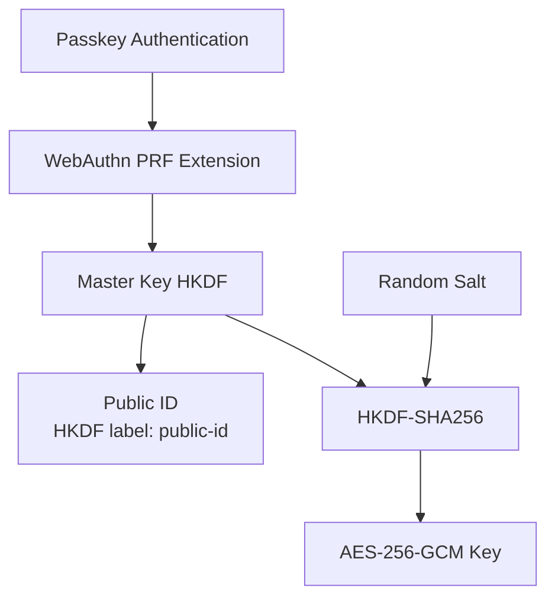
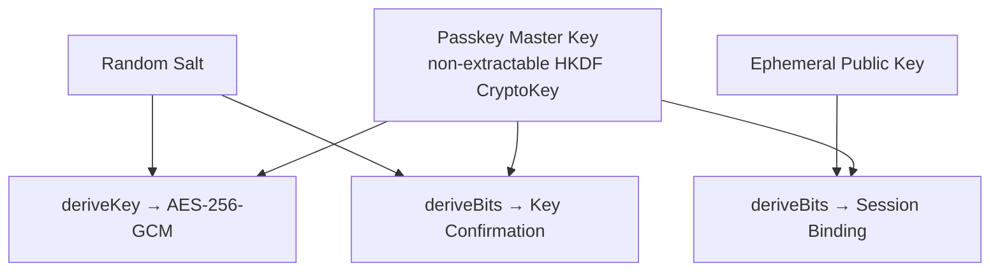
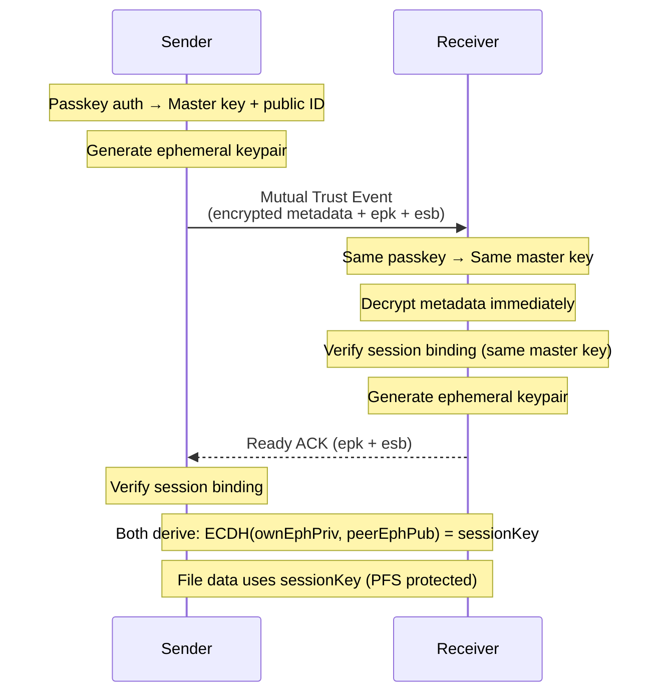

# Passkey Architecture

Passkeys provide an alternative to PIN-based authentication using the WebAuthn PRF extension for hardware-backed key derivation. Passkey mode is designed for **self-transfer** - sending files to yourself across devices using the same synced passkey.

## How It Works

1. **Credential Creation**: User creates a passkey at `/passkey`, stored in their password manager (1Password, iCloud Keychain, Google Password Manager)
2. **Passkey Sync**: Both sender and receiver must have the same passkey synced via their password manager
3. **PRF Extension**: WebAuthn PRF (Pseudo-Random Function) extension derives encryption keys from the passkey
4. **Hardware-Backed**: Keys are derived from device secure elements (Touch ID, Face ID, Windows Hello)

## Passkey Fingerprint

- **Fingerprint**: Truncated SHA-256 hash of the passkey public ID (32 bytes derived via HKDF). We take the first 8 bytes (64 bits) of the hash and encode as 16 hex characters (formatted as `XXXX-XXXX-XXXX-XXXX` for display).
- **Purpose**: Used for Nostr event filtering and verification that sender/receiver have the same passkey

## Passkey Public ID

- **Public ID**: 32 bytes derived from the passkey master key via HKDF (shareable, non-secret), encoded as base64 for copy/QR
- **Purpose**: Shared identifier for targeting Nostr events and validating receiver commitments (`rpkc`)

## Key Derivation Flow



**Non-extractable keys**: Keys marked as non-extractable cannot be exported from the Web Crypto key store, preventing extraction via XSS attacks or memory exfiltration and keeping raw key material confined to the browser's secure runtime.

1. **Master Key**: Single passkey prompt derives HKDF master key via PRF
2. **Public ID**: HKDF with label derives a 32-byte shareable identifier
3. **Per-Transfer Key**: HKDF with random salt derives unique AES key per transfer
4. **No PIN Required**: Biometric/device unlock replaces PIN entry

## Mutual Trust Key Derivation (Non-Extractable Keys)

When using passkey mutual trust mode, the passkey master key is kept as a **non-extractable CryptoKey** and used directly for key confirmation and session binding:



**Security benefit**: No raw private key material is exposed to JavaScript. The passkey master key stays inside Web Crypto as a non-extractable `CryptoKey`, and all derived keys are produced via `deriveKey`/`deriveBits`. This prevents:
- XSS attacks from reading raw secret material via memory inspection
- Accidental logging or serialization of raw keys
- Side-channel exposure of raw private bytes

**Implementation**: `getPasskeyMasterKey()`, `derivePasskeyPublicId()`, `generateEphemeralSessionKeypair()`, and `deriveSessionEncryptionKey()` in `src/lib/crypto/passkey.ts`

## Perfect Forward Secrecy (PFS)

Passkey mutual trust mode provides **Perfect Forward Secrecy** via ephemeral session keys, similar to TLS/HTTPS ECDHE.

### Self-Transfer Flow (Same Passkey - Single Round Trip)

When sender and receiver share the same passkey (synced via password manager), they derive the same PRF output and can encrypt/decrypt immediately:



**How it works:**

1. **Identity Material**: Passkey PRF derives a non-extractable master key and a public ID (for fingerprint verification)
2. **Ephemeral Keys**: Each session generates fresh ECDH keypairs using `crypto.subtle.generateKey()` - raw private key material is **NEVER** exposed to JavaScript
3. **Session Binding**: `HKDF(masterKey, ephemeralPub)` proves ephemeral keys are authorized by the passkey identity
4. **Session Key**: `ECDH(ownEphemeralPriv, peerEphemeralPub)` derives the actual encryption key

**Security benefit**: Compromising the passkey public ID or a single session's memory does NOT help decrypt past or future sessions because:
- Ephemeral private keys are generated via Web Crypto and never exposed as raw bytes
- Each session uses unique ephemeral keys that are discarded after use
- Even memory inspection during one session only reveals that session's ephemeral keys

**PFS is mandatory**: In passkey mode, both sender and receiver MUST provide ephemeral keys. Events/ACKs without ephemeral keys are rejected.

**Time-bound validity / clock tolerance**:
- Ephemeral keys have **no separate lifetime** beyond the transfer TTL; there is no explicit timestamp on `epk`/`esb`.
- Validity is **bounded by the exchange event TTL** (`TRANSFER_EXPIRATION_MS`, currently 1 hour) using `created_at` timestamps.
- Implementations should **reject session bindings** if the associated exchange event is expired; **no additional clock-skew window** is currently defined beyond the existing TTL check.

**Implementation**: `generateEphemeralSessionKeypair()`, `verifySessionBinding()`, `deriveSessionEncryptionKey()`, `getPasskeySessionKeypair()` in `src/lib/crypto/passkey.ts`

## Passkey Mode (Sender)

When passkey mode is enabled, the sender uses passkey-derived keys instead of a PIN. PIN generation and PIN exchange events are not used in passkey mode.

## Mutual Trust Security Enhancements

When using passkey mode, additional cryptographic protections are applied:

| Enhancement | Event Tag | Purpose |
|-------------|-----------|---------|
| Key Confirmation | `kc` | HKDF-derived hash proves both parties derived same shared secret (MITM detection) |
| Receiver Public ID Commitment | `rpkc` | SHA-256 of receiver's public ID truncated to 16 bytes (32 hex chars) prevents relay substitution attacks |
| Replay Nonce | `n` | 16-byte random nonce (base64) echoed in ACK prevents replay attacks within TTL |
| Constant-Time Comparison | N/A | All security-critical string comparisons use timing-attack-resistant comparison |
| Input Validation | N/A | Nonce must decode to exactly 16 bytes; key confirmation input validated as 16-byte Uint8Array |

**Mutual Trust Event Tags:**
```
['h', receiverFingerprint]     // For event filtering
['spk', senderFingerprint]     // Sender verification
['kc', keyConfirmHash]         // Key confirmation (MITM detection)
['rpkc', sha256(receiverPublicId)] // Receiver public ID commitment (SHA-256 truncated to 16 bytes)
['n', nonce]                   // Replay nonce (base64, 16 bytes)
['s', salt]                    // Per-transfer salt
['t', transferId]              // Transfer ID
['type', 'mutual_trust']       // Event type
['expiration', timestamp]      // TTL (NIP-40)
['epk', ephemeralPubKey]       // PFS: Ephemeral public key (base64, 65 bytes)
['esb', sessionBinding]        // PFS: Session binding proof (base64, 32 bytes)
```

**Ready ACK Tags (PFS):**
```
['epk', ephemeralPubKey]       // PFS: Receiver's ephemeral public key
['esb', sessionBinding]        // PFS: Receiver's session binding proof
```

**Verification Flow:**
1. Sender computes key confirmation hash, receiver public ID commitment (SHA-256 truncated to 16 bytes), and random nonce
2. Receiver verifies RPKC by computing SHA-256 of own public ID and comparing the truncated 16-byte hex (prevents relay MITM)
3. Receiver verifies key confirmation hash matches (detects shared secret mismatch)
4. Receiver echoes nonce in ready ACK
5. Sender verifies nonce match using constant-time comparison (prevents replay)

**Constant-Time Comparison Implementation:**

The `constantTimeEqual()` function in `src/lib/crypto/ecdh.ts` provides timing-attack-resistant string comparison:

- **Single loop**: Always iterates `maxLen = Math.max(a.length, b.length)` times
- **No early returns**: Length mismatch is detected via XOR (`a.length ^ b.length`) accumulated into result
- **Bounds checking**: Uses `i < a.length ? a.charCodeAt(i) : 0` instead of modulo indexing
- **Bitwise accumulation**: All differences accumulated with `result |= charA ^ charB`

> **Note:** This is a best-effort constant-time mitigation in JavaScript. True constant-time guarantees are not possible in JS due to JIT optimization, garbage collection, and string implementation details. However, this approach avoids obvious timing leaks from early returns or variable iteration counts.

**Input Validation:**

Security-critical functions validate inputs before cryptographic operations:

- `hashKeyConfirmation()`: Validates input is exactly 16-byte Uint8Array before SHA-256 digest
- `parseMutualTrustEvent()`: Validates nonce decodes to exactly 16 bytes, salt decodes to at least 16 bytes

For a comparison of security properties across PIN and Passkey modes, see [Security Properties by Mode](./ARCHITECTURE.md#security-properties-by-mode) in the main architecture document.
